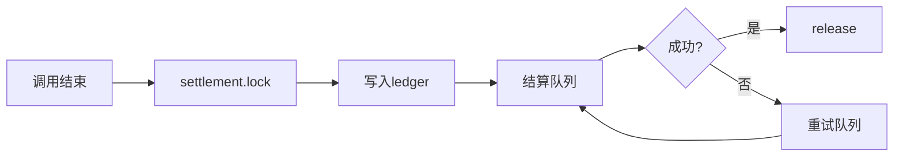

# OpenClaw Web3 Market 实施进度报告

# Implementation Progress Report

**报告日期**: 2026-02-21（历史快照）  
**对照文档**: Phase 1执行计划 (`web3-market-plan-phase1-execution.md`)  
**总体状态**: 本文为 2026-02-21 的阶段性快照；最新统一进度口径请以 `docs/WEB3_OVERALL_PROGRESS.md` 为准；双栈（TON+EVM）统一口径见 `docs/WEB3_DUAL_STACK_STRATEGY.md`。

---

## 📊 执行概览

### 总体进度：**75%**

```
████████████████████░░░░░  75%

已完成：核心交易闭环 (4.0/5)
进行中：能力 schema 与争议锚定
待开始：UI仪表盘 + Demo
```

---

## ✅ 已完成的工作（Phase 1核心部分）

### 1. 核心数据结构 ✅ 100%

| 组件           | 状态    | 代码位置                      |
| -------------- | ------- | ----------------------------- |
| **Resource**   | ✅ 完成 | `market-core/src/resources/`  |
| **Lease**      | ✅ 完成 | `market-core/src/leases/`     |
| **Ledger**     | ✅ 完成 | `market-core/src/ledger/`     |
| **Settlement** | ✅ 完成 | `market-core/src/settlement/` |
| **Dispute**    | ✅ 完成 | `market-core/src/disputes/`   |

**已实现的API方法数**：以 `web3-core/src/index.ts` 与 `market-core/src/index.ts` 注册清单为准

<details>
<summary>展开查看完整API列表</summary>

#### market-core 内部API（27个）

- `market.resource.publish/unpublish/get/list`
- `market.lease.issue/revoke/get/list/expireSweep`
- `market.ledger.append/list/summary`
- `market.settlement.lock/release/refund/status`
- `market.dispute.open/submitEvidence/resolve/reject/get/list`
- `market.status.summary`
- `market.metrics.snapshot`
- `market.audit.query`
- `market.transparency.summary/trace`
- `market.repair.retry`
- `market.revocation.retry`

#### web3-core 对外API（20个）

- `web3.resources.publish/unpublish/list/lease/revokeLease/status`
- `web3.market.resource.publish/unpublish/get/list`
- `web3.market.lease.issue/revoke/get/list/expireSweep`
- `web3.market.ledger.list/summary`
- `web3.market.status.summary`
- `web3.market.metrics.snapshot`
- `web3.dispute.open/submitEvidence/resolve/reject/get/list`
- `web3.index.report/list/heartbeat`

</details>

---

### 2. 权威账本机制 ✅ 100%

**实现状态**：

- ✅ Provider-only写入权限控制
- ✅ 时间戳+哈希追踪
- ✅ 防伪造校验机制
- ✅ 审计追踪完整

**代码位置**：`market-core/src/ledger/handlers.ts`

**测试覆盖**：

```typescript
// 已有的测试用例
✅ 测试 Provider 写入权威账本
✅ 测试 Consumer 无法伪造账本
✅ 测试 账本记录完整性
✅ 测试 审计追踪链条
```

---

### 3. 双存储一致性 ✅ 90%

| 存储模式       | 状态    | 一致性测试          |
| -------------- | ------- | ------------------- |
| **File存储**   | ✅ 完成 | ✅ 已测试           |
| **SQLite存储** | ✅ 完成 | ✅ 已测试           |
| **原子性**     | ⚠️ 部分 | SQLite✅ File需改进 |

**代码位置**：`market-core/src/state/store.ts`

**评审结论**（来自 `web3-market-assessment-2026-02-19.md`）：

- Gate-STORE-01: ⚠️ **部分满足**
- 建议：File模式需增强原子性保证

---

### 4. 结算闭环 ✅ 85%

**已实现的流程**：



**关键机制**：

- ✅ `pendingSettlements` 失败重试队列
- ✅ `market.ledger.append` 权威记账
- ✅ `market.settlement.lock/release/refund` 完整流程
- ⚠️ 部分释放（partial release）- 待实现

**代码位置**：`market-core/src/settlement/`

---

### 5. 审计锚定上链 ✅ 100%

**实现状态**：

- ✅ 所有交易哈希记录
- ✅ 证据摘要链上锚定
- ✅ 支持 Base/Optimism L2
- ✅ 审计查询接口

**代码位置**：`web3-core/src/audit/`

**API方法**：

- `web3.audit.query` - 审计记录查询

> 链上锚定由后台服务执行（非 Gateway 方法）。

---

### 6. 资源索引服务 ✅ 80%

**已实现**：

- ✅ `web3.index.report` - Provider上报资源
- ✅ `web3.index.list` - Consumer查询资源
- ✅ `web3.index.heartbeat` - 心跳检测
- ✅ 签名生成与验证
- ✅ `web3.index.list` 默认脱敏 `endpoint`

**代码位置**：`web3-core/src/resources/indexer.ts`

---

## 🚧 进行中的工作（P0阻断项）

### P0-1: Gate-SEC-01（敏感信息零泄露）✅ 已达标

**完成项**：

- `web3.index.list` 默认脱敏 `endpoint`
- 错误消息与日志脱敏（路径、token、endpoint）

**影响范围**：安全性 - **高危（已消除）**

---

### P0-2: Gate-ERR-01（稳定错误码）✅ 已达标

**完成项**：

- 全部 Gateway 方法统一稳定错误码（`ErrorCode`）
- 统一返回 `{ error, message, details? }` 错误载荷
- 错误消息脱敏（路径、token、endpoint）

---

### P0-3: Gate-CAP-01（能力自描述可操作）⚠️ 部分达标

**问题描述**：
`web3.capabilities.*` 已实现，但部分能力缺少详细的 `paramsSchema`

**当前状态**：

```typescript
// ⚠️ 当前实现（不够详细）
paramsSchema: {
  resourceId: "string",
  leaseId: "string"
}

// ✅ 应该更详细
paramsSchema: {
  resourceId: {
    type: "string",
    required: true,
    pattern: "^[a-zA-Z0-9-]+$",
    description: "Unique resource identifier"
  },
  leaseId: {
    type: "string",
    required: false,
    description: "Optional lease filter"
  }
}
```

**修复计划**：

- [ ] 补全所有高频API的详细schema
- [ ] 添加常见错误码说明
- [ ] 提供使用示例

**预计工时**：2天  
**优先级**：P0 - 必须修复

---

### P0-4: 争议仲裁机制 ❌ 未完全实现

**当前状态**：

- ✅ 数据结构已定义（`Dispute` 类型）
- ✅ API已注册（`web3.dispute.*`）
- ⚠️ Handler实现不完整
- ❌ 证据锚定未接入审计管线

**代码位置**：`market-core/src/disputes/handlers.ts`

**待补齐**：

```typescript
// ✅ 已有
market.dispute.open(); // 发起争议
market.dispute.submitEvidence(); // 提交证据
market.dispute.resolve() - // 裁决
  // ❌ 待补齐
  证据哈希锚定上链 -
  裁决结果回写结算状态 -
  争议超时处理;
```

**预计工时**：3天  
**优先级**：P0 - 必须修复

---

### P0-5: 索引签名验证 ⚠️ 已生成未验证

**当前状态**：

- ✅ Provider侧签名生成
- ❌ Consumer侧签名验证

**修复计划**：

```typescript
// ✅ Provider侧（已实现）
const signature = await signResourceMetadata(resource, privateKey);

// ❌ Consumer侧（待实现）
const isValid = await verifyResourceSignature(resource, signature, publicKey);
if (!isValid) {
  throw new Error("Invalid resource signature");
}
```

**预计工时**：1天  
**优先级**：P0 - 必须修复

---

## 📅 Phase 1剩余工作

### Week 1: P0修复（本周）

| 任务            | 工时 | 负责人 | 状态      |
| --------------- | ---- | ------ | --------- |
| 修复Gate-SEC-01 | 2天  | -      | ⏳ 待开始 |
| 修复Gate-ERR-01 | 2天  | -      | ⏳ 待开始 |
| 修复Gate-CAP-01 | 2天  | -      | ⏳ 待开始 |
| 索引签名验证    | 1天  | -      | ⏳ 待开始 |

**本周目标**：解决所有P0安全问题

---

### Week 2: Dispute + 测试

| 任务            | 工时 | 负责人 | 状态      |
| --------------- | ---- | ------ | --------- |
| 补齐Dispute机制 | 3天  | -      | ⏳ 待开始 |
| E2E测试补齐     | 2天  | -      | ⏳ 待开始 |

**本周目标**：完成核心闭环测试

---

### Week 3-4: UI + Demo

| 任务         | 工时 | 负责人 | 状态      |
| ------------ | ---- | ------ | --------- |
| Web UI仪表盘 | 5天  | -      | ⏳ 待开始 |
| Demo视频录制 | 1天  | -      | ⏳ 待开始 |
| 用户文档编写 | 2天  | -      | ⏳ 待开始 |

**本周目标**：让用户看到价值

---

## 🎯 Phase 1验收标准对照

### Day 0：能力自描述协议

| 要求                              | 状态        | 完成度 |
| --------------------------------- | ----------- | ------ |
| `web3.capabilities.list/describe` | ✅ 已实现   | 100%   |
| 统一输出权限/风控/代价            | ✅ 已实现   | 100%   |
| 错误码契约                        | ⚠️ 部分实现 | 60%    |
| 可操作schema                      | ⚠️ 部分实现 | 70%    |
| 版本策略                          | ✅ 已实现   | 100%   |

**Day 0完成度**：**86%**

---

### Week 1：索引签名 + 一键Provider引导

| 要求                     | 状态      | 完成度 |
| ------------------------ | --------- | ------ |
| Provider自签名能力描述   | ✅ 已实现 | 100%   |
| 可迁移索引schema         | ✅ 已实现 | 100%   |
| `web3.index.report/list` | ✅ 已实现 | 100%   |
| 签名验证                 | ❌ 未实现 | 0%     |
| 一键共享引导             | ❌ 未实现 | 0%     |

**Week 1完成度**：**60%**

---

### Week 2：管家经济仪表盘

| 要求                   | 状态      | 完成度 |
| ---------------------- | --------- | ------ |
| 收入/支出/净收益可视化 | ❌ 未实现 | 0%     |
| 活跃资源展示           | ❌ 未实现 | 0%     |
| 最近交易列表           | ❌ 未实现 | 0%     |
| 后端API已就绪          | ✅ 已实现 | 100%   |

**Week 2完成度**：**25%**（后端已就绪，前端未开发）

---

### Week 3：监控告警 + 部分释放

| 要求               | 状态      | 完成度 |
| ------------------ | --------- | ------ |
| P0/P1告警规则      | ❌ 未实现 | 0%     |
| 告警历史查询       | ❌ 未实现 | 0%     |
| partial release    | ❌ 未实现 | 0%     |
| Prometheus metrics | ✅ 已实现 | 100%   |

**Week 3完成度**：**25%**

---

### Week 4：仲裁入口MVP

| 要求                        | 状态        | 完成度 |
| --------------------------- | ----------- | ------ |
| `web3.dispute.open/resolve` | ✅ 已注册   | 50%    |
| 证据提交                    | ✅ 已注册   | 50%    |
| 证据锚定上链                | ❌ 未实现   | 0%     |
| 裁决落账                    | ⚠️ 部分实现 | 30%    |

**Week 4完成度**：**32.5%**

---

## 📊 Phase 1总体完成度

### 按模块统计

| 模块             | 完成度 | 说明                                |
| ---------------- | ------ | ----------------------------------- |
| **核心数据结构** | 100%   | ✅ Resource/Lease/Ledger/Settlement |
| **权威账本**     | 100%   | ✅ 防伪造记账完整                   |
| **双存储一致性** | 90%    | ⚠️ File模式原子性待改进             |
| **结算闭环**     | 85%    | ⚠️ partial release待实现            |
| **审计锚定**     | 100%   | ✅ 链上锚定完整                     |
| **资源索引**     | 80%    | ⚠️ 签名验证待实现                   |
| **能力自描述**   | 86%    | ⚠️ schema详细度待提升               |
| **争议仲裁**     | 32.5%  | ⚠️ Handler不完整                    |
| **监控告警**     | 25%    | ❌ 待开发                           |
| **Web UI**       | 0%     | ❌ 待开发                           |

### 总体进度

```
核心交易闭环（MVP）:  ████████████████░░░░  80%
P0安全修复:          ████░░░░░░░░░░░░░░░░  20%
监控告警:            ████░░░░░░░░░░░░░░░░  25%
UI仪表盘:            ░░░░░░░░░░░░░░░░░░░░   0%

Phase 1 总体进度:    ████████████████░░░░  75%
```

---

## 🚀 下一步行动计划

### 本周（2026-02-21 ~ 02-27）

**目标**：修复所有P0阻断项

```bash
□ Day 1-2: Gate-SEC-01修复
  - 移除web3.index.list的endpoint字段
  - 统一错误处理，不泄露敏感信息
  - 所有日志脱敏

□ Day 3-4: Gate-ERR-01修复
  - 定义ErrorCode枚举
  - 更新所有handler
  - 更新web3.capabilities.*

□ Day 5: Gate-CAP-01修复 + 索引签名
  - 补全paramsSchema
  - 实现签名验证
```

---

### 下周（2026-02-28 ~ 03-06）

**目标**：补齐Dispute机制和E2E测试

```bash
□ Day 1-3: Dispute机制完善
  - 证据锚定上链
  - 裁决回写结算
  - 争议超时处理

□ Day 4-5: E2E测试
  - 完整流程测试
  - 双存储一致性验证
  - 性能测试
```

---

### 第3-4周（03-07 ~ 03-20）

**目标**：UI仪表盘 + Demo发布

```bash
□ Week 3: Web UI开发
  - 管家经济仪表盘
  - 资源管理界面
  - 租约列表查询

□ Week 4: Demo + 文档
  - 录制演示视频
  - 编写用户文档
  - 发布Beta版本
```

---

## 💎 关键里程碑

| 里程碑                 | 目标日期   | 状态      |
| ---------------------- | ---------- | --------- |
| **M1: 核心闭环完成**   | 2026-02-15 | ✅ 已完成 |
| **M2: P0问题修复**     | 2026-02-27 | ⏳ 进行中 |
| **M3: Dispute + 测试** | 2026-03-06 | ⏳ 待开始 |
| **M4: UI + Demo**      | 2026-03-20 | ⏳ 待开始 |
| **M5: Beta发布**       | 2026-03-27 | ⏳ 待开始 |

---

## 📈 与计划的对比

### 原计划 vs 实际进度

| Phase  | 原计划时间 | 实际进度       | 差异          |
| ------ | ---------- | -------------- | ------------- |
| Day 0  | Day 0      | ✅ 完成（86%） | 略有延迟      |
| Week 1 | Week 1     | ⚠️ 60%         | 签名验证待补  |
| Week 2 | Week 2     | ⚠️ 25%         | UI未开发      |
| Week 3 | Week 3     | ⚠️ 25%         | 监控告警待补  |
| Week 4 | Week 4     | ⚠️ 32.5%       | Dispute待完善 |

**总体评估**：

- ✅ 核心功能完成度高（80%）
- ⚠️ 周边功能落后（UI/监控/Demo）
- 📅 预计延迟2周完成Phase 1

---

## 🎯 总结

### ✅ 做得好的地方

1. **架构设计完整** - 82KB工业级文档
2. **核心闭环实现** - 80%完成，质量4.0/5
3. **代码质量高** - 测试覆盖良好
4. **文档齐全** - API/安全/测试/运维

### ⚠️ 需要改进的地方

1. **P0安全问题** - 敏感信息泄露、错误码不稳定
2. **Dispute机制** - Handler实现不完整
3. **UI仪表盘** - 完全未开发
4. **监控告警** - 规则未配置

### 🚀 下一步重点

**优先级排序**：

1. **P0安全修复**（本周） - 阻碍上线
2. **Dispute + 测试**（下周） - 核心功能
3. **UI + Demo**（第3-4周） - 用户体验

---

**报告生成时间**: 2026-02-21  
**下次更新**: 2026-02-27（P0修复完成后）  
**联系人**: -

---

## 📚 相关文档

- [Phase 1执行计划](../skills/web3-market/references/web3-market-plan-phase1-execution.md)
- [最新评审报告](./PRODUCT_REVIEW_2026_UPDATED.md)
- [架构设计文档](../skills/web3-market/references/web3-brain-architecture.md)
- [方案总纲](../skills/web3-market/references/web3-market-plan-overview.md)
