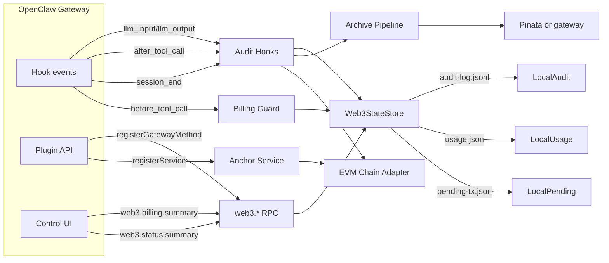
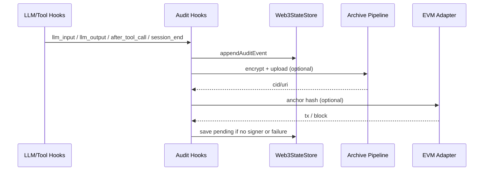
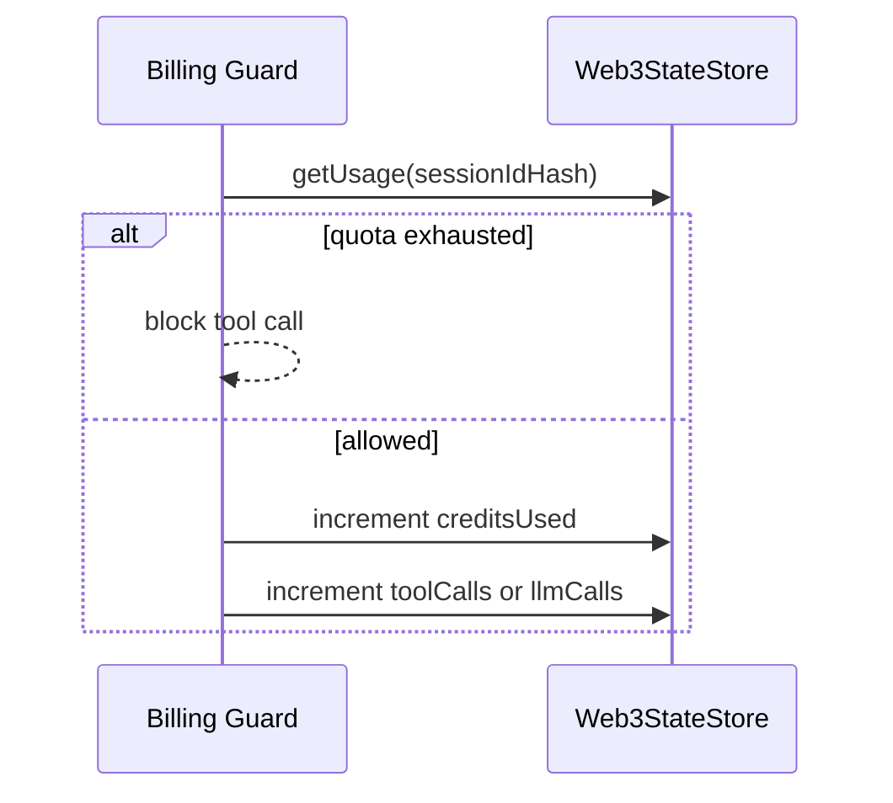
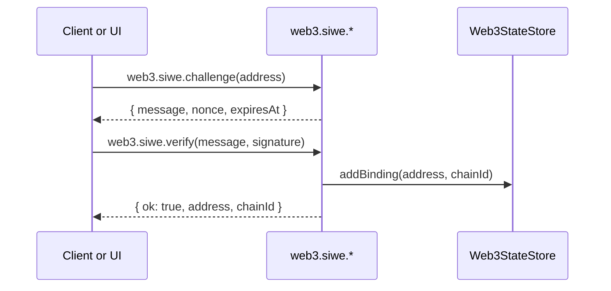

# Web3 Core Dev Guide

This document is the development reference for the `web3-core` plugin. It covers
OpenClaw integration points, architecture, data flows, and concrete interfaces so
you can execute extension plans with minimal backtracking.

## Scope

- Plugin entry points and OpenClaw integration
- Architecture and data flow diagrams
- Config schema and local persistence
- Commands, hooks, and gateway RPC interfaces
- UI integration touchpoints

## Integration points in OpenClaw

The plugin integrates through the core plugin API and lifecycle hooks:

- **Plugin registration**: `register(api)` in `extensions/web3-core/src/index.ts`
- **Hooks**: `api.on("llm_input")`, `api.on("llm_output")`, `api.on("after_tool_call")`, `api.on("session_end")`
- **Billing guard hooks**: `api.on("before_tool_call")`, `api.on("llm_output")`
- **Gateway methods**: `api.registerGatewayMethod("web3.*", handler)`
- **Background service**: `api.registerService({ id: "web3-anchor-service" })`

OpenClaw hook event shapes and contexts are defined in `src/plugins/types.ts`.

## Architecture



## Data flow

### Audit and anchoring



### Billing



### SIWE identity



## Config model

The plugin reads configuration from `plugins.entries.web3-core.config` and merges
with defaults in `extensions/web3-core/src/config.ts`.

### Config keys

- **`chain.network`**: `base | optimism | arbitrum | ethereum | sepolia`
- **`chain.rpcUrl`**: RPC endpoint
- **`chain.privateKey`**: signer key for anchoring
- **`storage.provider`**: `ipfs | arweave | filecoin`
- **`storage.gateway`**: HTTP gateway for archived content
- **`storage.pinataJwt`**: Pinata JWT for IPFS uploads
- **`storage.arweaveKeyfile`**: Arweave keyfile JSON path for uploads
- **`storage.filecoinToken`**: Filecoin upload API token (e.g. web3.storage)
- **`storage.filecoinEndpoint`**: Filecoin upload endpoint (default: `https://api.web3.storage/upload`)
- **`privacy.onChainData`**: `hash_only | hash_and_meta | encrypted_content`
- **`privacy.archiveEncryption`**: encrypt archive payloads
- **`privacy.redactFields`**: fields redacted before hashing and storage
- **`identity.allowSiwe`**: enable SIWE
- **`identity.requiredChainId`**: enforce chain id
- **`billing.enabled`**: enable quota and usage
- **`billing.quotaPerSession`**: credits per session
- **`billing.costPerLlmCall`**: cost per LLM call
- **`billing.costPerToolCall`**: cost per tool call

## Local persistence

State lives under the Gateway state directory in `web3/`:

- `web3/bindings.json` wallet bindings
- `web3/audit-log.jsonl` append only audit log
- `web3/usage.json` billing state
- `web3/pending-tx.json` pending anchor queue
- `web3/archive-key.json` archive encryption key

## Interfaces

## Resource sharing (B-2) and provider routes

If you are building the AI butler flows for the resource-sharing market (model/search/storage),
use the API contract page as the source of truth:

- [Web3 Resource Market API](/reference/web3-resource-market-api)

Important security constraints:

- Never expose `accessToken`, provider endpoints, or real filesystem paths in docs, logs, errors, or status output.
- If you use resource discovery/indexing, treat endpoint data as a sensitive asset and only return safe summaries by default.

### Resource index (discovery)

The plugin exposes an internal index surface used for discovery and testing:

- `web3.index.report`
- `web3.index.list`

These methods are internal and **must not expose provider endpoints by default**. Treat any endpoint-like data as a sensitive asset: return only safe summaries to users/agents, and use a controlled mechanism (for example, lease issuance plus gateway-controlled routing, or trusted local configuration) to resolve routing.

If you keep endpoint-like values for local debugging, ensure they are redacted in outputs and never appear in logs, errors, status output, or tool results.

### Commands

- **`/bind_wallet <0x...>`**: validate address input and guide SIWE verification
- **`/unbind_wallet <0x...>`**: remove wallet binding
- **`/whoami_web3`**: list bindings
- **`/credits`**: session credits and usage
- **`/pay_status`**: query settlement status from market state (orderId or settlementId)
- **`/audit_status`**: recent audit events

### Hooks

- **Audit**: `llm_input`, `llm_output`, `after_tool_call`, `session_end`
- **Billing**: `before_tool_call`, `llm_output`

### Gateway RPC

#### `web3.capabilities.list`

**Intent**: List `web3.*` capabilities and their availability so an agent/UI can discover safe entrypoints without reading external docs.

**Contract (target)**

- **Params**:
  - `includeUnavailable?`: boolean
  - `includeDetails?`: boolean
  - `group?`: string (one of `capabilities|identity|audit|billing|status|resources|market|index|monitor|tools`)
- **Response**:
  - `{ "capabilities": CapabilitySummary[] }` when `includeDetails=false` (default)
  - `{ "capabilities": CapabilityDescriptor[] }` when `includeDetails=true`

**Example (summaries)**

```json
{
  "capabilities": [
    {
      "name": "web3.resources.list",
      "summary": "List published resource offers.",
      "kind": "gateway",
      "group": "resources",
      "availability": { "enabled": true }
    }
  ]
}
```

**Implementation notes (current code)**

- `capabilities[*].paramsSchema` is currently a lightweight hint map (often string placeholders), not a fully machine-validated schema.

#### `web3.capabilities.describe`

**Intent**: Describe a single capability by name, including parameter hints, guards, and pricing signals.

**Contract (target)**

- **Params**:
  - `name`: string (capability name, e.g. `web3.market.resource.publish`)
  - `includeUnavailable?`: boolean
- **Response**:
  - `{ "capability": CapabilityDescriptor }`
- **Errors (target, stable)**:
  - `E_INVALID_ARGUMENT`: missing/invalid `name`
  - `E_NOT_FOUND`: capability not found

**Example**

```json
{
  "capability": {
    "name": "web3.market.resource.publish",
    "summary": "Market entrypoint for resource publish (proxy to market-core).",
    "kind": "gateway",
    "group": "market",
    "availability": { "enabled": true },
    "paramsSchema": { "resource": "ResourceOffer" },
    "aliases": ["web3.resources.publish"]
  }
}
```

**Implementation notes (current code)**

- Errors are returned as stable `E_*` codes via `formatWeb3GatewayErrorResponse(...)`, with safe, shareable messages (no endpoint/token/real path leakage).

#### `web3.siwe.challenge`

**Params**

```json
{ "address": "0xabc..." }
```

**Response**

```json
{ "message": "...", "nonce": "...", "expiresAt": "..." }
```

#### `web3.siwe.verify`

**Params**

```json
{ "message": "...", "signature": "0x..." }
```

**Response**

```json
{ "ok": true, "address": "0x...", "chainId": 8453 }
```

#### `web3.audit.query`

**Params**

```json
{ "limit": 50 }
```

**Response**

```json
{ "events": ["..."], "count": 50 }
```

Each event follows `AuditEvent` with fields such as `id`, `kind`, `timestamp`,
`sessionIdHash`, `payloadHash`, `archivePointer`, and `chainRef`.

#### `web3.billing.status`

**Params**

```json
{ "sessionIdHash": "..." }
```

**Response**

```json
{ "enabled": true, "sessionIdHash": "...", "usage": { "creditsUsed": 10 } }
```

#### `web3.billing.summary`

**Params**

```json
{ "sessionKey": "..." }
```

**Response**

```json
{
  "enabled": true,
  "sessionIdHash": "...",
  "usage": {
    "creditsUsed": 10,
    "creditsQuota": 1000,
    "llmCalls": 3,
    "toolCalls": 2,
    "lastActivity": "2026-02-18T12:34:56.000Z"
  }
}
```

#### `web3.status.summary`

**Params**

```json
{}
```

**Response**

```json
{
  "auditEventsRecent": 5,
  "auditLastAt": "2026-02-18T12:34:56.000Z",
  "archiveProvider": "ipfs",
  "archiveLastCid": "bafy...",
  "anchorNetwork": "base",
  "anchorLastTx": "0x...",
  "pendingAnchors": 0,
  "anchoringEnabled": true
}
```

## UI integration

The Control UI consumes gateway summaries:

- **Usage page**: `web3.billing.summary`
- **Overview page**: `web3.status.summary`

Suggested client behavior:

- Load on view entry
- Allow manual refresh
- Avoid polling faster than 30 seconds

## Debug and operational notes

- **No signer key**: anchoring is queued into `pending-tx.json`.
- **IPFS uploads**: require `storage.pinataJwt`.
- **SIWE nonce store**: persisted on disk under the Gateway state directory (siwe-challenges.json).

## Related docs

- [Plugins](/tools/plugin)
- [Plugin manifest](/plugins/manifest)
