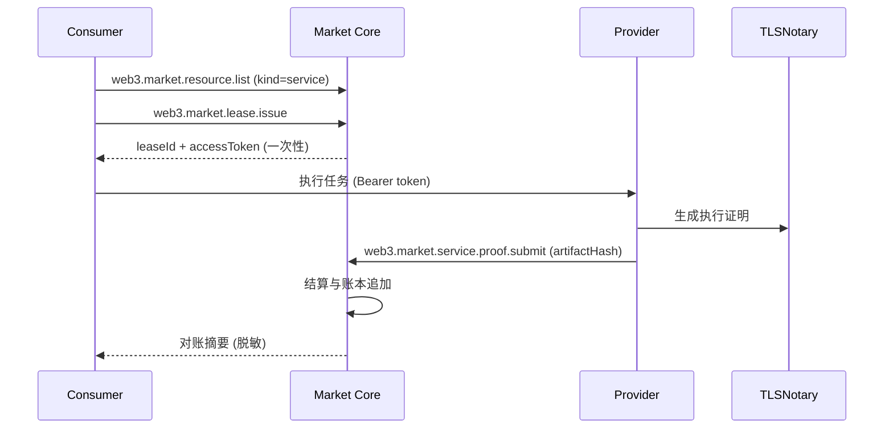

## 背景与目标

OpenClaw 已具备 Web3 Market 的资源共享与结算底座，但当前能力主要围绕“算力与资源”交易。为实现“AI 管家作为自主经济体”的愿景，需要把交易对象扩展为“可验证的劳务”。本计划以“可验证执行 + 可审计结算”为核心，逐步实现服务市场与自主预算闭环。

### 目标

- **Q2**：从“算力买卖”升级为“劳务买卖”，引入服务型资源与执行证明。
- **Q3**：引入动态质押与信誉权重惩罚，提升资金效率与抗作弊能力。
- **Q4**：实现自主预算，支持 Agent 按预算自动采购服务与资源。

### 非目标

- 不在 Q2 上线全链上执行细节记录，仅保留最小披露与可验证摘要。
- 不在 Q2 引入完整任务市场协议与节点撮合网络（仍以现有 `market-core` 为权威执行层）。

## 现状评审与差距

### 已具备

- `web3-core` 与 `market-core` 形成清晰分层，对外 `web3.*`，对内 `market.*`。
- 资源共享（Resource、Lease、Ledger）与结算（Settlement）已实现，并支持可分享的脱敏输出。
- 争议与透明度接口已存在，具备后续证据与仲裁的承载面。

### 关键缺口

- **服务型资源缺口**：暂无 `service` 类型与服务契约字段。
- **执行证明缺口**：无统一的“执行证明”结构与提交入口。
- **信誉与质押缺口**：已有评分口径，但未形成与质押挂钩的可执行策略。
- **自主预算缺口**：预算策略未与市场采购流程形成闭环。

## 核心设计原则

- **低侵入**：复用 `market-core` 结算与账本，不重造结算主线。
- **最小披露**：证明只记录 hash 与必要元数据；脱敏是默认行为。
- **可降级**：证明与结算不可用时不阻断核心调用，只降级提示。
- **可审计**：所有关键动作可追溯，且输出可分享。

## AI 管家体验最短路径与架构调整（提案）

### 最短路径（AI 视角的一次性闭环）

1. **选择与确认**：`web3.market.resource.list` → 过滤 `kind=service` → 生成“可执行摘要 + 风险提示”，明确预算上限与可撤销条件。
2. **租约与访问**：`web3.market.lease.issue` 返回一次性 `accessToken` 与 `orderId`，在本地会话内短时持有。
3. **执行与证明**：调用 Provider 服务 → 生成 `ExecutionProof` → `web3.market.service.proof.submit` 仅写入 hash 元数据。
4. **结算与争议**：进入争议窗口，默认 `release`；若失败则 `web3.market.dispute.*` 进入裁决。
5. **可分享对账**：输出仅含 hash/摘要的 `ReconciliationSummary`，不含 endpoint/token/真实路径。

### 架构调整方向（AI 体验优先）

- **统一体验层入口**：对外只保留 `web3.market.*` 作为服务与争议入口，避免在 `web3.*` 之外出现多套体验路径。
- **补齐任务导向入口**：新增“任务型编排”语义（例如 `web3.task.request`/`web3.task.fulfill`），由内部映射到 `market-core` 的资源、租约、证明与结算。
- **预算与自动化决策收敛**：将 `agent-wallet` 与 `x402` 统一到同一决策树，避免在调用层出现多套预算逻辑。

### 技术选型调整（面向可验证与可降级）

- **证明后端可插拔**：首期 `tlsnotary`，后续允许接入 `Rekor` 或 TEE 证明，但保持 `ExecutionProof` 字段稳定。
- **索引先安全后去中心化**：默认输出不含 endpoint，优先补齐验签与信任策略，再考虑 DHT 迁移。
- **争议最小语义优先**：保持 `market-core` 权威裁决与账本一致，避免在体验层做状态机分叉。

## 关键数据结构

### ServiceSchema

服务型资源在资源发布时附带 `serviceSchema`：

- `inputs`：输入字段列表。
- `outputs`：输出字段列表。
- `sla`：响应时限与交付标准。
- `proofRequirements`：证明类型与要求（最小披露）。

### ExecutionProof

执行证明用于提交可验证的“任务已完成”证据：

- `type`：首期支持 `tlsnotary`。
- `artifactHash`：证明文件或可验证快照的摘要。
- `issuedAt`：签发时间。
- `redactedFields`：脱敏字段清单。
- `verifier`：验证方或验证方法标识。

## 核心接口与流程扩展

### 新增或扩展的入口

- **资源发布**：`web3.market.resource.publish` 增加 `kind: service` 与 `serviceSchema`。
- **证明提交**：新增 `web3.market.service.proof.submit`（写入证明摘要，关联订单）。
- **争议关联**：复用 `web3.market.dispute.*`，允许证明作为争议证据来源。

> 说明：对外统一以 `web3.market.*` 为体验入口，内部映射到 `market-core` 的 `market.*` 能力。

### 最小执行流程



## Q2 计划与验收

### Q2 交付范围

- `MarketResourceKind` 支持 `service`。
- 新增 `ServiceSchema` 与 `ExecutionProof`。
- 证明提交与争议关联路径可用。
- 对账摘要可输出服务类订单信息。

### Q2 验收 Gate

- **Gate SEC**：任何对外输出无 token、endpoint、真实路径。
- **Gate PROOF**：证明存储仅保留 hash 与元信息。
- **Gate SETTLE**：服务类订单可完成 `lock → release/refund` 流转。

## Q3 计划与验收

### 动态质押与信誉权重

引入“信誉权重惩罚”策略：信誉越高，质押门槛越低；失信将提升质押要求并触发更严格的风控。

建议函数：

- `requiredCollateral = base * 1 / max(0.2, reputation/100)`

### Q3 验收 Gate

- 信誉分可与质押策略绑定。
- 争议失败与证明无效触发 slashing。
- 质押与风险控制可通过配置启停。

## Q4 计划与验收

### 自主预算闭环

- **预算策略**：预算上限、白名单、自动采购规则。
- **采购执行**：Agent 按预算筛选资源与服务。
- **对账摘要**：输出预算扣减与采购明细（脱敏）。

### Q4 验收 Gate

- 每月预算上限可强制执行。
- 采购失败与超限可正确回退。
- 对账摘要可直接分享。

## 评审结论与待补充契约

### 评审结论

- 方案与现有 `web3-core`/`market-core` 分层保持一致，Q2 到 Q4 的推进节奏合理。
- 当前主要缺口在“字段级契约”和“状态机绑定”，需要在 Q2 前完成最小执行规范。

### 待补充契约（Q2 最小可执行）

#### ServiceSchema 字段规范

- `inputs`/`outputs`：数组，非空；元素为字段名或字段描述对象。
- `sla`：明确响应时限与交付标准（例如 `maxLatencySec`、`deliveryWindowSec`）。
- `proofRequirements`：至少包含 `type` 与 `required`，首期允许 `tlsnotary`。

#### ExecutionProof 字段规范

- `type`：`tlsnotary`。
- `artifactHash`：必填，格式 `sha256:<hex>`。
- `issuedAt`：必填，ISO 8601。
- `redactedFields`：可选，默认空数组。
- `verifier`：必填，标识验证方或验证方法。

#### 证明与结算绑定（最小语义）

- `web3.market.service.proof.submit` 仅写入摘要，不回显敏感字段。
- 证明提交成功后进入“待释放”状态，需等待争议窗口结束再 `release`。
- 证明无效或过期时进入争议流程，默认回滚为 `refund` 或进入人工裁决。

#### 争议证据最小映射

- 证明作为 `web3.market.dispute.*` 的 `evidence` 载体时，至少包含 `proofType`、`artifactHash`、`issuedAt`。

## 接口定义草案（Q2）

### 资源发布扩展

- **方法**：`web3.market.resource.publish`
- **新增字段**：`resource.kind = "service"`，`resource.serviceSchema`
- **最小请求示例**（脱敏）：

```json
{
  "method": "web3.market.resource.publish",
  "params": {
    "actorId": "0x...",
    "resource": {
      "kind": "service",
      "label": "CI 验证服务",
      "price": { "unit": "call", "amount": "10", "currency": "USDC" },
      "serviceSchema": {
        "inputs": ["repoUrl", "commitSha"],
        "outputs": ["ciStatus"],
        "sla": { "maxLatencySec": 120, "deliveryWindowSec": 600 },
        "proofRequirements": [{ "type": "tlsnotary", "required": true }]
      }
    }
  }
}
```

### 证明提交

- **方法**：`web3.market.service.proof.submit`
- **最小请求示例**（脱敏）：

```json
{
  "method": "web3.market.service.proof.submit",
  "params": {
    "actorId": "0x...",
    "orderId": "order_...",
    "proof": {
      "type": "tlsnotary",
      "artifactHash": "sha256:...",
      "issuedAt": "2026-03-02T12:00:00Z",
      "redactedFields": ["sessionCookies"],
      "verifier": "tlsnotary"
    }
  }
}
```

### 证明相关错误码

- `E_INVALID_ARGUMENT`：字段缺失或格式不合法。
- `E_NOT_FOUND`：订单或租约不存在。
- `E_CONFLICT`：证明重复提交或状态不允许提交。
- `E_FORBIDDEN`：调用方无权提交该订单证明。

## 测试与验收清单（Q2）

### 单元测试

- `serviceSchema` 字段校验（空输入、非法字段、缺少 proofRequirements）。
- `executionProof` 校验（hash 格式、时间格式、必填字段）。

### 集成测试

- 服务资源发布 → 租约签发 → 证明提交 → 结算进入待释放。
- 证明无效 → 争议开启 → 退款或裁决流转。

### 安全验收

- 所有对外输出不包含 token、endpoint、真实路径。
- 证明提交与争议输出仅包含 hash 与最小元信息。

## 模块映射与任务拆分（Q2）

### 模块映射

- **`market-core` 类型与契约**：`extensions/market-core/src/market/types.ts`（新增 `service` 资源类型与 `ServiceSchema`/`ExecutionProof`）。
- **`market-core` 校验**：`extensions/market-core/src/market/validators.ts`（字段级校验与错误码映射）。
- **`market-core` 处理器**：`extensions/market-core/src/market/handlers/` 与 `extensions/market-core/src/market/handlers.ts`（新增证明提交 handler 并注册）。
- **`market-core` 状态机与结算**：`extensions/market-core/src/market/state-machine.ts` 与 `extensions/market-core/src/market/settlement.handlers.test.ts`（证明进入待释放与争议窗口语义）。
- **`market-core` 存储**：`extensions/market-core/src/state/`（新增证明摘要持久化与查询）。
- **`web3-core` 汇总输出**：`extensions/web3-core/src/market/handlers.ts` 与 `extensions/web3-core/src/status/`（对账摘要增加服务类字段）。

### 任务拆分

- **扩展资源与证明类型**：补齐 `service` 资源与 `ServiceSchema`/`ExecutionProof` 字段契约。
- **新增证明提交入口**：实现 `market.service.proof.submit` 的校验与落盘。
- **绑定结算与争议**：证明提交后进入待释放状态，争议失败触发退款或裁决流转。
- **对账摘要增强**：在 `web3.*` 对外摘要中补齐服务类订单字段。
- **最小测试覆盖**：单测与集成测试覆盖提交、争议、结算三条主链路。
- **文档同步**：更新本计划与相关 API 文档的字段说明与示例。

### 文件级实现清单（建议顺序）

- **类型扩展**：`extensions/market-core/src/market/types.ts`（新增 `ServiceSchema`、`ExecutionProof`、`service` 类型）。
- **字段校验**：`extensions/market-core/src/market/validators.ts`（新增 schema 校验与错误码）。
- **处理器新增**：`extensions/market-core/src/market/handlers/`（新增 `service-proof` handler 文件）。
- **处理器注册**：`extensions/market-core/src/market/handlers.ts`（追加导出与注册）。
- **落盘扩展**：`extensions/market-core/src/state/`（增加 proof 摘要存取）。
- **状态机绑定**：`extensions/market-core/src/market/state-machine.ts`（待释放与争议分支）。
- **汇总输出**：`extensions/web3-core/src/market/handlers.ts`、`extensions/web3-core/src/status/`（对账摘要扩展）。
- **测试新增**：`extensions/market-core/src/market/handlers.test.ts` 与相关单测文件。

## 风险与对策

- **证明有效性**：首期以 TLSNotary 为唯一 Proof 类型，后续可扩展到签名回执或其他证明方案。
- **隐私泄露**：严格限制证明与审计输出字段，脱敏策略必须一致。
- **执行失败**：服务执行失败时触发退款与争议窗口。

## 里程碑与交付清单

### Q2

- 服务型资源 schema
- 证明提交与争议关联
- 对账摘要支持服务订单

### Q3

- 信誉权重质押
- slashing 规则与回滚策略
- 配置化风险控制

### Q4

- 自主预算策略与执行器
- 自动采购与结算闭环
- 预算对账摘要

## 关联文档

- Web3 Market 概览：[/concepts/web3-market](/concepts/web3-market)
- Web3 Market 开发文档：[/reference/web3-market-dev](/reference/web3-market-dev)
- Web3 资源共享 API：[/reference/web3-resource-market-api](/reference/web3-resource-market-api)
- 双栈策略总规划：[/web3/WEB3_DUAL_STACK_STRATEGY](/web3/WEB3_DUAL_STACK_STRATEGY)
- 双栈支付与结算参考：[/reference/web3-dual-stack-payments-and-settlement](/reference/web3-dual-stack-payments-and-settlement)
- AI 管家黄金路径：[/web3/ai-steward-golden-path](/web3/ai-steward-golden-path)
