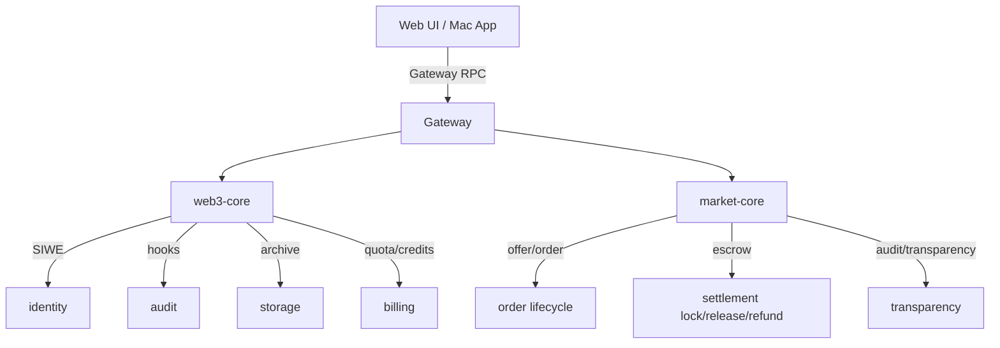

## 范围与目标

本文档定义 OpenClaw 作为“链上用户最方便的管家入口”时，Web3 Market 的**默认体验**与**可实现规范**。

- **默认生态（1-2 个）**：EVM/Base + IPFS（Pinata + `w3s.link`）作为默认体验；开发环境可用 Sepolia。
- **默认结算策略**：开放市场默认 **预付锁定（escrow）**；信任域可选 **会话后付**。
- **实现约束**：不侵入 OpenClaw 核心逻辑，仅通过插件 hooks / gateway methods / services 扩展；链/存储不可用时必须可降级。

## 架构（插件联动）

## 默认生态选择（基于代码现状）

### 链：EVM / Base

- `web3-core` 默认网络：`base`
- `market-core` 默认网络：`base`
- 支持网络枚举：`base | optimism | arbitrum | ethereum | sepolia`

### 存储：IPFS 默认，Filecoin/web3.storage 可选

`web3-core` 支持的存储 provider：

- `ipfs`：通过 Pinata pinning API 上传（需要 `storage.pinataJwt`），读取默认走 `https://w3s.link`。
- `filecoin`：通过 `https://api.web3.storage/upload` 上传（需要 `storage.filecoinToken`），读取默认走 `https://w3s.link`。
- `arweave`：需要 `storage.arweaveKeyfile`。

> 备注：`w3up-client`/Storacha 属于更现代的栈，但当前代码里还未直接接入；可以作为后续 adapter 增强项。

## 接口：已有 Gateway 方法（可直接集成）

> 对外入口统一为 `web3.*`；`market.*` 仅供 `web3-core` 与受信运维使用。

### `web3-core`（已存在）

- `web3.capabilities.list`（params: `includeUnavailable?`, `includeDetails?`, `group?`）
- `web3.capabilities.describe`（params: `name`, `includeUnavailable?`）
- `web3.siwe.challenge`（params: `address`）
- `web3.siwe.verify`（params: `message`, `signature`）
- `web3.audit.query`（params: `limit?`）
- `web3.billing.status`（params: `sessionIdHash`）
- `web3.billing.summary`（params: `sessionKey?`, `sessionId?`, `senderId?`, `sessionIdHash?`）
- `web3.status.summary`（no params）

> `web3.capabilities.*` 是 UI/Agent 构造调用的权威入口：能力描述应包含字段级 `paramsSchema`、常见稳定错误码集合（以 `web3-market-resource-api.md` 为准）与最小示例，且不得泄露 `accessToken`、Provider `endpoint` 或真实路径。

### `market-core`（已存在，内部权威层）

> `market.*` 属于内部权威方法，仅供 `web3-core` 与受信运维使用；对外入口统一为 `web3.*`。

交易与结算（Offer/Order/Settlement/Consent/Delivery/Transparency）：

- Offer：`market.offer.create|publish|update|close`
- Order：`market.order.create|cancel`
- Settlement：`market.settlement.lock|release|refund|status`
- Consent：`market.consent.grant|revoke`
- Delivery：`market.delivery.issue|complete|revoke`
- Transparency：`market.status.summary` `market.audit.query` `market.transparency.summary` `market.transparency.trace`

资源共享（resources/leases/ledger）：

- Resource：`market.resource.publish|unpublish|get|list`
- Lease：`market.lease.issue|revoke|get|list|expireSweep`
- Ledger：`market.ledger.append|list|summary`
- Repair：`market.repair.retry`

资源共享的详细 API 契约与 Provider routes 见：[/reference/web3-resource-market-api](/reference/web3-resource-market-api)。

## 状态机（严格按 `market-core` 实现）

### Order 状态机

- `order_created` → `payment_locked` → `consent_granted` → `delivery_ready` → `delivery_completed` → `settlement_completed`
- 取消/撤回分支：
  - `order_created` → `order_cancelled`
  - `payment_locked` → `settlement_cancelled`
  - `consent_granted` → `consent_revoked` → `settlement_cancelled`

### Settlement 状态机

- `settlement_locked` → `settlement_released`
- `settlement_locked` → `settlement_refunded`

## 默认结算策略规范（你已确认）

### 1) 开放市场（默认）：预付锁定 + 自动退款 + 部分结算 + 争议窗口

#### 目标

- 对供给侧公平：避免节点“交付后收不到钱”。
- 对需求侧公平：资金锁在 escrow，不直接交给节点；不合格可退款/争议。

#### 规则（MVP 可实现版）

- **锁定模式**：优先实现“按预算锁定”。
  - 触发时机：在执行前（`before_tool_call`）或在会话开始时创建订单并锁定预算。
  - 对应接口：`market.order.create` + `market.settlement.lock`。

- **争议窗口**：默认 `disputeWindowSec = 600`。
  - MVP 实现方式：
    - 交付完成后不立即调用 `release`，而是进入“待释放”状态；
    - 到期自动释放（后台 service）；
    - 若争议发生则走退款或人工仲裁策略。

- **超时自动退款**：超过 TTL 未交付。
  - 对应接口：`market.settlement.refund`（需要 `payer`，可带 `reason`）。

- **部分结算（按比例释放）**：
  - 在 `market.settlement.release` 中传入 payees + amounts，实现分次释放。
  - 比例依据：必须来自可验证的 usage（例如 creditsUsed、LLM/tool call 计数、或里程碑事件）。

> 注：`market-core` 当前未内置“dispute”网关方法。MVP 可以先实现“延迟释放 + 人工仲裁/退款”策略，后续再补 `market.dispute.*`。

### 2) 信任域（可选）：会话后付 + cap + 限速

- 适用范围：allowlist 节点、同一操作者控制的节点、或可信组织内部。
- 实现建议：
  - `web3-core` 继续用 `credits` 做实时门禁（`before_tool_call`）。
  - `session_end` 汇总 usage 后生成订单并结算（锁定/释放可合并为单次 release，或直接走 off-chain 结算模式）。

## UI 与产品集成要求（最小可用）

- 必须展示：钱包绑定状态、审计/锚定状态、归档 CID、credits/配额、订单/结算状态。
- 遇到链/存储不可用：必须继续允许 OpenClaw 正常工作，只在 UI 上提示“未锚定/未归档/未结算”。

## 相关文档

- `web3-core` 插件：[/plugins/web3-core](/plugins/web3-core)
- `web3-core` 开发者文档：[/plugins/web3-core-dev](/plugins/web3-core-dev)
- `market-core` 插件：[/plugins/market-core](/plugins/market-core)
- Web3 Market 概览：[/concepts/web3-market](/concepts/web3-market)
- Web3 资源共享 API 契约：[/reference/web3-resource-market-api](/reference/web3-resource-market-api)
