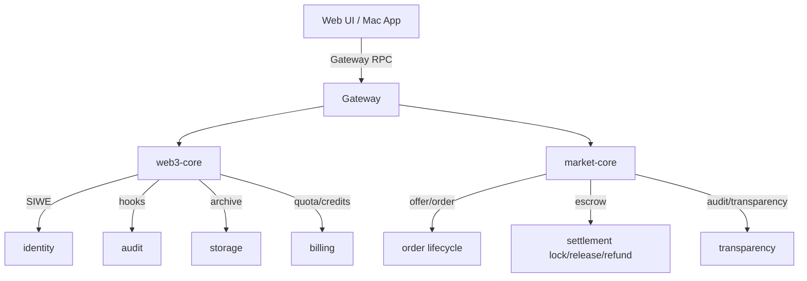

## 范围与目标

本文档定义 OpenClaw 作为“链上用户最方便的管家入口”时，Web3 Market 的**默认体验**与**可实现规范**。

- **默认生态（1-2 个）**：默认以 **EVM/Base + IPFS（Pinata + `w3s.link`）** 作为“可落地 MVP”体验；开发环境可用 Sepolia。
- **双栈口径（TON+EVM）**：统一口径已定义（参见 `docs/web3/WEB3_DUAL_STACK_STRATEGY.md` 与 `docs/reference/web3-dual-stack-payments-and-settlement.md`），当前 **EVM** 路径已成熟，**TON** 端到端结算闭环已实现（见 `docs/web3/TON_E2E_SETTLEMENT.md`）。
- **默认结算策略**：开放市场默认 **预付锁定（escrow）**；信任域可选 **会话后付**。
- **实现约束**：不侵入 OpenClaw 核心逻辑，仅通过插件 hooks / gateway methods / services 扩展；链/存储不可用时必须可降级。

## 架构（插件联动）

```mermaid
graph TD
  UI[Web UI / Mac App] -->|Gateway RPC| GW[Gateway]

  GW --> W3[web3-core]
  GW --> MKT[market-core]

  W3 -->|SIWE| ID[identity]
  W3 -->|hooks| AUD[audit]
  W3 -->|archive| DST[storage]
  W3 -->|quota/credits| BILL[billing]

  MKT -->|offer/order| ORDER[order lifecycle]
  MKT -->|escrow| ESCROW[settlement lock/release/refund]
  MKT -->|audit/transparency| TRACE[transparency]
```

## P2P 协同算力落位（OpenClaw 视角）

如果你正在把 `Web3 Market` 扩展到“算力池节点 + 个人电脑子节点”的 P2P 协同场景，请坚持以下边界：

- **`web3-core` 是控制面**：对外统一入口、能力发现、监控、计费门禁、状态摘要。
- **`market-core` 是权威经济层**：资源、租约、账本、结算、争议、奖励、任务与隐私状态机。
- **执行引擎不必内建在 OpenClaw 内核中**：可由外部运行时承接，例如 `vLLM`、`TensorRT-LLM`、`exo`、`llama.cpp` 一类系统。
- **优先做可信组圈，不先做开放公网**：这比一开始追求匿名网络更符合隐私、稳定性和产品现实。

如果你要进一步做这条方向，请继续阅读：

- 专题总览：[/web3/p2p-openclaw-index](/web3/p2p-openclaw-index)
- 战略判断：[/web3/p2p-openclaw-thesis](/web3/p2p-openclaw-thesis)
- 研究索引：[/reference/web3-p2p-research-landscape](/reference/web3-p2p-research-landscape)
- 架构落地图：[/reference/web3-p2p-openclaw-architecture](/reference/web3-p2p-openclaw-architecture)
- 验证手册：[/reference/web3-p2p-validation-playbook](/reference/web3-p2p-validation-playbook)

## 链策略：当前运行时事实 vs 下一阶段方向

### 当前运行时事实

- 当前默认链路仍是 **`EVM` 主线 + `TON` 双栈支付入口**。
- 这部分描述的是**现在代码已经在跑的事实**，不是长期唯一方向。

### 下一阶段方向：`Sui-first` Agentic Commerce

如果 `OpenClaw` 要继续往“万物皆可交易 / AI-to-AI 商务流”推进，推荐的长期分工是：

- **`Sui`**：对象化权利与结算语义层（`Capability / Lease / Receipt / Escrow / Reward`）
- **`EVM`**：稳定币、桥接、金库、外部流动性与 DeFi 兼容
- **`TON`**：分发、轻量支付、Telegram 场景触达

设计上应坚持：

- **链上只放权利与结算对象，不放真实执行载荷**
- **发现、报价、调度与执行尽量留在链下**
- **优先使用 `Owned Object first` 路径，避免把热交易都压进共享对象**

详细架构与对象模型见：[/reference/web3-sui-first-architecture](/reference/web3-sui-first-architecture)

## 默认生态选择（基于代码现状）

### 链：EVM（默认） + TON（已实现的双栈支付入口）

- **EVM（默认）**：
  - `web3-core` 默认网络：`base`
  - `market-core` 默认网络：`base`
  - 支持网络枚举：`base | optimism | arbitrum | ethereum | sepolia`
- **TON（已实现的双栈支付入口）**：
  - 目标用于“前台分发/轻量支付/回执”，并通过统一口径映射到同一订单/对账摘要。
  - 当前已具备 TON 支付/回执/结算主路径；统一对象模型与输出格式见：`docs/reference/web3-dual-stack-payments-and-settlement.md`。
  - 边界：TON provider 事件轮询链路中的 `checkNewTransactions()` 仍为 TODO，不应表述为已完成能力。

### 存储：IPFS 默认，Filecoin/web3.storage 可选

`web3-core` 支持的存储 provider：

- `ipfs`：通过 Pinata pinning API 上传（需要 `storage.pinataJwt`），读取默认走 `https://w3s.link`。
- `filecoin`：通过 `https://api.web3.storage/upload` 上传（需要 `storage.filecoinToken`），读取默认走 `https://w3s.link`。
- `arweave`：需要 `storage.arweaveKeyfile`。

> 备注：`w3up-client`/Storacha 属于更现代的栈，但当前代码里还未直接接入；可以作为后续 adapter 增强项。

## 契约治理（工业级规则）

- **运行时真相**：`extensions/web3-core/src/index.ts` 与 `extensions/market-core/src/index.ts`
- **对外稳定契约**：`web3.capabilities.*`（包含 `paramsSchema`、`stability`、风险提示、最小示例）
- **配置契约**：各插件 `openclaw.plugin.json`
- **本文定位**：开发导读与分组摘要；字段级 `params` / `returns` / `stability` 以 capability/schema 为准，不以手工表格为准

## 接口：已有 Gateway 方法（按当前代码分组）

> 对外入口统一为 `web3.*`；`market.*` 仅供 `web3-core` 与受信运维使用。

### `web3-core`（对外入口；是否可用与稳定性以 `web3.capabilities.*` 为准）

- **Capabilities**：`web3.capabilities.list` `web3.capabilities.describe`
- **Identity**：`web3.siwe.challenge` `web3.siwe.verify` `web3.identity.resolveEns` `web3.identity.reverseEns`
- **Wallet**：`web3.wallet.create` `web3.wallet.balance` `web3.wallet.sign` `web3.wallet.send` `web3.wallet.autopay`
- **Audit / Billing / Status**：`web3.audit.query` `web3.billing.status` `web3.billing.summary` `web3.billing.paymentTrace.query` `web3.billing.handlePaymentRequired` `web3.billing.consumePaymentRequired` `web3.status.summary`
- **Reward**：`web3.reward.get` `web3.reward.list` `web3.reward.claim` `web3.reward.updateStatus`
- **Market public surface**：`web3.market.resource.*` `web3.market.order.list` `web3.market.settlement.query` `web3.market.lease.*` `web3.market.service.proof.*` `web3.market.ledger.*` `web3.market.reputation.summary` `web3.market.tokenEconomy.*` `web3.market.bridge.*` `web3.market.metrics.snapshot` `web3.market.reconciliation.summary` `web3.market.status.summary` `web3.market.dispute.*`
- **Task Market**：`web3.market.task.publish|get|list|cancel|expireSweep` `web3.market.task.bid.place|list|award` `web3.market.task.result.submit|review` `web3.market.task.receipt.get|list`
- **Privacy / Consent**：`web3.market.consent.list|get` `web3.market.privacy.assets` `web3.market.privacy.replay.generate|list` `web3.market.privacy.erase`
- **Compatibility aliases**：`web3.resources.publish` `web3.resources.unpublish` `web3.resources.list` `web3.resources.lease` `web3.resources.revokeLease` `web3.resources.status`
- **Discovery / Monitoring**：`web3.index.*` `web3.metrics.*` `web3.monitor.*`

> `web3.capabilities.*` 是 UI/Agent 构造调用的权威入口；能力描述不得泄露 `accessToken`、Provider `endpoint` 或真实路径。
>
> 当前边界：`web3.wallet.sign` 依赖底层 `agent-wallet.sign`，因此仅在 EVM 模式可用；TON 签名仍未支持，应明确降级说明。

### `market-core`（内部权威层；当前运行时 inventory）

> `market.*` 属于内部权威方法，仅供 `web3-core` 与受信运维使用；对外入口统一为 `web3.*`。

交易与结算（Offer/Order/Settlement/Consent/Delivery/Transparency）：

- Offer：`market.offer.create|publish|update|close`
- Order：`market.order.create|cancel|list`
- Settlement：`market.settlement.lock|release|refund|status|query`
- Consent：`market.consent.grant|revoke`
- Delivery：`market.delivery.issue|complete|revoke`
- ServiceProof：`market.service.proof.submit|get|list`
- Dispute：`market.dispute.open|submitEvidence|resolve|reject|get|list`
- Transparency：`market.status.summary` `market.audit.query` `market.transparency.summary` `market.transparency.trace`

任务市场（Task Market）：

- TaskOrder：`market.task.publish|get|list|cancel|expireSweep`
- TaskBid：`market.task.bid.place|list|award`
- TaskResult：`market.task.result.submit|review`
- TaskReceipt：`market.task.receipt.get|list`

隐私与 Consent 管理：

- Consent 查询：`market.consent.list|get`
- 知识资产：`market.privacy.assets`
- 合规回放：`market.privacy.replay.generate|list`
- 删除/保留：`market.privacy.erase`

资源共享与运营：

- Resource：`market.resource.publish|unpublish|get|list`
- Lease：`market.lease.issue|revoke|get|list|expireSweep`
- Ledger：`market.ledger.append|list|summary`
- Reputation：`market.reputation.summary`
- Reward：`market.reward.create|get|list|issueClaim|updateStatus`
- TokenEconomy：`market.tokenEconomy.summary|configure|mint|burn|governance.update`
- Bridge：`market.bridge.routes|request|update|status|list`
- Metrics：`market.metrics.snapshot`
- Repair / Revocation：`market.repair.retry` `market.revocation.retry`

资源共享的详细 API 契约与 Provider routes 见：[/reference/web3-resource-market-api](/reference/web3-resource-market-api)。

## 状态机（严格按 `market-core` 实现）

### Order 状态机

- `order_created` → `payment_locked` → `consent_granted` → `delivery_ready` → `delivery_completed` → `settlement_completed`
- 取消/撤回分支：
  - `order_created` → `order_cancelled`
  - `payment_locked` → `settlement_cancelled`
  - `consent_granted` → `consent_revoked` → `settlement_cancelled`

### Settlement 状态机

- `settlement_locked` → `settlement_released`
- `settlement_locked` → `settlement_refunded`

### TaskOrder 状态机

- `task_open` → `task_awarded` → `task_closed`
- 取消：`task_open` → `task_cancelled`
- 过期：`task_open` → `task_expired`

### TaskBid 状态机

- `bid_submitted` → `bid_accepted` | `bid_rejected` | `bid_withdrawn`

### TaskResult 状态机

- `result_submitted` → `result_accepted`（触发结算释放）
- `result_submitted` → `result_rejected`（触发争议创建）

### Task 与 Order/Settlement 联动

- 授标时（`awardBid`）：创建 Order（`delivery_completed`）+ Settlement lock
- 验收通过（`reviewResult accept`）：释放结算 → Order → `settlement_completed` → Task → `task_closed` → 生成 Receipt
- 验收拒绝（`reviewResult reject`）：创建 Dispute → Result → `result_rejected`

### Dispute 状态机

- `dispute_opened` → `dispute_resolved` | `dispute_rejected`
- 注意：Dispute 状态机不允许自迁移（`dispute_opened → dispute_opened` 会抛出 `E_CONFLICT`）

## 默认结算策略规范（你已确认）

### 1) 开放市场（默认）：预付锁定 + 自动退款 + 部分结算 + 争议窗口

#### 目标

- 对供给侧公平：避免节点“交付后收不到钱”。
- 对需求侧公平：资金锁在 escrow，不直接交给节点；不合格可退款/争议。

#### 规则（MVP 可实现版）

- **锁定模式**：优先实现“按预算锁定”。
  - 触发时机：在执行前（`before_tool_call`）或在会话开始时创建订单并锁定预算。
  - 对应接口：`market.order.create` + `market.settlement.lock`。

- **争议窗口**：默认 `disputeWindowSec = 600`。
  - MVP 实现方式：
    - 交付完成后不立即调用 `release`，而是进入“待释放”状态；
    - 到期自动释放（后台 service）；
    - 若争议发生则走退款或人工仲裁策略。

- **超时自动退款**：超过 TTL 未交付。
  - 对应接口：`market.settlement.refund`（需要 `payer`，可带 `reason`）。

- **部分结算（按比例释放）**：
  - 在 `market.settlement.release` 中传入 payees + amounts，实现分次释放。
  - 比例依据：必须来自可验证的 usage（例如 creditsUsed、LLM/tool call 计数、或里程碑事件）。

> 注：`market-core` 已内置 `market.dispute.*`。MVP 可直接采用“延迟释放 + 争议窗口 + 争议/退款流程”组合策略。

### 2) 信任域（可选）：会话后付 + cap + 限速

- 适用范围：allowlist 节点、同一操作者控制的节点、或可信组织内部。
- 实现建议：
  - `web3-core` 继续用 `credits` 做实时门禁（`before_tool_call`）。
  - `session_end` 汇总 usage 后生成订单并结算（锁定/释放可合并为单次 release，或直接走 off-chain 结算模式）。

## UI 与产品集成要求（最小可用）

- 必须展示：钱包绑定状态、审计/锚定状态、归档 CID、credits/配额、订单/结算状态。
- 必须提供一页式入口：`/web3` 命令 + UI Web3 Tab（身份/计费/审计/市场健康度 + 下一步动作）。
- 遇到链/存储不可用：必须继续允许 OpenClaw 正常工作，只在 UI 上提示“未锚定/未归档/未结算”。

## 相关文档

- `web3-core` 插件：[/plugins/web3-core](/plugins/web3-core)
- `web3-core` 开发者文档：[/plugins/web3-core-dev](/plugins/web3-core-dev)
- `market-core` 插件：[/plugins/market-core](/plugins/market-core)
- Web3 Market 概览：[/concepts/web3-market](/concepts/web3-market)
- Web3 资源共享 API 契约：[/reference/web3-resource-market-api](/reference/web3-resource-market-api)
- AI 管家黄金路径：[/web3/ai-steward-golden-path](/web3/ai-steward-golden-path)
- 双栈总规划（TON+EVM）：`docs/web3/WEB3_DUAL_STACK_STRATEGY.md`
- 双栈支付与结算参考：[/reference/web3-dual-stack-payments-and-settlement](/reference/web3-dual-stack-payments-and-settlement)
- Sui-first 架构草案：[/reference/web3-sui-first-architecture](/reference/web3-sui-first-architecture)
- EaaS 协议规范：[/reference/web3-eaas-protocol-spec](/reference/web3-eaas-protocol-spec)
- EaaS 开发指南：[/reference/web3-eaas-developer-guide](/reference/web3-eaas-developer-guide)
- GA 运维 Runbook：[/reference/web3-ga-runbook](/reference/web3-ga-runbook)
