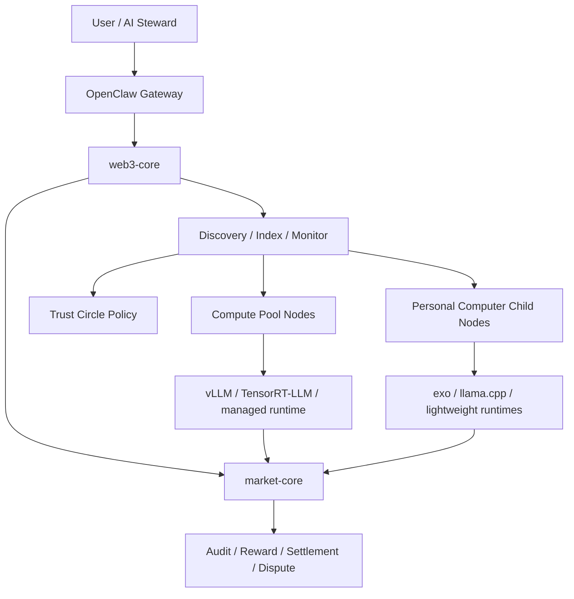

# OpenClaw P2P 协同算力架构落地图

> **Status**: Architecture guidance  
> **Updated**: 2026-03-09  
> **Goal**: 把“P2P 协同算力”从外部研究概念，映射到 `OpenClaw` 仓库已经存在的 Web3 与市场能力上，并明确下一阶段应该怎么演进。

## 1. 先说结论

`OpenClaw` 当前最适合扮演的角色，不是“直接实现一套极限低延迟的层级并行推理引擎”，而是：

> **P2P 协同算力网络的控制面、经济面与可信协作面。**

也就是说：

- **执行面** 可以由外部推理/执行系统承接（如 `vLLM`、`TensorRT-LLM`、`exo`、`llama.cpp` 等）
- **OpenClaw** 负责把这些执行节点纳入：
  - 发现
  - 身份与可信组圈
  - 租约
  - 账本
  - 结算
  - 奖励
  - 争议
  - 审计
  - 隐私边界

这比“一上来自己做完整分层推理框架”更符合当前仓库能力与工业推进顺序。

## 2. 当前仓库已经有哪些可复用锚点

基于当前文档与运行时注册面，`OpenClaw` 已经具备下列关键锚点：

### 2.1 `web3-core`：控制平面与公共入口

当前仓库中，`web3-core` 已经承担：

- 身份与钱包绑定
- 审计与锚定
- 去中心化归档
- 计费保护与支付要求处理
- Discovery / Index
- 监控与告警
- `web3.*` / `web3.market.*` 公共入口
- Market 相关公共代理面

这意味着 `web3-core` 已经天然适合做：

- 节点发现与能力目录
- 可信圈策略入口
- 对外统一编排面
- 监控与状态汇总

### 2.2 `market-core`：权威经济状态机

当前仓库中，`market-core` 已经承担：

- Resource Registry
- Lease Manager
- Ledger
- Settlement
- Dispute
- Reward
- Task Market
- Privacy / Consent 管理

并且它仍然遵守一条最关键的工业级约束：

> **对外统一走 `web3.*` / `web3.market.*`，内部权威执行由 `market-core` 完成。**

这对 P2P 协同算力非常关键，因为它意味着：

- 节点协同不必直接暴露内部状态机
- 对外契约稳定
- 经济与安全边界能保持集中治理

### 2.3 安全边界已经是现成约束

现有文档已经多次强调：

- 不得泄露 `accessToken`
- 不得泄露 provider endpoint
- 不得泄露真实路径
- 日志、错误、状态输出都必须脱敏

这正好适合作为 P2P 协同算力的默认安全底线。

## 3. 推荐的系统角色划分

### 3.1 角色总览

### 3.2 四层职责

#### A. 控制平面：`web3-core`

负责：

- 统一对外入口
- 能力发现与目录聚合
- 节点身份接入
- 监控与健康摘要
- 计费门禁
- 与 `market-core` 的公共编排对接

#### B. 权威市场平面：`market-core`

负责：

- 资源发布
- 租约签发与撤销
- 账本追加与汇总
- 结算锁定/释放/退款
- 争议与证据
- 奖励与激励
- 任务市场与隐私治理

#### C. 执行平面：外部运行时 / 节点执行器

负责：

- 真正执行推理或任务
- 资源计量
- 结果产出
- 回执或可验证执行结果

它们可以是：

- `vLLM` / `TensorRT-LLM`：更偏算力池
- `exo` / `distributed-llama` / `llama.cpp`：更偏个人设备与轻量执行面

#### D. 信任与策略平面：Trust Circle

负责：

- 节点是否能加入某个圈
- 某类工作负载是否允许发给某类节点
- 哪些节点可见某类能力
- 哪些数据能离开本地主机或本组织边界

## 4. 两类供给侧的架构定位

### 4.1 算力池节点（Pool Nodes）

推荐定位：

- **主承载层**
- **稳定容量层**
- **高价值 / 低风险工作负载的默认去向**

适合承接：

- 需要更稳吞吐的模型服务
- 结算基线容量
- 批量任务与高并发任务
- 可信圈外但经过认证的商业供给

推荐特征：

- 更高在线率
- 可测的 SLA
- 监控更完善
- 与 `market-core` 的结算对接更稳定

### 4.2 个人电脑子节点（Personal Child Nodes）

推荐定位：

- **边际补峰层**
- **本地优先层**
- **可信圈协同层**

适合承接：

- 批处理任务
- 异步 Agent 工作流
- 夜间任务
- 组织或熟人圈内的私有协同任务
- 不需要极致 95/99 分位延迟的任务

不建议第一阶段承接：

- 公网匿名在线主脑逐 token 解码
- 对时延极其敏感的生产级在线会话

## 5. 为什么要把“可信组圈”当成一等架构对象

如果没有可信组圈，P2P 协同算力会立刻面对以下问题：

- 节点身份无法可靠绑定
- 恶意节点与低质量节点难以过滤
- Prompt / 中间状态跨节点暴露风险更高
- 争议成本迅速变高
- 供给质量无法稳定建模

因此，推荐把 **Trust Circle** 当成独立的策略对象，而不是一条附属配置。

### 5.1 推荐的组圈类型

- **家庭圈**：家中设备 + 家庭成员设备
- **好友圈**：熟人设备共享与互助计算
- **团队圈**：公司/项目组内部协同算力
- **组织圈**：带白名单、准入与角色分层的正式组织网络

### 5.2 推荐的策略维度

每个 Circle 至少应约束：

- 成员身份与加入方式
- 可发布能力类别
- 可接收任务类别
- 数据外流等级
- 最大预算与结算方式
- 是否允许个人节点参与实时任务
- 是否要求额外审计或回放

## 6. 数据与隐私边界

### 6.1 当前应坚持的最低原则

在 P2P 协同算力场景中，以下原则不应放松：

- **最小披露**：能不出圈的数据就不出圈
- **最小可见性**：消费者不应天然看到 provider endpoint
- **一次性凭证**：租约凭证只在必要时短暂暴露一次
- **可审计**：关键动作都必须有追踪面

### 6.2 需要重点防守的敏感面

- 原始 Prompt
- 私有上下文与长期记忆
- 中间激活值 / KV cache（若未来做更细粒度协同推理）
- `accessToken`
- provider endpoint
- 节点真实路径、内网地址与运维细节

### 6.3 当前最现实的隐私策略

对于第一阶段验证，我建议：

- 只在可信圈内开放高敏任务
- 默认先跑**异步任务**而不是**实时解码路径**
- 对跨节点任务采用严格的最小输入原则
- 所有对账、状态、日志、工具结果坚持脱敏

## 7. 推荐的最小生命周期

下面是一条适合 `OpenClaw` 的协同算力最小闭环：

### 步骤 1：节点入网

- 节点通过 `Discovery / Index` 注册能力摘要
- 节点被标记为：算力池节点 / 个人电脑子节点
- 节点进入某个 `Trust Circle`

### 步骤 2：能力发布

- 由节点发布资源摘要
- `OpenClaw` 仅公开：能力、价格、SLA、健康度、策略标签
- 不公开 endpoint/token/path

### 步骤 3：任务或租约创建

- `AI Steward` 基于用户意图选择资源
- `market-core` 创建租约/任务/结算锁定
- `web3-core` 负责对外编排和状态摘要

### 步骤 4：执行与计量

- 任务被路由到合适节点
- 节点执行后返回结果与必要回执
- Provider 或执行器侧生成权威计量或可验证摘要

### 步骤 5：账本与结算

- `market-core` 写入账本
- 进入释放、退款或争议流程
- 必要时触发奖励与后续信誉更新

### 步骤 6：监控与审计

- `web3.monitor.*` 汇总健康度与告警
- `web3.audit.*` / 归档 / 锚定承接审计需求
- 对外只输出脱敏摘要

## 8. 当前已实现事实 vs 下一阶段目标态

| 主题                          | 当前仓库事实                                                               | 下一阶段建议                               |
| ----------------------------- | -------------------------------------------------------------------------- | ------------------------------------------ |
| 公共入口                      | 已有 `web3.*` / `web3.market.*` 单入口                                     | 保持不变，继续强化能力自描述               |
| 权威状态机                    | `market-core` 已覆盖资源、租约、账本、结算、争议、奖励、任务、隐私         | 保持其“经济权威层”定位                     |
| Discovery / Index             | 已有 `web3.index.*` 与发现相关模块                                         | 下一阶段补强圈子策略、健康度排序与多源发现 |
| Monitoring                    | 已有 `web3.monitor.*` 与监控模块                                           | 下一阶段强化节点质量评分与供给治理         |
| Reward / Settlement           | 已有 reward 与结算相关能力                                                 | 下一阶段用于节点激励与供给侧治理           |
| Fine-grained layer scheduling | 仓库内暂无可验证的专用逐层推理调度引擎                                     | 先把外部执行器当 Provider，不急于自研      |
| Trusted circle policy         | 已有 Discovery / Market / Privacy 作为基础，但尚未见专门文档化的组圈策略面 | 应优先补充为一等产品对象                   |

## 9. 推荐的工程决策

### 9.1 不先自研“最复杂的分层推理调度器”

推荐先把外部运行时看作节点执行面：

- `vLLM` / `TensorRT-LLM` 承接算力池
- `exo` / `llama.cpp` 一类承接个人设备

`OpenClaw` 负责其上层的：

- 发现
- 编排
- 凭证
- 审计
- 结算
- 争议

### 9.2 默认以“混合网络”而不是“纯 P2P 公网”设计

目标网络应是：

- 有稳定基线容量的池节点
- 有低成本补峰的个人节点
- 有可信圈的策略约束
- 有必要时回退到云的能力

### 9.3 默认把工作负载分级

推荐至少分成三类：

1. **强实时主脑路径**：优先池节点或本地强节点
2. **可排队异步路径**：优先可信圈个人节点 + 池节点补峰
3. **批处理 / 后台路径**：最适合先引入个人电脑子节点

## 10. 不应过度承诺的事项

在正式产品叙事中，不建议把以下内容说成当前已经具备：

- 公网匿名节点的稳定低延迟协同推理
- 通用逐层推理调度器已内建于 `OpenClaw`
- Prompt / 激活 / KV cache 跨节点隐私问题已经完全解决
- P2P 已经能够替代云算力主承载层

这些都更适合写成“下一阶段路线”而不是“当前事实”。

## 11. 建议的最终架构定位

最适合 `OpenClaw` 的高层定位是：

> **让 AI 私人管家能够把云算力、可信圈设备和市场化算力组织成一个统一的协同网络；其中，`OpenClaw` 负责控制、经济与治理，执行由可替换的运行时承接。**

这条路径的优点是：

- 与仓库现有能力高度一致
- 工程风险可控
- 便于分阶段验证
- 能同时容纳 `算力池节点` 和 `个人电脑子节点`
- 能把 P2P 做成“可信且可运营”的补充市场

## 相关文档

- [专题总览](/web3/p2p-openclaw-index)
- [战略判断](/web3/p2p-openclaw-thesis)
- [研究索引](/reference/web3-p2p-research-landscape)
- [验证手册](/reference/web3-p2p-validation-playbook)
- [Web3 Market（概览）](/concepts/web3-market)
- [Web3 Market Dev](/reference/web3-market-dev)
- [Web3 Core Plugin](/plugins/web3-core)
- [TON + EVM 双栈策略](/web3/WEB3_DUAL_STACK_STRATEGY)
