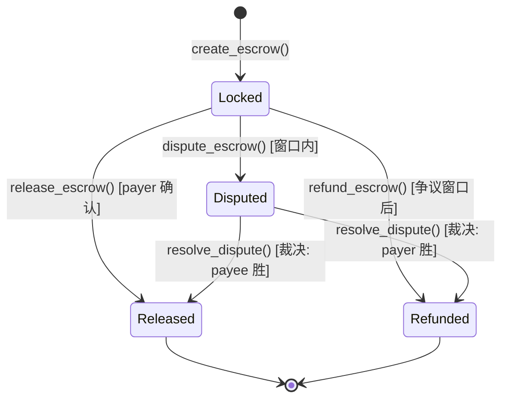
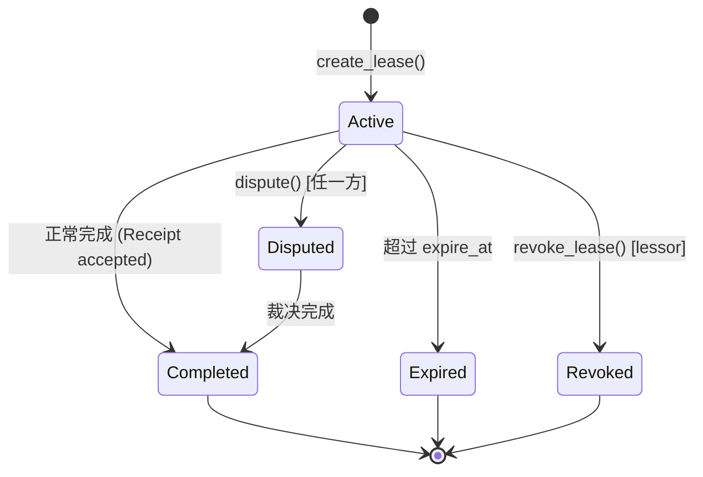
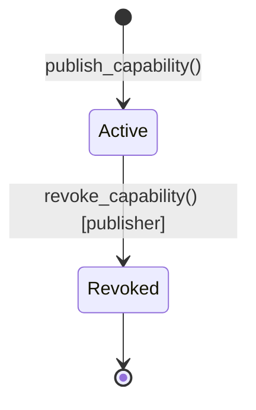
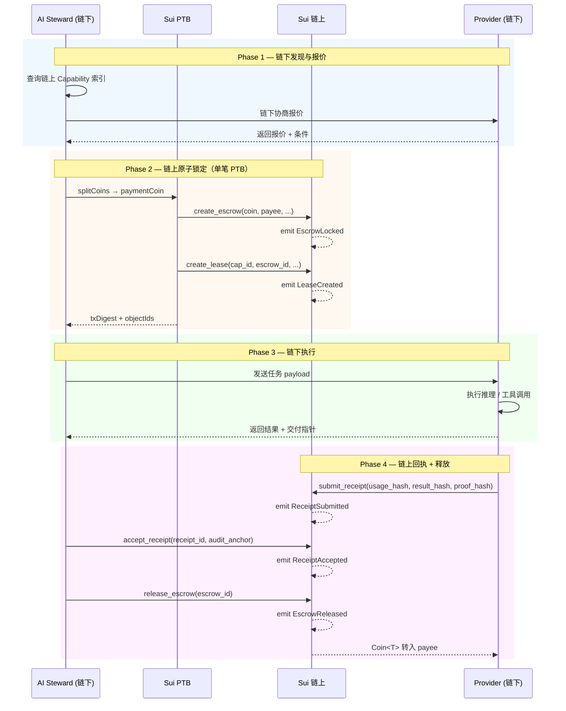

# Sui Move 协议草图 — 最小对象 Schema + PTB 交易流

> **Status**: Protocol Sketch (Draft)
> **Updated**: 2026-03-10
> **合约源码**: `extensions/blockchain-adapter/contracts/sui/openclaw_protocol/`
> **前置文档**: [Sui-first 架构草案](/reference/web3-sui-first-architecture)
> **平行参考**: [双栈支付与结算参考](/reference/web3-dual-stack-payments-and-settlement)

---

## 1. 概述

本文档是 [OpenClaw Web3 Sui-first 架构草案](/reference/web3-sui-first-architecture) §7 五件套对象模型的**可实现协议草图**。交付物为：

1. **两个 Move 模块**的最小可编译 schema（struct + entry function + event）
2. **PTB 多步原子编排伪代码**（TypeScript `@mysten/sui` SDK 风格）
3. **状态迁移图**（Mermaid）
4. **三链对照表**（Sui vs EVM vs TON）
5. **安全不变量汇总**

### 设计原则

| 原则                     | 描述                                                                         |
| ------------------------ | ---------------------------------------------------------------------------- |
| **Owned Object first**   | 五件套全部为 Owned Object（`key, store`），单一持有者，低冲突路径            |
| **Shared Object 最小化** | 仅 `MarketRegistry` 为 Shared Object（全局索引锚点），热交易不触及           |
| **Balance 内管**         | Escrow 内部用 `Balance<T>`，entry 入口接受 `Coin<T>` 并 `coin::into_balance` |
| **Hash-only 引用**       | 敏感引用一律 SHA-256 digest（`vector<u8>`），链上零泄露                      |
| **单向状态机**           | 状态以 `u8` 常量 + `assert` 强制跃迁，不可回退                               |

---

## 2. 模块拆分与对象概览

```
openclaw_protocol/
├── Move.toml
└── sources/
    ├── openclaw_market.move    # Capability + Lease + Receipt + MarketRegistry
    └── openclaw_escrow.move    # Escrow<T> + Reward
```

两个模块通过 `friend` 声明互操作。

### 2.1 对象一览表

| 对象             | 模块              | 所有权            | Abilities    | 语义                           |
| ---------------- | ----------------- | ----------------- | ------------ | ------------------------------ |
| `Capability`     | `openclaw_market` | Owned (publisher) | `key, store` | 卖的到底是什么能力             |
| `Lease`          | `openclaw_market` | Owned (lessee)    | `key, store` | 谁在什么条件下获得访问权       |
| `Receipt`        | `openclaw_market` | Owned (executor)  | `key, store` | 某次交付已发生的可审计凭证     |
| `MarketRegistry` | `openclaw_market` | **Shared**        | `key`        | 全局能力索引锚点（唯一共享面） |
| `Escrow<T>`      | `openclaw_escrow` | Owned (payer)     | `key, store` | 资金锁定、释放与争议           |
| `Reward`         | `openclaw_escrow` | Owned (subject)   | `key, store` | 奖励语义与领取凭证             |

### 2.2 核心字段映射（草案 §7 → Move struct）

#### Capability

| 草案字段                  | Move 字段                 | 类型         | 说明                         |
| ------------------------- | ------------------------- | ------------ | ---------------------------- |
| `capability_id`           | `id: UID`                 | `UID`        | Sui 原生对象 ID              |
| `publisher`               | `publisher`               | `address`    | 发布者                       |
| `category`                | `category`                | `vector<u8>` | model / tool / dataset / ... |
| `service_ref_hash`        | `service_ref_hash`        | `vector<u8>` | SHA-256, 32 bytes            |
| `pricing_policy_ref`      | `pricing_policy_ref`      | `vector<u8>` | 定价策略 hash                |
| `visibility_policy`       | `visibility_policy`       | `u8`         | 可见性标识                   |
| `sla_policy_ref`          | `sla_policy_ref`          | `vector<u8>` | SLA hash                     |
| `settlement_asset_policy` | `settlement_asset_policy` | `u8`         | 结算资产标识                 |
| `metadata_hash`           | `metadata_hash`           | `vector<u8>` | 元数据 hash                  |
| `status`                  | `status`                  | `u8`         | ACTIVE / REVOKED             |

#### Escrow

| 草案字段                  | Move 字段            | 类型         | 说明                                    |
| ------------------------- | -------------------- | ------------ | --------------------------------------- |
| `escrow_id`               | `id: UID`            | `UID`        | 对象 ID                                 |
| `payer`                   | `payer`              | `address`    | 付款方                                  |
| `payee`                   | `payee`              | `address`    | 收款方                                  |
| `asset` + `amount_locked` | `locked: Balance<T>` | `Balance<T>` | 泛型参数 T 即资产类型                   |
| `receipt_requirement`     | `receipt_required`   | `bool`       | 是否需要 Receipt 才能释放               |
| `dispute_window_sec`      | `dispute_window_sec` | `u64`        | 争议窗口                                |
| `status`                  | `status`             | `u8`         | LOCKED / RELEASED / REFUNDED / DISPUTED |

> 其余对象（Lease、Receipt、Reward）字段映射见合约源码注释。

---

## 3. 状态常量与状态迁移

### 3.1 状态常量定义

```move
// ── Capability ──
const STATUS_CAP_ACTIVE: u8    = 1;
const STATUS_CAP_REVOKED: u8   = 2;

// ── Lease ──
const STATUS_LEASE_ACTIVE: u8    = 1;
const STATUS_LEASE_COMPLETED: u8 = 2;
const STATUS_LEASE_EXPIRED: u8   = 3;
const STATUS_LEASE_REVOKED: u8   = 4;
const STATUS_LEASE_DISPUTED: u8  = 5;

// ── Receipt ──
const STATUS_RECEIPT_PENDING: u8  = 1;
const STATUS_RECEIPT_ACCEPTED: u8 = 2;
const STATUS_RECEIPT_REJECTED: u8 = 3;

// ── Escrow ──
const STATUS_ESCROW_LOCKED: u8    = 1;
const STATUS_ESCROW_RELEASED: u8  = 2;
const STATUS_ESCROW_REFUNDED: u8  = 3;
const STATUS_ESCROW_DISPUTED: u8  = 4;

// ── Reward ──
const STATUS_REWARD_PENDING: u8  = 1;
const STATUS_REWARD_CLAIMED: u8  = 2;
const STATUS_REWARD_EXPIRED: u8  = 3;
```

### 3.2 Escrow 状态迁移图



### 3.3 Lease 状态迁移图



### 3.4 Capability 状态迁移图



---

## 4. Entry Function 签名清单

### 4.1 openclaw_market 模块

| 函数                   | 调用者    | 效果                                   | 事件                  |
| ---------------------- | --------- | -------------------------------------- | --------------------- |
| `publish_capability()` | Provider  | 创建 Capability + 注册到 Registry      | `CapabilityPublished` |
| `revoke_capability()`  | Publisher | Capability 状态 → REVOKED              | `CapabilityRevoked`   |
| `create_lease()`       | Lessee    | 创建 Lease（配合 Escrow PTB 原子组合） | `LeaseCreated`        |
| `submit_receipt()`     | Executor  | 创建 Receipt（可审计摘要）             | `ReceiptSubmitted`    |
| `accept_receipt()`     | Lessee    | Receipt 状态 → ACCEPTED                | `ReceiptAccepted`     |

### 4.2 openclaw_escrow 模块

| 函数                  | 调用者            | 效果                                  | 事件             |
| --------------------- | ----------------- | ------------------------------------- | ---------------- |
| `create_escrow<T>()`  | Payer             | 创建 Escrow，Coin → Balance 锁定      | `EscrowLocked`   |
| `release_escrow<T>()` | Payer             | Balance → Coin 转给 payee             | `EscrowReleased` |
| `refund_escrow<T>()`  | Payer             | Balance → Coin 退还 payer（需窗口后） | `EscrowRefunded` |
| `dispute_escrow<T>()` | Payer/Payee       | 状态 → DISPUTED（窗口内）             | `EscrowDisputed` |
| `create_reward()`     | System/Governance | 创建 Reward → transfer 给 subject     | `RewardCreated`  |
| `claim_reward()`      | Subject           | Reward 状态 → CLAIMED                 | `RewardClaimed`  |

---

## 5. PTB 多步原子交易流

### 5.1 完整 Agent 商务流（Happy Path）

以下使用 `@mysten/sui` v1.x `Transaction` builder API 风格伪代码：

```typescript
import { Transaction } from "@mysten/sui/transactions";
import { SuiClient } from "@mysten/sui/client";

// ═══════════════════════════════════════════════════════
// Phase 1: 链下发现与报价（Off-chain）
// ═══════════════════════════════════════════════════════

// AI Steward 链下查询 MarketRegistry 索引
const capabilities = await client.getOwnedObjects({
  owner: providerAddress,
  filter: { StructType: `${PACKAGE_ID}::openclaw_market::Capability` },
});

// 链下选择候选 Capability、协商价格
const selectedCap = selectBestCapability(capabilities, budget);
const quoteResult = await negotiateOffChain(selectedCap, budget);

// ═══════════════════════════════════════════════════════
// Phase 2: 链上原子锁定（PTB — 单次提交）
// ═══════════════════════════════════════════════════════

const tx = new Transaction();

// Step 2a: 拆分支付 Coin
const [paymentCoin] = tx.splitCoins(tx.gas, [quoteResult.amount]);

// Step 2b: 创建 Escrow（锁定资金）
tx.moveCall({
  target: `${PACKAGE_ID}::openclaw_escrow::create_escrow`,
  typeArguments: ["0x2::sui::SUI"], // 或稳定币类型
  arguments: [
    paymentCoin, // Coin<T>
    tx.pure.address(providerAddress), // payee
    tx.pure.bool(true), // receipt_required
    tx.pure.u64(86400), // dispute_window_sec: 24h
    tx.object("0x6"), // Clock shared object
  ],
});

// Step 2c: 创建 Lease（签发租约）
tx.moveCall({
  target: `${PACKAGE_ID}::openclaw_market::create_lease`,
  arguments: [
    tx.pure.address(selectedCap.objectId), // capability_id
    tx.pure.address(providerAddress), // lessor
    tx.pure.u64(expireAt), // expire_at (ms)
    tx.pure.u64(quoteResult.amount), // usage_budget
    tx.pure.vector("u8", allowedScopes), // allowed_scopes
    tx.pure.vector("u8", credentialHash), // credential_delivery_ref_hash
    tx.pure.address(escrowObjectId), // escrow_id (from step 2b)
    tx.pure.u8(0), // revocation_policy
    tx.pure.u64(86400), // dispute_window_sec
    tx.object("0x6"), // Clock
  ],
});

// 原子提交 —— Escrow + Lease 同一事务创建
const result = await client.signAndExecuteTransaction({
  signer: buyerKeypair,
  transaction: tx,
});

// ═══════════════════════════════════════════════════════
// Phase 3: 链下执行（Off-chain inference / task）
// ═══════════════════════════════════════════════════════

// Provider 链下执行推理 / 工具调用 / 数据交付
const executionResult = await provider.execute(leaseId, taskPayload);
const usageSummaryHash = sha256(JSON.stringify(executionResult.usage));
const resultPointerHash = sha256(executionResult.deliveryPointer);

// ═══════════════════════════════════════════════════════
// Phase 4: 链上回执 + 释放结算（两笔交易）
// ═══════════════════════════════════════════════════════

// 4a: Provider 提交回执
const txReceipt = new Transaction();
txReceipt.moveCall({
  target: `${PACKAGE_ID}::openclaw_market::submit_receipt`,
  arguments: [
    txReceipt.object(leaseObjectId), // &Lease
    txReceipt.pure.vector("u8", usageSummaryHash),
    txReceipt.pure.vector("u8", resultPointerHash),
    txReceipt.pure.vector("u8", proofRefHash),
    txReceipt.object("0x6"), // Clock
  ],
});

await client.signAndExecuteTransaction({
  signer: providerKeypair,
  transaction: txReceipt,
});

// 4b: Buyer 验收回执
const txAccept = new Transaction();
txAccept.moveCall({
  target: `${PACKAGE_ID}::openclaw_market::accept_receipt`,
  arguments: [
    txAccept.object(receiptObjectId), // &mut Receipt
    txAccept.pure.vector("u8", auditAnchorRef),
  ],
});

await client.signAndExecuteTransaction({
  signer: buyerKeypair,
  transaction: txAccept,
});

// 4c: Buyer 释放 Escrow（资金流向 Provider）
const txRelease = new Transaction();
txRelease.moveCall({
  target: `${PACKAGE_ID}::openclaw_escrow::release_escrow`,
  typeArguments: ["0x2::sui::SUI"],
  arguments: [
    txRelease.object(escrowObjectId), // &mut Escrow<T>
    txRelease.object("0x6"), // Clock
  ],
});

await client.signAndExecuteTransaction({
  signer: buyerKeypair,
  transaction: txRelease,
});
```

### 5.2 争议路径（Unhappy Path）

```typescript
// ── 争议发起（payer 或 payee 在窗口内） ──
const txDispute = new Transaction();
txDispute.moveCall({
  target: `${PACKAGE_ID}::openclaw_escrow::dispute_escrow`,
  typeArguments: ["0x2::sui::SUI"],
  arguments: [
    txDispute.object(escrowObjectId),
    txDispute.object("0x6"), // Clock
  ],
});
await client.signAndExecuteTransaction({
  signer: disputerKeypair,
  transaction: txDispute,
});

// ── 链下仲裁 ──
// 争议进入后，资金冻结。链下仲裁机制（DAO / 多签委员会 / 自动裁决）
// 产出裁决结果后，由 governance 角色调用链上执行。

// ── 退款路径（争议窗口过后，无争议时 payer 可退款） ──
const txRefund = new Transaction();
txRefund.moveCall({
  target: `${PACKAGE_ID}::openclaw_escrow::refund_escrow`,
  typeArguments: ["0x2::sui::SUI"],
  arguments: [txRefund.object(escrowObjectId), txRefund.object("0x6")],
});
await client.signAndExecuteTransaction({
  signer: payerKeypair,
  transaction: txRefund,
});
```

### 5.3 奖励流

```typescript
// ── 系统创建奖励 ──
const txReward = new Transaction();
txReward.moveCall({
  target: `${PACKAGE_ID}::openclaw_escrow::create_reward`,
  arguments: [
    txReward.pure.address(providerAddress), // subject
    txReward.pure.u8(1), // reason_code: 推荐奖励
    txReward.pure.vector("u8", assetTypeHash),
    txReward.pure.u64(1000000), // amount
    txReward.pure.u8(0), // claim_policy: 即时
    txReward.pure.u8(0), // vesting_policy: 无归属期
    txReward.pure.vector("u8", sourceEventHash),
  ],
});

// ── Subject 领取 ──
const txClaim = new Transaction();
txClaim.moveCall({
  target: `${PACKAGE_ID}::openclaw_escrow::claim_reward`,
  arguments: [
    txClaim.object(rewardObjectId), // &mut Reward
  ],
});
```

---

## 6. 数据流序列图



---

## 7. 三链对照表

### 7.1 对象模型对齐

| 概念          | Sui Move                            | EVM (Solidity)                  | TON (FunC)                    |
| ------------- | ----------------------------------- | ------------------------------- | ----------------------------- |
| **能力描述**  | `Capability` (Owned Object)         | — (链下 + metadata hash)        | — (链下)                      |
| **租约**      | `Lease` (Owned Object)              | — (链下 market-core 账本)       | — (链下)                      |
| **回执**      | `Receipt` (Owned Object)            | PaymentReceipt (链下统一口径)   | PaymentReceipt (链下统一口径) |
| **资金托管**  | `Escrow<T>` (Owned Object, Balance) | RewardDistributor.sol (mapping) | settlement.fc (TL-B cell)     |
| **奖励**      | `Reward` (Owned Object)             | RewardDistributor.claimReward() | settlement.fc release()       |
| **索引/注册** | `MarketRegistry` (Shared Object)    | —                               | —                             |
| **身份验证**  | — (链原生 address + zkLogin)        | SIWE (EIP-4361)                 | TON Connect                   |
| **验签**      | Move 原生                           | EIP-712 ecrecover               | Ed25519 check_signature       |

### 7.2 状态机对齐

| 状态     | Sui Escrow                   | EVM RewardDistributor   | TON settlement.fc |
| -------- | ---------------------------- | ----------------------- | ----------------- |
| **锁定** | `STATUS_ESCROW_LOCKED (1)`   | (mapping balance > 0)   | `STATUS_LOCKED`   |
| **释放** | `STATUS_ESCROW_RELEASED (2)` | `RewardClaimed` event   | `STATUS_RELEASED` |
| **退款** | `STATUS_ESCROW_REFUNDED (3)` | (admin refund function) | `STATUS_REFUNDED` |
| **争议** | `STATUS_ESCROW_DISPUTED (4)` | (off-chain + admin)     | `STATUS_DISPUTED` |

### 7.3 三链分工定位

| 链      | 定位                   | OpenClaw 中的角色                                     |
| ------- | ---------------------- | ----------------------------------------------------- |
| **Sui** | 对象化权利与结算语义层 | Capability / Lease / Receipt / Escrow / Reward 五件套 |
| **EVM** | 稳定币与外部流动性入口 | RewardDistributor、USDC/USDT 桥接、DeFi 组合          |
| **TON** | 分发与轻量支付入口     | Telegram 场景触达、轻量支付、settlement 回执          |

---

## 8. 安全不变量汇总

### 8.1 链上零泄露

| 约束           | 描述                                                                                                                |
| -------------- | ------------------------------------------------------------------------------------------------------------------- |
| **无明文秘密** | endpoint / token / API key / 真实路径 **绝不上链**                                                                  |
| **Hash-only**  | `service_ref_hash`、`credential_delivery_ref_hash`、`usage_summary_hash`、`result_pointer_hash` 均为 SHA-256 digest |
| **大对象链下** | 推理结果、Prompt、模型权重、上下文 → 链下存储 + 链上 hash 指针                                                      |

### 8.2 状态机完整性

| 约束               | 描述                                                          |
| ------------------ | ------------------------------------------------------------- |
| **单向跃迁**       | Escrow: Locked → Released \| Refunded \| Disputed（不可回退） |
| **assert 强制**    | 每个 entry function 入口校验当前状态，非法跃迁 abort          |
| **与三链口径对齐** | EVM / TON / Sui 的 LOCKED/RELEASED/REFUNDED/DISPUTED 语义一致 |

### 8.3 权限控制

| 约束                  | 描述                                                            |
| --------------------- | --------------------------------------------------------------- |
| **Owned Object 隔离** | 只有对象持有者可调用 mutating entry function                    |
| **Sender 校验**       | `revoke_capability` 校验 publisher、`release_escrow` 校验 payer |
| **争议双方均可发起**  | `dispute_escrow` 允许 payer 或 payee（在窗口内）                |

### 8.4 经济安全

| 约束                  | 描述                                                     |
| --------------------- | -------------------------------------------------------- |
| **零金额拒绝**        | `create_escrow` 和 `create_reward` 均 assert amount > 0  |
| **争议窗口**          | 退款需等争议窗口过后；争议需在窗口内发起                 |
| **Balance 而非 Coin** | 内部用 `Balance<T>` 管理，避免 Coin 对象所有权传递复杂性 |

---

## 9. 编译与验证

### 9.1 本地编译

```bash
cd extensions/blockchain-adapter/contracts/sui/openclaw_protocol
sui move build
```

### 9.2 本地测试（预留）

```bash
sui move test
```

> **Note**: 当前为协议草图阶段，合约包含最小校验逻辑。完整单元测试将在下一阶段补齐。

### 9.3 发布到 Testnet

```bash
sui client publish --gas-budget 100000000
```

---

## 10. 路线图与边界说明

### 10.1 当前阶段（协议草图）

- ✅ 五件套 struct 定义 + abilities
- ✅ 状态常量 + 事件定义
- ✅ Entry function 签名 + 最小校验逻辑
- ✅ PTB 交易流伪代码
- ✅ 三链对照表

### 10.2 下一阶段（完整实现）

- ⬜ 完整争议裁决链上执行（`resolve_dispute`）
- ⬜ Coin 拆分与找零逻辑
- ⬜ 多签治理（AdminCap / GovernanceCap）
- ⬜ zkLogin 集成
- ⬜ 跨链桥接（Sui ↔ EVM Wormhole / Sui ↔ TON）
- ⬜ 单元测试与 devnet 部署验证

### 10.3 不应过度承诺

- 本草图是**协议设计稿**，不是生产就绪合约
- 不代表 Sui 已全量上线或替代 EVM/TON
- 链上对象设计不等于算力执行引擎
- 争议裁决的链下仲裁机制需独立设计

---

## 相关文档

- [Sui-first 架构草案](/reference/web3-sui-first-architecture)
- [双栈支付与结算参考](/reference/web3-dual-stack-payments-and-settlement)
- [OpenClaw P2P 协同算力架构落地图](/reference/web3-p2p-openclaw-architecture)
- [Web3 Market Dev](/reference/web3-market-dev)
- [双栈策略](/web3/WEB3_DUAL_STACK_STRATEGY)
