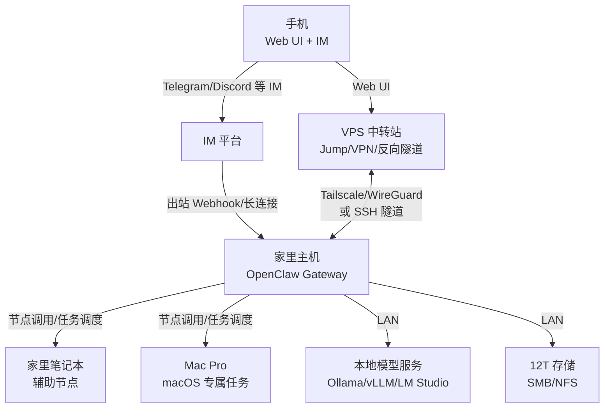

---
read_when:
  - 需要在家庭多机 + 外网中转的场景部署 OpenClaw
summary: 手机统一操控多台服务器/家用计算机的部署指南（VPS 中转 + 家庭算力）
title: 家庭中枢部署（外网中转 + 家庭算力）
---

# 家庭中枢部署（外网中转 + 家庭算力）

本指南面向以下场景：

- 你希望用手机同时操控多台机器（Web UI + IM 机器人）。
- 家里主机承担主要计算/本地模型服务。
- 一台外网 VPS 作为中转站，提升可达性与安全性。

## 架构流程图（Mermaid）



## 设备分工（你的四台设备）

| 设备                         | 角色           | 运行内容                                        | 主要连线                    |
| ---------------------------- | -------------- | ----------------------------------------------- | --------------------------- |
| 外网 VPS（2c4g）             | 中转站/跳板    | Tailscale/WireGuard 或 SSH 跳板（可选反向代理） | 手机 ↔ VPS ↔ 家里主机       |
| 家里主机（7950X3D + 3080Ti） | 核心执行面     | OpenClaw Gateway + 本地模型/数据服务            | 连接 IM 平台 + 接受中转访问 |
| 家里笔记本（i7 + 1050Ti）    | 辅助节点       | 轻量任务/备用执行                               | 通过安全链路连接 Gateway    |
| Mac Pro 2017（i7 + RX560）   | macOS 专属节点 | 桌面自动化/特定工具                             | 通过安全链路连接 Gateway    |

> 关键原则：**每台主机只跑一个 Gateway 网关**，其他机器以“节点/执行端”方式参与，保持状态和控制面集中。参见[多 Gateway 网关](/gateway/multiple-gateways)。

## 回连方案（两种都给）

### 方案 A：Tailscale / WireGuard（推荐）

**适用场景**：要让手机稳定访问 Web UI，且不希望暴露公网端口。

- 在 VPS、家里主机、笔记本、Mac Pro、手机上加入同一 tailnet/VPN。
- **家里主机**保持 Gateway 绑定在 loopback，使用 tailnet 访问即可。
- 手机直接访问 tailnet 内地址，Web UI 与 WebSocket 一致可用。

推荐阅读：[远程访问](/gateway/remote) 与 [网络模型](/gateway/network-model)。

### 方案 B：SSH 隧道（备用）

**适用场景**：已有 SSH 跳板体系，或临时访问排查问题。

- 家里主机对 VPS 建立反向隧道（出站即可）：

```bash
ssh -N -R 18789:127.0.0.1:18789 vps-user@vps-host
```

- 在 VPS 上将该端口安全地转给你常用的控制设备（电脑或手机的 SSH 客户端）。
- **注意**：手机 Web UI 建议仍使用方案 A，SSH 方案更适合临时运维或桌面设备。

参考：[远程访问](/gateway/remote)。

## 部署步骤（按设备）

### 1) 外网 VPS（中转站）

1. 安装并加入 tailnet/VPN（或作为 SSH 跳板）。
2. **不需要运行 Gateway**，除非你有意在 VPS 上部署备用 Gateway。
3. 若使用 SSH 方案，确保反向隧道端口受限（仅 loopback 或受信 IP）。

### 2) 家里主机（核心执行面）

1. 安装 OpenClaw，并完成基础引导：

```bash
openclaw setup
```

2. 设置 Gateway 认证令牌并启动：

```bash
export OPENCLAW_GATEWAY_TOKEN="<your-token>"
openclaw gateway --port 18789
```

3. 如需长期运行，安装服务：

```bash
openclaw gateway install
```

4. 配置 IM 入口（任选 Telegram/Discord）：
   - Telegram：见[Telegram 频道](/channels/telegram)
   - Discord：见[Discord 频道](/channels/discord)

5. 部署本地模型服务与存储（按你已有方案即可）。

### 3) 家里笔记本（辅助节点）

1. 安装 OpenClaw，保持可被 Gateway 调用。
2. 按[网关配对](/gateway/pairing)将笔记本作为节点接入。
3. 用于轻量任务/冗余执行，避免占用主机显卡。

### 4) Mac Pro（macOS 专属节点）

1. 安装 OpenClaw（或使用 macOS 菜单栏应用）。
2. 按[网关配对](/gateway/pairing)接入 Gateway。
3. 适合桌面自动化、macOS 专属工具链任务。

## 入口配置（Web UI + IM）

- **Web UI**：
  - 方案 A：手机通过 tailnet 访问 `http://<home-gateway-host>:18789`。
  - 方案 B：先建立 SSH 隧道，再访问 `http://127.0.0.1:18789`。

- **IM 机器人**：
  - 推荐 Telegram/Discord（手机使用原生客户端）。
  - 网关为出站连接，无需开放入站端口。

## 验证与排查

```bash
openclaw health
openclaw status --deep
```

- 确认 Gateway 可达、IM 渠道已连接。
- 远程访问问题优先检查：令牌、隧道是否建立、是否误将 Gateway 暴露在公网。

## 安全注意事项

- **默认保持 loopback**，远程访问通过 tailnet 或 SSH 实现。
- 使用 `OPENCLAW_GATEWAY_TOKEN` 或 `gateway.auth.*` 保护 Gateway。
- 详见[安全](/gateway/security)与[远程访问](/gateway/remote)。
