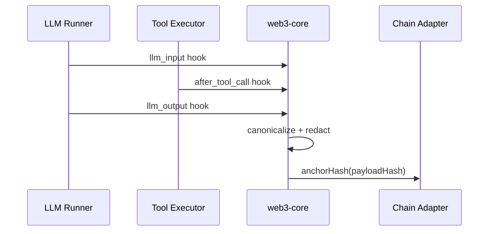
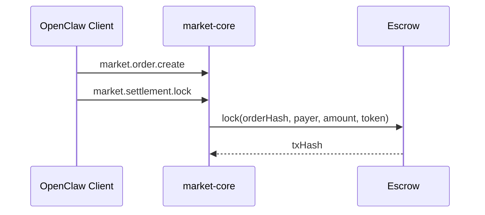

### OpenClaw Web3 市场化集成方案评审与设计文档（`web3-core` + `market-core`）

### **文档目的**

对你提出的 **Web3 Market + Node 网络**方案进行评审，并基于现有 `web3-core` 与 `market-core` 的真实能力，给出 **可落地、可扩展、可演进** 的设计方案与实现边界，最终形成 AI 代理可直接执行的实现方向。

---

### **一、方案评审结论（针对你提供的 Market/Node 方案）**

#### **结论：方向正确，但与现有插件能力存在落地鸿沟**

该方案将 OpenClaw 变成“Client + Node”双角色的 **去中心化任务市场**，这是合理方向；但**当前代码基座**（`web3-core` + `market-core`）仅提供 **身份/审计/归档/计费/结算** 的基础设施，并未实现：

- **任务广播/竞标/撮合**
- **节点注册与能力声明**
- **远程执行与结果回传**

因此，方案必须拆成 **可与当前插件对齐的阶段性落地**，否则实现成本与风险极高。

---

### **二、差距与补齐点（现状 vs 目标）**

| 目标能力        | 现状支撑                                  | 主要缺口                       |
| --------------- | ----------------------------------------- | ------------------------------ |
| Client 发布任务 | `market-core` 支持 offer/order/settlement | 无 TaskOrder/Bid/Result 协议层 |
| Node 接单/执行  | 无                                        | 缺 Node 身份/能力/执行器       |
| 任务撮合        | 无                                        | 缺 matcher/协议/广播           |
| 结算与支付      | `market-core` 支持 escrow 结算            | 未绑定 OpenClaw 调用入口       |
| 审计与可验证    | `web3-core` 已实现 audit hooks            | 缺市场任务审计字段扩展         |
| 归档与取回      | `web3-core` 已实现归档适配器              | 缺任务结果/证明的归档接入      |
| CLI/UI 入口     | `web3-core` 已有基础                      | 缺“市场视图/节点视图”          |

---

### **三、设计原则（落地基线）**

- **现有插件优先复用**：以 `web3-core` 与 `market-core` 为基础，先补齐协议与入口，再扩展 Node 网络。
- **非侵入 OpenClaw 核心**：仅通过 hooks / gateway / plugin service 扩展。
- **最小披露**：链上仅保留 hash + minimal metadata，内容走加密归档。
- **可降级**：链/存储不可用不阻断 OpenClaw 核心调用，只降级提示。

---

### **四、落地架构（以插件联动为中心）**

```mermaid
graph TD
  UI[Web UI / Mac App] -->|RPC/Status| GW[Gateway]
  CLI[CLI Commands] -->|Commands| GW

  GW --> W3[web3-core plugin]
  GW --> MKT[market-core plugin]

  W3 --> AUD[Audit Hooks & Anchor]
  W3 --> ARC[Archive / DStorage]
  W3 --> ID[Wallet Identity (SIWE)]
  W3 --> BILL[Billing / Quota Guard]

  MKT --> OFFER[Offer/Order]
  MKT --> SETTLE[Settlement]
  MKT --> CONSENT[Consent/Delivery]
  MKT --> TRACE[Audit/Transparency]

  W3 --> STORE[State Dir / Local Store]
  MKT --> STORE

  AUD --> CHAIN[Chain Adapter]
  ARC --> DST[Storage Adapter]
```

---

### **五、关键流程设计**

#### **1) LLM / Tool 审计与锚定（`web3-core`）**



#### **2) 结算链路（`market-core`）**



#### **3) 与 OpenClaw 调用入口的绑定（未来扩展点）**

- **方案 A：预付锁定**：`before_tool_call` 检查是否存在 `settlement_locked` 记录。
- **方案 B：后付结算**：在 `session_end` 汇总 usage → `market.settlement.lock/release`。

---

### **六、接口设计（基于现有插件）**

#### **A. `web3-core`（身份/审计/归档/计费）**

- **Commands**：`/bind_wallet` `/unbind_wallet` `/whoami_web3` `/credits` `/pay_status` `/audit_status`
- **Gateway**：`web3.siwe.challenge` `web3.siwe.verify` `web3.audit.query` `web3.billing.status` `web3.billing.summary` `web3.status.summary`
- **Hooks**：`llm_input` `llm_output` `after_tool_call` `session_end` `before_tool_call`

#### **B. `market-core`（交易/结算）**

- **Offer**：`market.offer.create|publish|update|close`
- **Order**：`market.order.create|cancel`
- **Settlement**：`market.settlement.lock|release|refund|status`
- **Consent/Delivery**：`market.consent.grant|revoke` `market.delivery.issue|complete|revoke`
- **Transparency**：`market.status.summary|audit.query|transparency.summary|trace`

#### **C. 插件间联动点（必须实现）**

- **`/pay_status`**：由 `web3-core` 读取 `market-core` store（file/sqlite）并汇总。
- **`web3.billing.summary`**：输出 credits 与 settlement 绑定状态（新增字段）。

---

### **七、设计方案（分阶段落地）**

#### **Phase 1：对齐与联动（当前可落地）**

- 目标：保证 `web3-core` 与 `market-core` 状态一致，完善 CLI/UI 展示。
- 产出：
  - `web3.status.summary` 展示 audit/anchor/archive/billing
  - `market.status.summary` 与 `web3` UI 对齐
  - `/pay_status` 与 settlement 状态一致

#### **Phase 2：代币消费入口（关键升级）**

- 目标：将 OpenClaw 调用入口与结算强绑定。
- 产出：
  - `before_tool_call` 检查 settlement/credits 状态
  - `session_end` 汇总 usage → `market.settlement.lock/release`

##### **默认计费/结算策略（你已确认：开放市场默认“预付锁定”，信任域允许“后付”）**

- **默认（开放市场 / 任意节点）**：**预付锁定（escrow lock）+ 自动退款/部分结算 + 争议窗口**
  - **锁定粒度**（二选一或同时支持）：
    - **按预算锁定**：锁定本次任务/会话的最大预算（简化实现，推荐先做）。
    - **按时间/按 token 流式锁定/释放**：更公平但实现更复杂（后续可接入 Superfluid/Sablier 范式）。
  - **超时自动退款**：超过 `timeoutSec`（或订单 TTL）未交付，自动走 `market.settlement.refund`。
  - **部分结算规则**：允许“部分交付 → 按比例 release”，其比例由可验证的 usage/里程碑定义（例如：已生成 token 数、已完成 step 数、已上传归档 CID 等）。
  - **争议窗口**：交付后 `disputeWindowSec`（建议默认 600 秒）内允许发起 dispute；无争议则自动 release。

- **可选（信任域 / allowlist 节点 / 自己设备）**：**会话后付（session_end）+ cap + 限速**
  - **单会话上限（cap）**：避免意外烧钱；超出直接阻断或要求二次确认。
  - **速率限制**：限制单位时间内 tool/LLM 调用频次或额度消耗。
  - **结算触发点**：`session_end` 汇总 usage 后统一结算；若中途达到 cap 也可提前结算/强制结束。

#### **Phase 3：市场化协议扩展（可选新插件或扩展 `market-core`）**

- 目标：引入 TaskOrder/Bid/Result 协议层，形成 Client/Node 原型。
- 产出：
  - `TaskOrder` / `Bid` / `Result` / `Receipt` 类型
  - `gateway` task/bid/result API 原型

---

### **八、风险与对策**

- **节点作恶** → 签名不可抵赖 + 结果哈希 + 后续挑战机制
- **隐私泄露** → 默认最小披露 + 加密归档
- **链/存储不可用** → 降级到本地功能 + UI 提示

---

### **九、开源方案调研（避免重复造轮子）**

#### **9.1 哪些部分最容易“重复造轮子”**

- **身份与签名**：SIWE、EIP-712 typed data、挑战/验签流程。
- **去中心化存储 SDK**：IPFS 客户端、上传/取回、与 Filecoin/w3up 生态对接。
- **可验证审计/透明日志**：append-only + Merkle 证明 + 一致性验证（不一定非得“上链写合约”）。
- **算力/任务市场**：任务发布/撮合/执行/回传/结算这一整套协议与运行时。

#### **9.2 GitHub 上可直接复用/对标的开源项目（按能力分组）**

- **分布式计算/任务执行（偏“算力网络”）**
  - [Bacalhau](https://github.com/bacalhau-project/bacalhau)：主打 **Compute over Data**，天然和 IPFS/Filecoin 数据路径适配，适合我们把“任务执行”外包给节点（但它不是代币市场本体）。
  - [Golem `yagna`](https://github.com/golemfactory/yagna)：更接近“**requestor/provider + 市场**”的完整体系，属于我们设想的 Market/Node 的重型对标。
  - [Akash `node`](https://github.com/akash-network/node)：更像去中心化云/部署层（适合作为 Node 的托管/部署基础设施，而不是任务协议本身）。
  - [Bittensor](https://github.com/opentensor/bittensor)：偏“**模型网络 + 激励/子网**”，能对标“模型市场/奖励机制”，但集成成本高、范式也不同。

- **去中心化存储（偏 SDK/服务能力）**
  - [IPFS `helia`](https://github.com/ipfs/helia)：TypeScript 的现代 IPFS 实现，适合做我们 `web3-core` 的 `storage` 适配器基座。
  - [w3up protocol implementation（快照仓库）](https://github.com/web3-storage/w3up-pl-snapshot)：`w3up` 协议实现（偏协议/实现细节）。
  - [w3up-client](https://github.com/web3-storage/w3up-client)：更贴近我们需要的 **JS 客户端 SDK**（上传/授权/能力委托）。

- **可验证审计 / 透明日志（偏“不可篡改证明”）**
  - [Sigstore Rekor](https://github.com/sigstore/rekor)：成熟的 **透明日志**（append-only + Merkle），可作为“锚定/可验证审计”的替代或补充（不必把所有事件都写链）。
  - [Google Trillian](https://github.com/google/trillian)：通用可验证日志/可验证 map（维护模式，但仍是经典对标）。
  - [OpenTimestamps server](https://github.com/petertodd/opentimestamps-server)：更轻量的“时间戳证明”路线，对“不可抵赖时间戳”很贴合。
  - [immudb](https://github.com/codenotary/immudb)：带加密证明的不可篡改数据库（更像自带 proof 的审计存储层）。

- **钱包身份 / 登录（SIWE）**
  - [spruceid/siwe](https://github.com/spruceid/siwe)：SIWE 的事实标准实现，我们不应自研 SIWE 消息格式/验签细节。

- **支付/结算（偏合约与支付范式）**
  - [Superfluid protocol](https://github.com/superfluid-finance/protocol-monorepo)：流支付/持续预算（适合“按时间/按 token 流量”结算）。
  - [Sablier v2-core](https://github.com/sablier-labs/v2-core)：流支付/线性释放等，适合“预算锁定 + 渐进释放”的结算体验。

#### **9.3 对 OpenClaw 的复用建议（结合现有 `web3-core` / `market-core`）**

- **`web3-core/identity`**：保留我们自己的“OpenClaw 会话/权限语义”，但 **SIWE 消息构造与验签**应直接复用 `spruceid/siwe`（或同等成熟实现），避免协议细节坑。
- **`web3-core/storage`**：我们真正需要自研的是“**客户端加密、脱敏策略、对象打包格式**”；IPFS 上传/取回应优先基于 `helia` 或 `w3up-client`，不要重写 DAG/块传输。
- **`web3-core/audit`**：我们必须自研的是“**从 OpenClaw hooks 生成 canonical 事件**”；锚定层可以允许多后端：链上（你现在的方向）+ Rekor/Trillian/OpenTimestamps（更轻量，落地更快）。
- **`market-core/settlement`**：你已经有结算骨架（lock/release/refund）。如果后续要“按时间/按 token 流”计费，再考虑接入 Superfluid/Sablier；但不要在 Phase 1-2 重造结算协议。
- **未来的 `web3-market`（如果要做）**：只做“TaskOrder/Bid/Result + 传输 + Node 执行器编排”，并尽量把“执行运行时”交给 Bacalhau/Golem 这种现成网络；我们重点做 OpenClaw 侧的适配与风控。

#### **9.4 结论：是否重复造轮子？**

- **是**：如果我们在 `web3-market` 里从零做 P2P 发现、任务协议、撮合、节点运行时、存储协议与验签细节，那基本等于重造 Golem/Bacalhau/w3up/SIWE 的轮子。
- **不是**：如果我们把重点放在“OpenClaw hooks → canonical →（可选）锚定/归档/结算”的 **产品化集成层**，并用成熟开源项目承接底层协议/网络/存储，那么我们的自研部分非常聚焦且必要。

---

### **十、执行清单（AI 代理可直接跟进）**

- `web3-core`：对齐 billing summary + pay_status，并把 SIWE 实现替换为可复用库的封装层（保持对外接口不变）。
- `web3-core`：给 `storage` 适配器增加基于 `helia` / `w3up-client` 的实现选项（保留现有本地/归档逻辑）。
- `web3-core`：审计锚定增加可插拔后端（链上 + Rekor/OpenTimestamps 任选其一先落地）。
- `market-core`：继续作为 settlement 单一权威来源（不要在别处再造 escrow）。
- **扩展**：若要做任务市场，优先做“OpenClaw → Bacalhau/Golem”适配器原型，再决定是否需要自研 Task 协议层。

---

### **十一、业界对标与选择评审：我们这条路是否“最优”？**

#### **11.1 先给结论（不卖关子）**

- **如果你的目标是：尽快把 Web3 能力“产品化”接入 OpenClaw，并且可控、可迭代、可降级**，那当前路线（`web3-core` 负责 identity/audit/archive/billing，`market-core` 负责 settlement）属于 **业界更偏“最优”的工程路径**：模块边界清晰、风险可控、便于逐步上线。
- **如果你的目标是：做一个完全去中心化、无需信任的算力/模型市场**，那当前路线 **还不够“业界最优”**，因为它缺少对“节点作恶/结果正确性/可验证计算/争议仲裁”的完整机制；这类目标通常需要更重的网络与协议（或直接复用现成网络，如 Golem/Bacalhau/Bittensor）。

#### **11.2 业界常见的 4 种路线（对标）**

| 路线                                                 | 代表/类比              | 优点                       | 代价/风险                         | 对 OpenClaw 的适配建议                   |
| ---------------------------------------------------- | ---------------------- | -------------------------- | --------------------------------- | ---------------------------------------- |
| **A. 全上链（强一致/强约束）**                       | “所有事件/结算都上链”  | 可审计性最强               | 成本高、UX 差、吞吐低、隐私风险高 | 不建议作为主路径；只保留“可选锚定”       |
| **B. 混合式（链上结算 + 链下审计/存储 + 可选锚定）** | 多数 Web3 产品工程实践 | 速度快、可降级、成本可控   | 需要明确信任边界                  | **我们当前路线更接近这一类**             |
| **C. 复用成熟算力网络（我们做适配层）**              | Golem/Bacalhau         | 不重造节点运行时/发现/调度 | 与 OpenClaw 语义映射成本          | **优先推荐**：先接 1 个网络打通闭环      |
| **D. 自研 P2P 市场网络（协议/发现/撮合/执行全做）**  | “重新做一个 Golem”     | 可定制性最高               | 最高风险/最高长期负担             | 不建议在早期做；除非你要做的是“协议本身” |

#### **11.3 我认为当前方案距离“业界最优”还差的关键决策点**

- **信任模型**：Node 返回结果不可信时怎么办？（仅签名不可抵赖 ≠ 结果正确）
  - MVP 可接受“签名 + 可追责 + 争议人工处理”；若要升级，需要挑战机制、仲裁、或可验证计算/TEE。
- **计费模型**：预付锁定 vs 后付结算 vs 流支付
  - Phase 2 的 **方案 A/B** 需要你明确：是否允许“任务失败/超时”退款、以及费用粒度（tool-call、LLM-call、token、time）。
- **审计锚定后端**：链上锚定不是唯一最优
  - 业界常见是“链上只做结算或偶尔锚定”，审计走透明日志/时间戳服务（Rekor/OpenTimestamps）来平衡成本与可验证性。
- **存储选型**：自己写“IPFS 传输层”通常不是最优
  - 业界更优是复用 `helia`/`w3up-client`，我们只做加密、脱敏、打包格式与状态管理。

#### **11.4 评审结论（工程最优 vs 协议最优）**

- **工程最优（我推荐）**：继续坚持文档当前路线：以 `web3-core`/`market-core` 为基座 + 复用成熟开源组件，把“代币消费入口（Phase 2）”先做成可用闭环。
- **协议最优（更重）**：如果你最终要做“开放网络的算力/模型市场”，那 Phase 3 应优先“接入/对标现成网络”，而不是先自研 Task 协议；自研协议应发生在我们对执行、争议、结算的真实需求被验证之后。

---

### **结论**

该方案是正确方向，但需要 **以 `web3-core` 与 `market-core` 为基座**，优先复用成熟开源组件补齐底层能力，再完成联动与消费入口的落地，最后才扩展到完整的 Client/Node 市场网络。
该文档已整理为 **AI 代理可执行的分阶段设计方案**。
