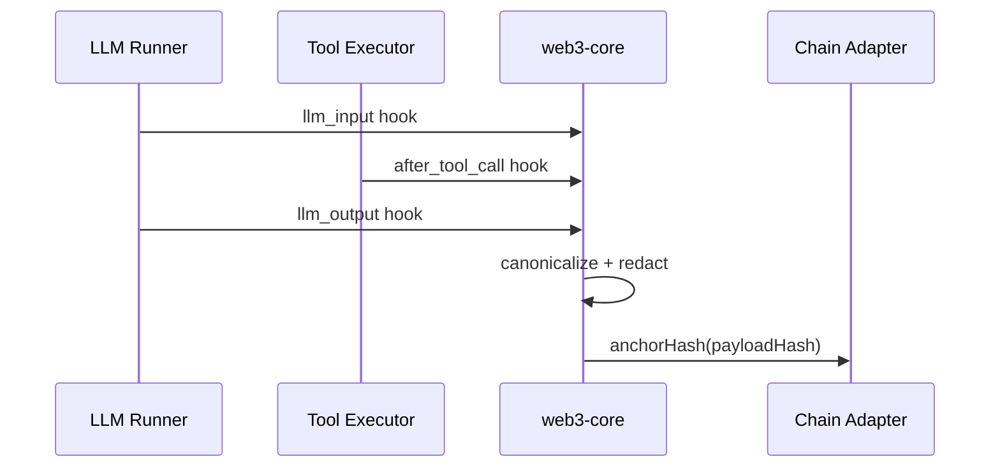
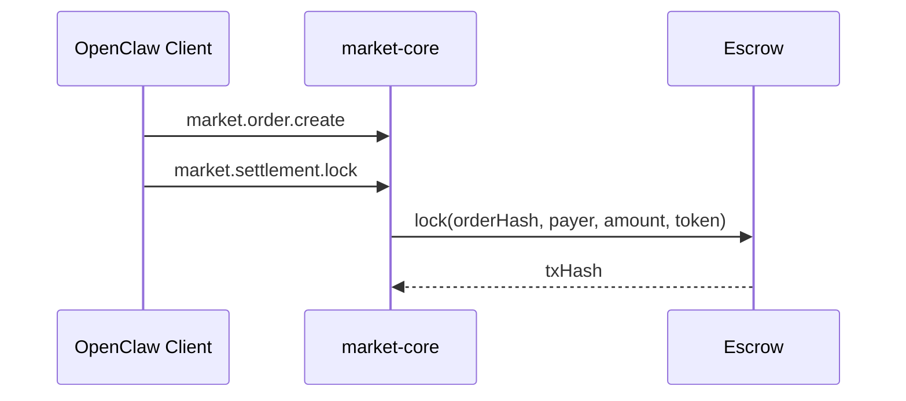

### OpenClaw Web3 Market：方案总纲与阶段设计（`web3-core` + `market-core`）

### **文档目的**

在保持 OpenClaw 核心轻量的前提下，规划一个**可选启用**的 Web3 Market 扩展（`web3-core` + `market-core`）：对外默认仅暴露 **`web3.*` 单入口体验层**，并通过 **能力自描述** 让管家可机器化、无歧义地调用；内部由 `market-core` 作为权威执行层完成资源/租约/账本/结算等状态变更。

同时，任务市场协议、争议仲裁、监控告警、管理台等能力属于**后续可选扩展或独立服务**，不作为 OpenClaw Core 的默认职责。

#### **Non-goals（明确不做）**

- 不把 OpenClaw Core 做成电商平台或支付处理器：不处理法币支付，不存储支付凭证，不承担支付合规职责
- 默认不暴露 Provider `endpoint`、`accessToken`、真实文件路径等敏感信息；连接信息必须通过受控机制获得（例如租约签发后的受控路由或本地受信配置解析）
- `web_search` / `browser` 是通用执行工具（上网查询、打开网页、推广与操作）；Web3 Market 是“能力可交易”的协议层，两者分层不重叠

### **产品一句话（10 秒理解）**

OpenClaw Web3 Market 让你的 **AI 管家**可以安全地**发现、租用与出售**模型/搜索/存储等能力，并通过**租约 + 权威账本 + 代币结算**完成闭环，用户只需要关心“价值与成本”。

### **定调（对外叙事）**

- 一句话：**用户需要一个自由的交易市场**（自由选择 Provider / 自由比较成本与性能 / 自由退出与迁移）。
- 在 OpenClaw 语境下：`web3-core` 负责“入口语义 + 审计/归档/身份/计费”，`market-core` 负责“权威交易与记账/结算”。
- 现阶段现实约束：仓库里仍存在 `market.*` 低层端点（UI/运维在用），但产品方向以“对外单入口 `web3.*`”为准。

### **文档定位与导航**

- 本文是方案总纲与阶段设计，**新版规划以“新版权威规划”小节为准**。
- 主文档：`web3-brain-architecture.md`
- 执行清单附录：`web3-market-resource-implementation-checklist.md`
- 评审文档（仅评审，不作为规范）：`web3-market-assessment-2026-02-19.md`
- 具体方案文档：
  - `web3-market-plan-phase1-execution.md`
  - `web3-market-plan-roadmap-open-source-coldstart.md`
  - `web3-market-plan-parallel-execution-ray-celery.md`
- 若与资源共享细节冲突，以以下文档为权威：
  - `web3-market-resource-api.md`
  - `web3-market-resource-security.md`
  - `web3-market-resource-ops.md`
  - `web3-market-resource-testing.md`
  - `web3-market-resource-implementation-checklist.md`
- 快速进入：先读 `web3-brain-architecture.md`，再读资源共享 API 与安全文档。

### **新版权威规划（以本节为准）**

#### **目标与边界**

- **单入口体验层**：对外仅暴露 `web3.*`，所有用户与管家只学习一套语义。
- **能力自描述**：`web3.capabilities.*` 返回机器可理解的能力与约束，确保管家“懂一切”。
- **权威执行层**：`market-core` 仍是资源/租约/账本/结算的权威执行层；争议仲裁在 Phase 2+ 以扩展能力逐步引入，但同样不直接对外暴露。
- **平台闭环（路线图目标）**：逐步补齐任务市场协议、仲裁体系、索引服务、监控告警与管理台（均以扩展或独立服务承载）。
- **与 OpenClaw 方向一致**：Core 保持轻量，所有“市场/协议/仲裁/索引/管理台”均在扩展或独立服务中实现。

#### **单入口体验层（`web3.*`）能力分组**

- **能力自描述**：`web3.capabilities.list`，`web3.capabilities.describe`
- **市场与任务协议**：`web3.market.*`（发布、发现、下单、竞标、授标、交付、验收）
- **争议与仲裁**：`web3.dispute.*`（发起、提交证据、仲裁、申诉）
- **索引与发现**：`web3.index.*`（查询、健康、信誉；默认不返回 Provider `endpoint`）
- **监控与告警**：`web3.monitor.*`（指标、规则、历史）
- **管理台聚合**：`web3.admin.*`（概览、资源、租约、账本、争议）

#### **能力自描述（机器可理解）**

能力描述必须包含：

- **功能**：方法名、意图、用途示例
- **输入参数**：类型、必填/可选、范围、格式
- **权限与风控**：所需 scope、allowlist、速率限制、预算上限
- **代价与结算**：计费单位、预估成本、是否需要预付锁定
- **前置条件**：必须存在的租约、钱包绑定或配置
- **返回含义**：字段语义、错误码与降级策略

推荐结构：

- `CapabilityDescriptor { name, summary, paramsSchema, permissions, risk, pricing, prerequisites, returns, examples }`

#### **权威执行层与数据一致性**

- `web3.*` 只做编排、审计与体验层语义；所有资金与账本变更由 `market-core` 执行。
- `market-core` 对外只暴露给 `web3-core`，不直接暴露给普通用户与管家。

#### **阶段规划与验收标准**

- **Phase 0：能力自描述（Day 0 必备）**
  - **产出**：`web3.capabilities.list/describe` 作为管家间沟通协议；能力描述含权限/风控/代价/前置条件。
  - **验收**：管家仅依赖能力自描述即可安全调用，不依赖外部文档。

- **Phase 1：资源租约闭环与用户体验**
  - **产出**：索引条目签名（可迁移到 DHT）；一键 Provider 引导；“管家经济仪表盘”。
  - **验收**：资源可发现 → 自动租约 → 直接调用 → 账本结算；用户可见收入/支出/净收益。
  - **细化规范**：见 `web3-market-plan-phase1-execution.md` 的 Day 0 + Week 1-2。

- **Phase 2：监控告警 + 部分释放结算 + 仲裁入口**
  - **产出**：P0/P1 告警与历史；partial release；链下仲裁入口（预留 `arbitratorType`）。
  - **验收**：可观测与可控；争议可发起、证据可提交、裁决可落账。

- **Phase 3：任务市场协议（后续）**
  - **产出**：TaskOrder/Bid/Result/Receipt 数据结构与状态机；`web3.market.*` 方法集；签名与可审计哈希。
  - **验收**：任务发布 → 竞标 → 授标 → 交付 → 验收 → 结算全链路可跑通。
  - **细化规范**：见 `web3-market-plan-phase1-execution.md` 的“Phase 3：任务市场协议规范”。

- **Phase 4：去中心化索引与产品化 UI 进阶**
  - **产出**：DHT/去中心化索引传输层；用户与管理台分层体验。
  - **验收**：索引可去中心化迁移，用户/运维界面各自清晰。

### **Phase 1 上线硬 Gate（必须全部通过）**

> 这些是 Phase 1 的“硬性验收门槛”，不满足则视为不可上线（哪怕功能跑通）。

- **Gate-SEC-01（敏感信息零泄露）**：任何输出面（gateway method 返回、HTTP route 错误、CLI 状态、logs、审计摘要、能力自描述、tool 结果）不得包含 `accessToken`、provider endpoint、真实文件路径。
- **Gate-ERR-01（稳定错误码）**：对外返回必须使用稳定错误码（例如 `E_INVALID_ARGUMENT`/`E_FORBIDDEN`/`E_NOT_FOUND`/`E_CONFLICT`/`E_INTERNAL` 等；最低集合见 `web3-market-resource-api.md`），并保持机器可解析；错误契约以 `web3-market-resource-api.md` 为准。
- **Gate-CAP-01（能力自描述可操作）**：`web3.capabilities.*` 必须提供字段级输入结构（必填/可选/范围/格式）与关键前置条件/风险/成本提示，使管家无需外部文档即可构造有效请求。
- **Gate-LEDGER-01（权威记账防伪造）**：Provider 才能写入权威 `market.ledger.append`；Consumer 侧不得伪造权威账本（以 `market-core` 校验为准）。
- **Gate-STORE-01（双存储一致性）**：file/sqlite 两种 store 行为一致，且关键路径用例必须在两种模式下通过（至少覆盖发布→租约→调用→记账→撤销/过期）。

---

### **任务协议与仲裁概要表（不重复细节）**

| 对象        | 关键字段（摘要）                                                             | 状态                                                                | 权威落盘层    | 对外入口                                    |
| ----------- | ---------------------------------------------------------------------------- | ------------------------------------------------------------------- | ------------- | ------------------------------------------- |
| TaskOrder   | `taskId`, `creatorActorId`, `requirements`, `budget`, `expiryAt`, `hash`     | `task_open/task_awarded/task_closed/task_cancelled/task_expired`    | `market-core` | `web3.market.publishTask/listTasks/getTask` |
| TaskBid     | `bidId`, `taskId`, `bidderActorId`, `price`, `eta`, `hash`                   | `bid_submitted/bid_withdrawn/bid_accepted/bid_rejected`             | `market-core` | `web3.market.placeBid/listBids`             |
| TaskAward   | `awardId`, `taskId`, `bidId`, `awarderActorId`, `hash`                       | `award_active/award_revoked`                                        | `market-core` | `web3.market.awardBid`                      |
| TaskResult  | `resultId`, `taskId`, `bidId`, `delivererActorId`, `artifacts`, `hash`       | `result_submitted/result_accepted/result_rejected`                  | `market-core` | `web3.market.submitResult/reviewResult`     |
| TaskReceipt | `receiptId`, `taskId`, `bidId`, `amount`, `settlementId`                     | `receipt_pending/receipt_settled/receipt_refunded/receipt_disputed` | `market-core` | `web3.market.reviewResult`                  |
| Dispute     | `disputeId`, `taskId`, `bidId`, `initiatorActorId`, `resolution`, `evidence` | `dispute_open/dispute_resolved/dispute_rejected`                    | `market-core` | `web3.dispute.open/submitEvidence/resolve`  |

### **状态机迁移规则简表（MVP）**

| 对象        | 允许迁移                                                                                                                     | 禁止迁移（示例）                    | 触发入口                                            |
| ----------- | ---------------------------------------------------------------------------------------------------------------------------- | ----------------------------------- | --------------------------------------------------- |
| TaskOrder   | `task_open → task_awarded → task_closed`，`task_open → task_cancelled`，`task_open → task_expired`                           | 已关闭/已取消后回到 `task_open`     | `web3.market.awardBid/cancelTask/expireSweep`       |
| TaskBid     | `bid_submitted → bid_withdrawn`，`bid_submitted → bid_accepted/bid_rejected`                                                 | `bid_withdrawn → bid_accepted`      | `web3.market.placeBid/awardBid`                     |
| TaskAward   | `award_active → award_revoked`                                                                                               | `award_revoked → award_active`      | `web3.market.awardBid`（撤销入口可复用）            |
| TaskResult  | `result_submitted → result_accepted/result_rejected`                                                                         | `result_rejected → result_accepted` | `web3.market.submitResult/reviewResult`             |
| TaskReceipt | `receipt_pending → receipt_settled/receipt_refunded/receipt_disputed`，`receipt_disputed → receipt_settled/receipt_refunded` | 终态回到 `receipt_pending`          | `web3.market.reviewResult` + `web3.dispute.resolve` |
| Dispute     | `dispute_open → dispute_resolved/dispute_rejected`                                                                           | `dispute_resolved → dispute_open`   | `web3.dispute.open/resolve`                         |

### **状态机触发条件与守卫规则（MVP）**

| 对象        | 触发条件（示例）                          | 守卫规则（必须满足）                                          |
| ----------- | ----------------------------------------- | ------------------------------------------------------------- |
| TaskOrder   | `awardBid` / `cancelTask` / `expireSweep` | 仅 `task_open` 可授标或取消；`expireSweep` 需超时且无活跃授标 |
| TaskBid     | `placeBid` / `awardBid`                   | 仅 `task_open` 可竞标；同一 `bidId` 不可重复提交              |
| TaskAward   | `awardBid`                                | 竞标必须 `bid_submitted`；预算锁定成功才可 `award_active`     |
| TaskResult  | `submitResult` / `reviewResult`           | 仅 `award_active` 可提交结果；`reviewResult` 需具备验收权限   |
| TaskReceipt | `reviewResult` / `dispute.resolve`        | 结算释放/退款必须绑定有效 `settlementId`                      |
| Dispute     | `dispute.open` / `dispute.resolve`        | 仅结果被拒绝或验收超时可开争议；裁决需审计锚定完成            |

### **权限/风控/预算守卫规则（MVP）**

| 维度 | 规则（示例）                                                 | 适用入口                                            |
| ---- | ------------------------------------------------------------ | --------------------------------------------------- |
| 权限 | 仅 `creatorActorId` 可取消任务；仅 `awarderActorId` 可授标   | `web3.market.cancelTask/awardBid`                   |
| 权限 | 仅 `delivererActorId` 可提交结果；仅 `creatorActorId` 可验收 | `web3.market.submitResult/reviewResult`             |
| 风控 | 单任务预算上限/币种白名单校验                                | `web3.market.publishTask/awardBid`                  |
| 风控 | 单账户并发任务数与竞标频率限制                               | `web3.market.placeBid/listBids`                     |
| 风控 | 争议频率限制与重复争议合并                                   | `web3.dispute.open`                                 |
| 预算 | 授标前必须完成预算锁定（escrow 预锁）                        | `web3.market.awardBid`                              |
| 预算 | 结算释放/退款需对账一致（账本与 escrow）                     | `web3.market.reviewResult` + `web3.dispute.resolve` |

---

### **现状快照（与代码一致，供参考）**

- **B-1（主脑切换）已实现**：`before_model_resolve` + `resolve_stream_fn` 已在 core 与 `web3-core` 接通，`web3.status.summary` 与 `/pay_status` 已输出主脑来源与结算状态。
- **B-2（资源共享）已实现**：`market.resource.*` / `market.lease.*` / `market.ledger.*` 已落地；`web3.resources.*` + Provider HTTP routes + consumer tools 已可用。
- **仍未覆盖**：任务市场协议（TaskOrder/Bid/Result）、争议仲裁、独立索引服务、监控告警与 Web UI。

---

### **未实现项开发清单与里程碑（历史参考）**

- **P0：独立索引服务（index-service）**
  - 现状：`web3.index.report/list` 为本地 indexer（`web3/resource-index.json`）
  - 里程碑：Week 2（资源发现冷启动）
- **P0：争议仲裁入口（`market.dispute.open/resolve`）**
  - 现状：未实现
  - 里程碑：Week 3（争议仲裁 + 审计锚定）
- **P0：监控告警（指标 + 规则 + 历史）**
  - 现状：未实现
  - 里程碑：Week 4（监控告警 + Web UI）
- **P0：Web 管理台最小可用**
  - 现状：未实现
  - 里程碑：Week 4（管理台 MVP）
- **P1：任务市场协议层（TaskOrder/Bid/Result）**
  - 现状：未实现
  - 里程碑：Phase 3（生态扩展阶段）

### **评审方案中的未完成项清单（含实现方案推荐）**

- **P0：争议仲裁机制**
  - 推荐方案：链下仲裁 + 证据摘要写入审计/锚定管线，后续可升级链上仲裁。
- **P0：资源发现/索引服务**
  - 推荐方案：中心化索引服务 + Provider 定期上报；后续演进 DHT/去中心化目录。
- **P0：监控告警**
  - 推荐方案：Prometheus metrics + P0/P1 告警规则（结算队列、ledger 失败、租约失效、audit/anchor 失败率）。
- **P0：Web 管理台**
  - 推荐方案：最小可用管理台（概览/资源/租约/账本），复用现有 `web3.status.summary` 与 market API。
- **P0：跨插件 E2E 覆盖**
  - 推荐方案：file/sqlite 双模式的端到端用例（发布 → 租约 → 调用 → 记账 → 撤销/过期）。

---

### **一、方案对齐结论（针对你提供的 Market/Node 方案）**

#### **结论：方向正确，但与现有插件能力存在落地鸿沟**

该方案将 OpenClaw 变成“Client + Node”双角色的 **去中心化任务市场**，这是合理方向；但**当前代码基座**（`web3-core` + `market-core`）已具备 **身份/审计/归档/计费/结算 + 资源共享（B-2）** 的基础设施，仍未实现：

- **任务广播/竞标/撮合**
- **节点注册与能力声明**
- **远程执行与结果回传**

因此，方案必须拆成 **可与当前插件对齐的阶段性落地**，否则实现成本与风险极高。

---

### **二、差距与补齐点（现状 vs 目标）**

| 目标能力        | 现状支撑                                  | 主要缺口                       |
| --------------- | ----------------------------------------- | ------------------------------ |
| Client 发布任务 | `market-core` 支持 offer/order/settlement | 无 TaskOrder/Bid/Result 协议层 |
| Node 接单/执行  | 无                                        | 缺 Node 身份/能力/执行器       |
| 任务撮合        | 无                                        | 缺 matcher/协议/广播           |
| 结算与支付      | `market-core` 支持 escrow 结算            | 未绑定 OpenClaw 调用入口       |
| 审计与可验证    | `web3-core` 已实现 audit hooks            | 缺市场任务审计字段扩展         |
| 归档与取回      | `web3-core` 已实现归档适配器              | 缺任务结果/证明的归档接入      |
| CLI/UI 入口     | `web3-core` 已有基础                      | 缺“市场视图/节点视图”          |

---

### **三、设计原则（落地基线）**

- **现有插件优先复用**：以 `web3-core` 与 `market-core` 为基础，先补齐协议与入口，再扩展 Node 网络。
- **非侵入 OpenClaw 核心**：仅通过 hooks / gateway / plugin service 扩展。
- **最小披露**：链上仅保留 hash + minimal metadata，内容走加密归档。
- **可降级**：链/存储不可用不阻断 OpenClaw 核心调用，只降级提示。

---

### **四、落地架构（以插件联动为中心）**

```mermaid
graph TD
  UI[Web UI / Mac App] -->|RPC/Status| GW[Gateway]
  CLI[CLI Commands] -->|Commands| GW

  GW --> W3[web3-core plugin]
  GW --> MKT[market-core plugin]

  W3 --> AUD[Audit Hooks & Anchor]
  W3 --> ARC[Archive / DStorage]
  W3 --> ID[Wallet Identity (SIWE)]
  W3 --> BILL[Billing / Quota Guard]

  MKT --> OFFER[Offer/Order]
  MKT --> SETTLE[Settlement]
  MKT --> CONSENT[Consent/Delivery]
  MKT --> TRACE[Audit/Transparency]

  W3 --> STORE[State Dir / Local Store]
  MKT --> STORE

  AUD --> CHAIN[Chain Adapter]
  ARC --> DST[Storage Adapter]
```

---

### **五、关键流程设计**

#### **1) LLM / Tool 审计与锚定（`web3-core`）**



#### **2) 结算链路（`market-core`）**



#### **3) 与 OpenClaw 调用入口的绑定（未来扩展点）**

- **方案 A：预付锁定**：`before_tool_call` 检查是否存在 `settlement_locked` 记录。
- **方案 B：后付结算**：在 `session_end` 汇总 usage → `market.settlement.lock/release`。

---

### **六、接口设计（基于现有插件）**

#### **A. `web3-core`（身份/审计/归档/计费）**

- **Commands**：`/bind_wallet` `/unbind_wallet` `/whoami_web3` `/credits` `/pay_status` `/audit_status`
- **Gateway**：`web3.siwe.challenge` `web3.siwe.verify` `web3.audit.query` `web3.billing.status` `web3.billing.summary` `web3.status.summary`
- **Hooks**：`llm_input` `llm_output` `after_tool_call` `session_end` `before_tool_call`

#### **B. `market-core`（交易/结算）**

- **Offer**：`market.offer.create|publish|update|close`
- **Order**：`market.order.create|cancel`
- **Settlement**：`market.settlement.lock|release|refund|status`
- **Consent/Delivery**：`market.consent.grant|revoke` `market.delivery.issue|complete|revoke`
- **Transparency**：`market.status.summary|audit.query|transparency.summary|trace`

#### **C. 插件间联动点（必须实现）**

- **`/pay_status`**：由 `web3-core` 读取 `market-core` store（file/sqlite）并汇总。
- **`web3.billing.summary`**：输出 credits 与 settlement 绑定状态（新增字段）。

---

### **七、设计方案（分阶段落地）**

#### **Phase 1：对齐与联动（当前可落地）**

- 目标：保证 `web3-core` 与 `market-core` 状态一致，完善 CLI/UI 展示。
- 产出：
  - `web3.status.summary` 展示 audit/anchor/archive/billing
  - `market.status.summary` 与 `web3` UI 对齐
  - `/pay_status` 与 settlement 状态一致

#### **Phase 2：代币消费入口（关键升级）**

- 目标：将 OpenClaw 调用入口与结算强绑定。
- 产出：
  - `before_tool_call` 检查 settlement/credits 状态
  - `session_end` 汇总 usage → `market.settlement.lock/release`

##### **默认计费/结算策略（你已确认：开放市场默认“预付锁定”，信任域允许“后付”）**

- **默认（开放市场 / 任意节点）**：**预付锁定（escrow lock）+ 自动退款/部分结算 + 争议窗口**
  - **锁定粒度**（二选一或同时支持）：
    - **按预算锁定**：锁定本次任务/会话的最大预算（简化实现，推荐先做）。
    - **按时间/按 token 流式锁定/释放**：更公平但实现更复杂（后续可接入 Superfluid/Sablier 范式）。
  - **超时自动退款**：超过 `timeoutSec`（或订单 TTL）未交付，自动走 `market.settlement.refund`。
  - **部分结算规则**：允许“部分交付 → 按比例 release”，其比例由可验证的 usage/里程碑定义（例如：已生成 token 数、已完成 step 数、已上传归档 CID 等）。
  - **争议窗口**：交付后 `disputeWindowSec`（建议默认 600 秒）内允许发起 dispute；无争议则自动 release。

- **可选（信任域 / allowlist 节点 / 自己设备）**：**会话后付（session_end）+ cap + 限速**
  - **单会话上限（cap）**：避免意外烧钱；超出直接阻断或要求二次确认。
  - **速率限制**：限制单位时间内 tool/LLM 调用频次或额度消耗。
  - **结算触发点**：`session_end` 汇总 usage 后统一结算；若中途达到 cap 也可提前结算/强制结束。

#### **Phase 3：市场化协议扩展（可选新插件或扩展 `market-core`）**

- 目标：引入 TaskOrder/Bid/Result 协议层，形成 Client/Node 原型。
- 产出：
  - `TaskOrder` / `Bid` / `Result` / `Receipt` 类型
  - `gateway` task/bid/result API 原型

---

### **八、风险与对策**

- **节点作恶** → 签名不可抵赖 + 结果哈希 + 后续挑战机制
- **隐私泄露** → 默认最小披露 + 加密归档
- **链/存储不可用** → 降级到本地功能 + UI 提示

---

### **九、开源方案调研（避免重复造轮子）**

#### **9.1 哪些部分最容易“重复造轮子”**

- **身份与签名**：SIWE、EIP-712 typed data、挑战/验签流程。
- **去中心化存储 SDK**：IPFS 客户端、上传/取回、与 Filecoin/w3up 生态对接。
- **可验证审计/透明日志**：append-only + Merkle 证明 + 一致性验证（不一定非得“上链写合约”）。
- **算力/任务市场**：任务发布/撮合/执行/回传/结算这一整套协议与运行时。

#### **9.2 GitHub 上可直接复用/对标的开源项目（按能力分组）**

- **分布式计算/任务执行（偏“算力网络”）**
  - [Bacalhau](https://github.com/bacalhau-project/bacalhau)：主打 **Compute over Data**，天然和 IPFS/Filecoin 数据路径适配，适合我们把“任务执行”外包给节点（但它不是代币市场本体）。
  - [Golem `yagna`](https://github.com/golemfactory/yagna)：更接近“**requestor/provider + 市场**”的完整体系，属于我们设想的 Market/Node 的重型对标。
  - [Akash `node`](https://github.com/akash-network/node)：更像去中心化云/部署层（适合作为 Node 的托管/部署基础设施，而不是任务协议本身）。
  - [Bittensor](https://github.com/opentensor/bittensor)：偏“**模型网络 + 激励/子网**”，能对标“模型市场/奖励机制”，但集成成本高、范式也不同。

- **去中心化存储（偏 SDK/服务能力）**
  - [IPFS `helia`](https://github.com/ipfs/helia)：TypeScript 的现代 IPFS 实现，适合做我们 `web3-core` 的 `storage` 适配器基座。
  - [w3up protocol implementation（快照仓库）](https://github.com/web3-storage/w3up-pl-snapshot)：`w3up` 协议实现（偏协议/实现细节）。
  - [w3up-client](https://github.com/web3-storage/w3up-client)：更贴近我们需要的 **JS 客户端 SDK**（上传/授权/能力委托）。

- **可验证审计 / 透明日志（偏“不可篡改证明”）**
  - [Sigstore Rekor](https://github.com/sigstore/rekor)：成熟的 **透明日志**（append-only + Merkle），可作为“锚定/可验证审计”的替代或补充（不必把所有事件都写链）。
  - [Google Trillian](https://github.com/google/trillian)：通用可验证日志/可验证 map（维护模式，但仍是经典对标）。
  - [OpenTimestamps server](https://github.com/petertodd/opentimestamps-server)：更轻量的“时间戳证明”路线，对“不可抵赖时间戳”很贴合。
  - [immudb](https://github.com/codenotary/immudb)：带加密证明的不可篡改数据库（更像自带 proof 的审计存储层）。

- **钱包身份 / 登录（SIWE）**
  - [spruceid/siwe](https://github.com/spruceid/siwe)：SIWE 的事实标准实现，我们不应自研 SIWE 消息格式/验签细节。

- **支付/结算（偏合约与支付范式）**
  - [Superfluid protocol](https://github.com/superfluid-finance/protocol-monorepo)：流支付/持续预算（适合“按时间/按 token 流量”结算）。
  - [Sablier v2-core](https://github.com/sablier-labs/v2-core)：流支付/线性释放等，适合“预算锁定 + 渐进释放”的结算体验。

#### **9.3 对 OpenClaw 的复用建议（结合现有 `web3-core` / `market-core`）**

- **`web3-core/identity`**：保留我们自己的“OpenClaw 会话/权限语义”，但 **SIWE 消息构造与验签**应直接复用 `spruceid/siwe`（或同等成熟实现），避免协议细节坑。
- **`web3-core/storage`**：我们真正需要自研的是“**客户端加密、脱敏策略、对象打包格式**”；IPFS 上传/取回应优先基于 `helia` 或 `w3up-client`，不要重写 DAG/块传输。
- **`web3-core/audit`**：我们必须自研的是“**从 OpenClaw hooks 生成 canonical 事件**”；锚定层可以允许多后端：链上（你现在的方向）+ Rekor/Trillian/OpenTimestamps（更轻量，落地更快）。
- **`market-core/settlement`**：你已经有结算骨架（lock/release/refund）。如果后续要“按时间/按 token 流”计费，再考虑接入 Superfluid/Sablier；但不要在 Phase 1-2 重造结算协议。
- **未来的 `web3-market`（如果要做）**：只做“TaskOrder/Bid/Result + 传输 + Node 执行器编排”，并尽量把“执行运行时”交给 Bacalhau/Golem 这种现成网络；我们重点做 OpenClaw 侧的适配与风控。

#### **9.4 结论：是否重复造轮子？**

- **是**：如果我们在 `web3-market` 里从零做 P2P 发现、任务协议、撮合、节点运行时、存储协议与验签细节，那基本等于重造 Golem/Bacalhau/w3up/SIWE 的轮子。
- **不是**：如果我们把重点放在“OpenClaw hooks → canonical →（可选）锚定/归档/结算”的 **产品化集成层**，并用成熟开源项目承接底层协议/网络/存储，那么我们的自研部分非常聚焦且必要。

---

### **十、执行清单（AI 代理可直接跟进）**

- `web3-core`：对齐 billing summary + pay_status，并把 SIWE 实现替换为可复用库的封装层（保持对外接口不变）。
- `web3-core`：给 `storage` 适配器增加基于 `helia` / `w3up-client` 的实现选项（保留现有本地/归档逻辑）。
- `web3-core`：审计锚定增加可插拔后端（链上 + Rekor/OpenTimestamps 任选其一先落地）。
- `market-core`：继续作为 settlement 单一权威来源（不要在别处再造 escrow）。
- **扩展**：若要做任务市场，优先做“OpenClaw → Bacalhau/Golem”适配器原型，再决定是否需要自研 Task 协议层。

---

### **十一、业界对标与选择评审：我们这条路是否“最优”？**

#### **11.1 先给结论（不卖关子）**

- **如果你的目标是：尽快把 Web3 能力“产品化”接入 OpenClaw，并且可控、可迭代、可降级**，那当前路线（`web3-core` 负责 identity/audit/archive/billing，`market-core` 负责 settlement）属于 **业界更偏“最优”的工程路径**：模块边界清晰、风险可控、便于逐步上线。
- **如果你的目标是：做一个完全去中心化、无需信任的算力/模型市场**，那当前路线 **还不够“业界最优”**，因为它缺少对“节点作恶/结果正确性/可验证计算/争议仲裁”的完整机制；这类目标通常需要更重的网络与协议（或直接复用现成网络，如 Golem/Bacalhau/Bittensor）。

#### **11.2 业界常见的 4 种路线（对标）**

| 路线                                                 | 代表/类比              | 优点                       | 代价/风险                         | 对 OpenClaw 的适配建议                   |
| ---------------------------------------------------- | ---------------------- | -------------------------- | --------------------------------- | ---------------------------------------- |
| **A. 全上链（强一致/强约束）**                       | “所有事件/结算都上链”  | 可审计性最强               | 成本高、UX 差、吞吐低、隐私风险高 | 不建议作为主路径；只保留“可选锚定”       |
| **B. 混合式（链上结算 + 链下审计/存储 + 可选锚定）** | 多数 Web3 产品工程实践 | 速度快、可降级、成本可控   | 需要明确信任边界                  | **我们当前路线更接近这一类**             |
| **C. 复用成熟算力网络（我们做适配层）**              | Golem/Bacalhau         | 不重造节点运行时/发现/调度 | 与 OpenClaw 语义映射成本          | **优先推荐**：先接 1 个网络打通闭环      |
| **D. 自研 P2P 市场网络（协议/发现/撮合/执行全做）**  | “重新做一个 Golem”     | 可定制性最高               | 最高风险/最高长期负担             | 不建议在早期做；除非你要做的是“协议本身” |

#### **11.3 我认为当前方案距离“业界最优”还差的关键决策点**

- **信任模型**：Node 返回结果不可信时怎么办？（仅签名不可抵赖 ≠ 结果正确）
  - MVP 可接受“签名 + 可追责 + 争议人工处理”；若要升级，需要挑战机制、仲裁、或可验证计算/TEE。
- **计费模型**：预付锁定 vs 后付结算 vs 流支付
  - Phase 2 的 **方案 A/B** 需要你明确：是否允许“任务失败/超时”退款、以及费用粒度（tool-call、LLM-call、token、time）。
- **审计锚定后端**：链上锚定不是唯一最优
  - 业界常见是“链上只做结算或偶尔锚定”，审计走透明日志/时间戳服务（Rekor/OpenTimestamps）来平衡成本与可验证性。
- **存储选型**：自己写“IPFS 传输层”通常不是最优
  - 业界更优是复用 `helia`/`w3up-client`，我们只做加密、脱敏、打包格式与状态管理。

#### **11.4 评审结论（工程最优 vs 协议最优）**

- **工程最优（我推荐）**：继续坚持文档当前路线：以 `web3-core`/`market-core` 为基座 + 复用成熟开源组件，把“代币消费入口（Phase 2）”先做成可用闭环。
- **协议最优（更重）**：如果你最终要做“开放网络的算力/模型市场”，那 Phase 3 应优先“接入/对标现成网络”，而不是先自研 Task 协议；自研协议应发生在我们对执行、争议、结算的真实需求被验证之后。

---

### **结论**

该方案是正确方向，但需要 **以 `web3-core` 与 `market-core` 为基座**，优先复用成熟开源组件补齐底层能力，再完成联动与消费入口的落地，最后才扩展到完整的 Client/Node 市场网络。
该文档已整理为 **AI 代理可执行的分阶段设计方案**。

---

### **十二、web3-support-plan（主脑切换闭环实现计划）**

### **目标与边界（面向主脑切换链路）**

- **目标**：提供可审核、可执行的闭环计划，打通“主脑切换 → Web3 去中心化模型作为主脑 → 结算与状态可追踪”的链路。
- **边界**：补齐 **状态对齐、结算入口绑定、去中心化模型主脑接入**；不新造协议层，优先复用 `web3-core`/`market-core` 既有入口。
- **原则**：可降级、可回滚；去中心化主脑不可用时回退到中心化模型，不阻断对话链路。

### **数据流与状态对齐（闭环视角）**

- **入口态**：主脑切换完成后，以 `session` 维度记录“当前主脑来源 = web3/decentralized”与 `provider/model`。
- **运行态**：`before_tool_call` 做结算/credits 预检与可用性探测；`session_end` 汇总 usage 触发结算绑定。
- **展示态**：`/pay_status` 与 `web3.status.summary` 汇总并对齐 `market-core` 的结算权威状态，同时展示“当前主脑来源”。

### **Phase 1：状态对齐与 /pay_status 一致性（优先级 P0）**

- **目标**：主脑切换后，CLI/UI 上 Web3 状态与结算状态可审计、可追踪、可复核。
- **执行项**：
  - **状态汇总**：`web3.status.summary` 扩展字段，统一输出审计/锚定/归档/结算/主脑来源/可用性提示。
  - **结算对齐**：`/pay_status` 与 `market-core` 的 settlement 状态、余额/credits、锁定信息一致。
  - **异常提示**：统一输出“结算不可用/未绑定/余额不足/状态未知”的降级文案，避免阻断主脑切换。
- **涉及模块/文件**：
  - `extensions/web3-core/src/billing/commands.ts`
  - `extensions/web3-core/src/index.ts`
  - `extensions/market-core/src/market/handlers/*`（如需补齐汇总字段）
  - `extensions/web3-core/src/state/store.ts`（如需新增汇总缓存）
- **测试建议**：
  - **单元**：`commands.test.ts` 覆盖 `/pay_status` 与 `status summary` 字段对齐。
  - **集成**：模拟 `market-core` store（file/sqlite）一致性读取路径，避免重复扫描。

### **Phase 2：结算入口绑定（before_tool_call / session_end）**

- **目标**：主脑切换到 Web3 去中心化模型时，结算绑定与调用链路一致，失败可降级提示。
- **执行项**：
  - **入口绑定**：在 `before_tool_call` 检查结算/credits 与主脑可用性，失败降级提示并触发回退策略。
  - **会话结算**：在 `session_end` 汇总 usage，触发最小化结算绑定流程，控制写入频率。
  - **降级策略**：结算不可用或模型不可达 → 标记状态 + UI 提示 + 回退到中心化主脑。
- **涉及模块/文件**：
  - `extensions/web3-core/src/billing/guard.ts`
  - `extensions/web3-core/src/audit/hooks.ts`
  - `extensions/web3-core/src/state/store.ts`
- **测试建议**：
  - **单元**：`guard.test.ts` 覆盖可用/不可用/未知状态下的降级与回退行为。
  - **单元**：`hooks.test.ts` 覆盖 `session_end` 触发与最小写入策略。

### **Phase 3：去中心化主脑接入（必须）**

- **目标**：让 Web3 去中心化模型成为可选主脑，并纳入主脑切换链路。
- **执行项**：
  - **主脑候选注册**：将 Web3 去中心化模型注册为可选主脑来源，带 `provider/model/availability`。
  - **调用路径接入**：在主脑切换后走真实推理路径（web3 节点/网关/适配器），失败可回退。
  - **allowlist 校验**：仅允许可信节点/模型进入主脑池，未在 allowlist 直接降级。
- **涉及模块/文件**：
  - `extensions/web3-core/src/config.ts`
  - `extensions/web3-core/src/state/store.ts`
  - `extensions/web3-core/src/index.ts`
- **测试建议**：
  - **单元**：配置解析与 allowlist 校验覆盖。
  - **集成**：主脑切换到 Web3 模型的路径验证 + 回退路径验证。

### **输出与展示格式（CLI/UI 一致性）**

- **必须对齐字段**：`pay_status`、`web3.status.summary`、`market.status.summary`、`brain.source`（主脑来源）。
- **展示原则**：简洁一致、可审计、可降级，不输出敏感信息（私钥、配置细节）。

### **文件/模块清单（计划内）**

- `extensions/web3-core/src/config.ts`
- `extensions/web3-core/src/state/store.ts`
- `extensions/web3-core/src/billing/guard.ts`
- `extensions/web3-core/src/audit/hooks.ts`
- `extensions/web3-core/src/billing/commands.ts`
- `extensions/web3-core/src/index.ts`
- `extensions/market-core/src/market/handlers/*`
- `extensions/web3-core/src/billing/commands.test.ts`
- `extensions/web3-core/src/billing/guard.test.ts`
- `extensions/web3-core/src/audit/hooks.test.ts`
- `extensions/market-core/src/market/handlers.test.ts`

### **评审调整要点（相对原计划的优化）**

- **对齐主脑切换链路**：确保主脑可切到 Web3 去中心化模型，并可回退。
- **状态优先级明确**：`market-core` 为结算权威，`web3-core` 做汇总与入口绑定。
- **最小侵入**：结算绑定挂在 hooks 内，失败不阻断主链路。
- **真实推理路径**：去中心化模型进入主脑池，按 allowlist 约束并提供回退。

---

### **十三、开源项目对标矩阵（Phase 1/2 映射）**

| 目标模块      | 对标开源项目                            | 可借鉴机制                                    | Phase 1 验收映射                       | Phase 2 延伸                                             |
| ------------- | --------------------------------------- | --------------------------------------------- | -------------------------------------- | -------------------------------------------------------- |
| 链下结算协议  | OpenBazaar、Golem `yagna`               | 订单/结算状态机、链下对账、失败回滚语义       | 账本记录与结算队列闭环；双存储一致     | 结算入口与调用链绑定（`before_tool_call`/`session_end`） |
| 链上 escrow   | OpenBazaar、OpenZeppelin `RefundEscrow` | 托管/释放/退款流程、失败回滚                  | escrow 支持最小支付路径与失败回滚      | 支持流式/分期释放（Superfluid/Sablier 方向）             |
| 资源发现/索引 | Ocean `Aquarius`                        | 中心化索引 MVP、资源元数据模型、Provider 上报 | 资源可检索并支持租约+调用+结算         | 演进为 DHT/去中心化目录（The Graph/Gossipsub 方向）      |
| 争议仲裁      | Kleros `dispute-resolver`               | 争议生命周期、证据结构化、裁决闭环            | 可发起争议、证据归档、仲裁完成同步账本 | 引入链上仲裁或挑战机制（可选）                           |
| 监控告警      | OpenSearch `Alerting`                   | 监控指标→告警规则→通知链路                    | 指标可观测、P0/P1 告警可触发           | 告警历史与抑制/聚合策略                                  |
| Web 管理台    | Ocean `market`、OpenSearch Dashboards   | 状态概览+资源/租约/账本视图                   | 最小管理台可完成发布/出租/查询结算     | 角色分权、审计视图增强                                   |

### **Phase 1 最小化落地清单（对标结果映射）**

- **结算链路**：对齐 OpenBazaar/Golem 的链下状态机，补齐失败回滚语义。
- **escrow 合约**：以 `RefundEscrow` 作为参考，确保锁定/释放/退款路径完整。
- **索引服务**：以 `Aquarius` 模式落地中心化索引 MVP，支持 Provider 定期上报。
- **争议入口**：以 Kleros 争议生命周期定义 `market.dispute.open/resolve` 数据结构。
- **监控告警**：按 OpenSearch Alerting 建模指标与规则（P0/P1）。
- **管理台**：按 Ocean/OSD 结构规划最小页面布局与数据面板。

### **Phase 2 延伸清单（对标结果映射）**

- **结算绑定**：引入调用入口绑定（`before_tool_call`/`session_end`），对齐结算/credits。
- **代币策略**：自有代币治理/质押层与 ERC-20 结算并存的迁移路径。
- **索引去中心化**：预留 DHT/去中心化目录接口（不阻断 MVP）。
- **仲裁升级**：可选接入链上仲裁或挑战机制。
- **告警治理**：完善告警抑制、聚合与自愈策略。

---

### **十四、现有实现入口与缺口走查（对齐 Phase 1/2）**

#### **A. `market-core`（结算/账本/租约）**

- **入口注册**：`extensions/market-core/src/index.ts` 统一注册 `market.settlement.*`、`market.ledger.*`、`market.lease.*`。
- **核心 handler**：
  - `src/market/handlers/settlement.ts`
  - `src/market/handlers/ledger.ts`
  - `src/market/handlers/lease.ts`
- **存储层**：`src/state/store.ts`（File/SQLite 双后端，结算/账本/租约读写与汇总）。
- **校验层**：`src/market/validators.ts` + `src/market/resources/validators.ts`（通用校验）。

**可见缺口与注意事项**：

- **路由层未拆分**：当前路由仅在 `index.ts` 注册，无独立 `routes/` 聚合层。
- **业务校验粒度偏粗**：无结算/账本/租约的专用校验模块。
- **文件体积偏大**：`state/store.ts` 已超过 700 行，后续新增逻辑应优先拆分，避免继续膨胀。

#### **B. `web3-core`（资源索引/Provider 路由/编排）**

- **入口注册**：`extensions/web3-core/src/index.ts` 注册 `web3.resources.*`、`web3.search.*`、`web3.storage.*`，并通过 `registerPluginHttpRoute` 暴露 Provider HTTP 路由。
- **资源索引编排**：`src/resources/registry.ts`（Gateway 层，代理 `market.resource.*` / `market.lease.*`）。
- **Provider HTTP 路由**：`src/resources/http.ts`（模型/搜索/存储统一处理）。
- **Consumer 工具层**：`src/resources/tools.ts`（search/storage 工具入口）。
- **租赁访问控制**：`src/resources/leases.ts`（租赁校验 + 内存缓存）。
- **Brain 路由与回退**：`src/brain/resolve.ts` + `src/brain/stream.ts`（模型流式回退点）。

**可见缺口与注意事项**：

- **资源索引完全依赖 market 网关**：无本地索引或缓存兜底，`callGateway` 失败即不可用。
- **租赁缓存仅内存**：服务重启后清空，可能导致“租约可用但本地不可见”。
- **工具层缺少无租赁回退**：search/storage 工具缺租赁即失败，无中心化 fallback。
- **Provider 后端支持有限**：仅 `openai-compat/custom`、`searxng/custom`、`filesystem/custom`。
- **回退覆盖有限**：仅模型流式调用具备 fallback，search/storage 与索引无兜底。

#### **C. 对后续 Phase 1/2 的影响**

- **Phase 1 MVP** 需补齐“索引可用性兜底”与“租赁缓存持久化”策略，避免基础功能重启即失效。
- **Phase 2 绑定入口** 应优先扩展到 tools 层与 search/storage 路径，避免仅模型流式路径具备回退。

---

### **十五、管理台页面结构与数据接口清单（UI Plan）**

#### **页面结构（与 Phase 1 冷启动对齐）**

- **概览页**：全局状态、结算队列、资源供给、告警摘要。
- **资源管理**：资源列表、发布/下线、索引同步状态、Provider 信息。
- **租约与结算**：租约列表、结算状态、支付进度、异常重试。
- **账本与审计**：账本流水、审计事件、证据摘要、追踪入口。
- **告警与监控**：指标面板、告警规则、历史告警、通知配置。

#### **数据接口清单（现有可用）**

| 页面       | 关键数据                      | 现有接口（Gateway/Command）                                                                   | 备注                                                                                    |
| ---------- | ----------------------------- | --------------------------------------------------------------------------------------------- | --------------------------------------------------------------------------------------- |
| 概览页     | Web3 状态、结算队列、审计近况 | `web3.status.summary`, `market.status.summary`, `market.ledger.summary`                       | 可补充 `web3.billing.summary` 显示 credits 概览                                         |
| 资源管理   | 资源列表、资源详情、发布状态  | `market.resource.list`, `market.resource.get`, `web3.resources.list`, `web3.resources.status` | 发布/下线使用 `market.resource.publish/unpublish` 或 `web3.resources.publish/unpublish` |
| 租约与结算 | 租约列表、租约详情、结算状态  | `market.lease.list`, `market.lease.get`, `market.settlement.status`                           | 租约操作使用 `market.lease.issue/revoke`                                                |
| 账本与审计 | 账本流水、汇总、审计查询      | `market.ledger.list`, `market.ledger.summary`, `market.audit.query`, `web3.audit.query`       | 可增加 `market.transparency.summary/trace` 作为追踪入口                                 |
| 告警与监控 | 监控指标、告警规则            | `web3.status.summary`, `market.status.summary`                                                | 目前缺少告警规则/历史接口，需要补齐                                                     |

#### **Phase 1 需补齐的数据接口（建议优先级）**

- **P0**：监控指标聚合接口（结算队列长度、ledger 失败率、租约失效率、audit/anchor 失败率）。
- **P0**：告警规则与历史（至少支持 P0/P1 规则 + 触发记录查询）。
- **P1**：索引同步健康度（Provider 上报频率与成功率）。
- **P1**：资源/租约搜索与筛选（可选分页/条件筛选）。

---

### **十六、分阶段开发计划与验收清单（汇总）**

#### **Phase 1（近期：落地结算链路 + 冷启动）**

- **自主结算链路**
  - **执行重点**：账本写入闭环、结算队列可回滚、`market-core` 双存储一致。
  - **验收**：资源调用完成后，账本记录与结算队列闭环处理；escrow 支持最小支付路径与失败回滚；File/SQLite 行为一致。
- **资源发现与索引**
  - **执行重点**：中心化索引 MVP、Provider 上报、Consumer 查询入口。
  - **验收**：资源可被检索并完成租约→调用→结算；索引服务稳定支持多 Provider 聚合。
- **争议仲裁**
  - **执行重点**：`market.dispute.open/resolve` 入口，证据摘要锚定。
  - **验收**：可发起争议、记录证据、仲裁完成同步账本状态。
- **监控告警**
  - **执行重点**：指标采集与告警规则（P0/P1）。
  - **验收**：指标可观测，告警规则可触发。
- **Web 管理台**
  - **执行重点**：状态概览、资源管理、租约列表、账本查询。
  - **验收**：非开发者可独立完成“发布资源 → 出租 → 查询结算”。

#### **Phase 2（生态稳定后：引入自有代币）**

- **代币定位**
  - **执行重点**：治理 + 声誉抵押优先，避免支付媒介优先。
  - **验收**：明确代币用途与经济模型（治理、质押、激励）。
- **代币引入路径**
  - **执行重点**：与现有 ERC-20 结算兼容的迁移路径。
  - **验收**：代币与结算系统可并存，迁移路径清晰。
- **风险控制**
  - **执行重点**：合规、经济、技术风险清单与对策。
  - **验收**：完成风险清单与应对策略。

#### **推荐交付节奏**

- **第 1-2 周**：结算链路 + 资源发现 + 仲裁机制 MVP。
- **第 3-4 周**：监控告警 + Web UI + E2E 双存储模式。
- **生态稳定后**：启动自有代币设计与社区治理讨论。
