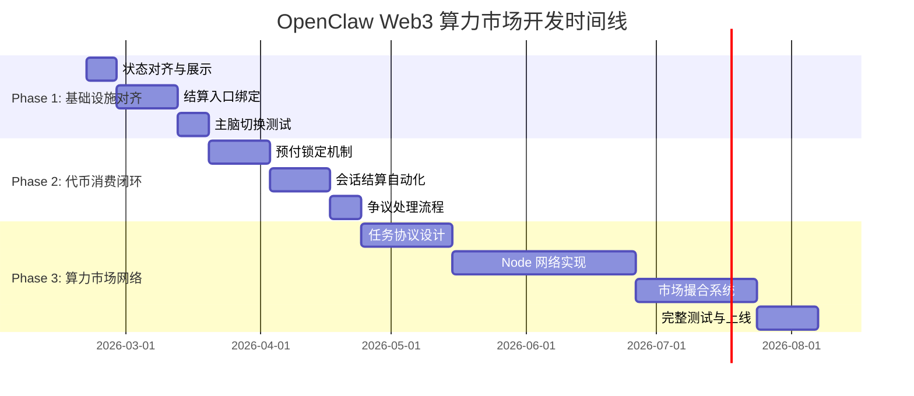
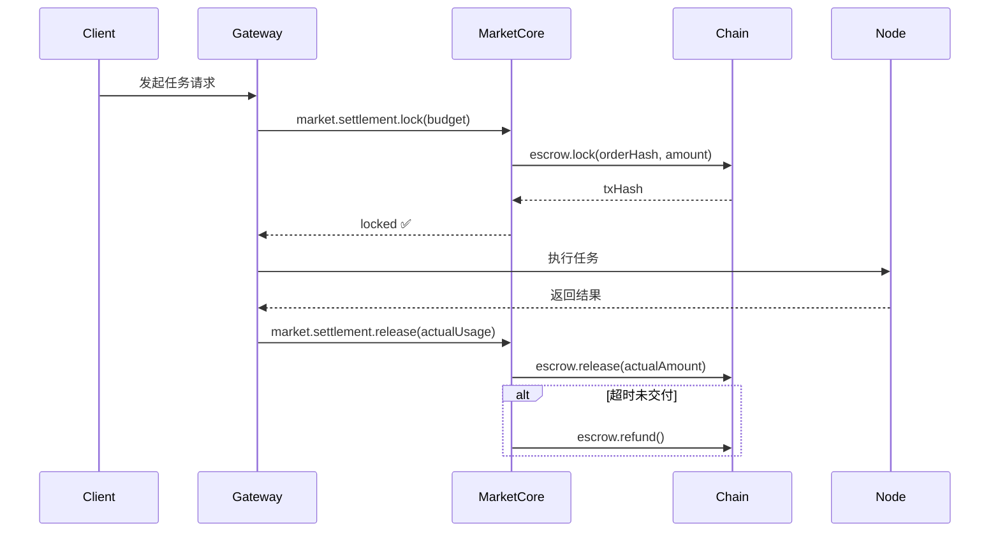
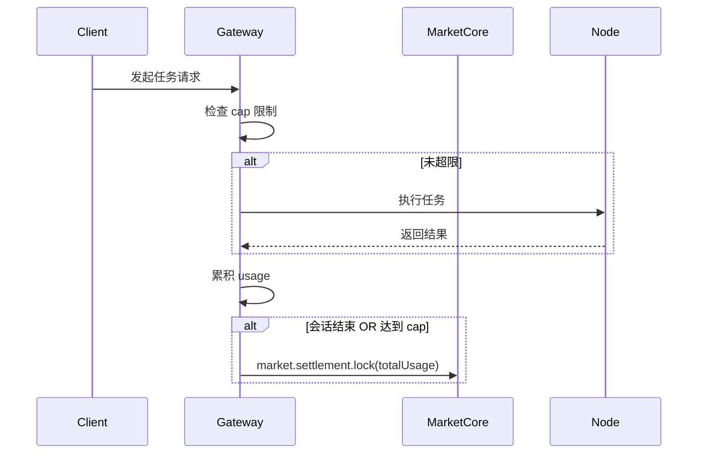
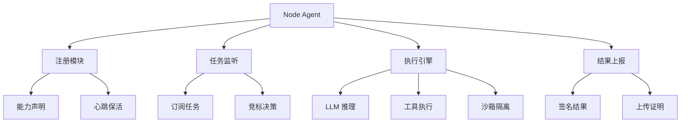
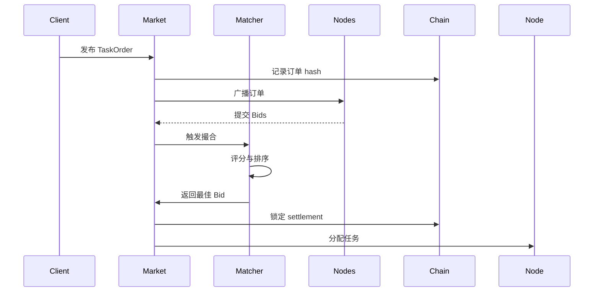

# OpenClaw Web3 算力市场开发路线图 🚀

> **项目目标**: 将 OpenClaw 打造成去中心化算力市场，让用户可以出租自己的电脑/服务器资源并赚取代币

**版本**: v1.0  
**更新日期**: 2026-02-20  
**项目状态**: Phase 0 已完成 ✅ | Phase 1 进行中 🚧

---

## 📊 执行摘要

### 当前状态评估

| 模块             | 完成度 | 状态      | 说明                                         |
| ---------------- | ------ | --------- | -------------------------------------------- |
| **web3-core**    | 80%    | ✅ 可用   | 身份认证、审计追踪、存储、计费基础设施已就绪 |
| **market-core**  | 70%    | ✅ 可用   | Offer/Order/Settlement 结算框架已完成        |
| **算力市场协议** | 0%     | ❌ 未开始 | TaskOrder/Bid/Result 协议层缺失              |
| **Node 网络**    | 0%     | ❌ 未开始 | 节点注册、任务分发、远程执行缺失             |
| **代币经济**     | 0%     | ❌ 未开始 | 定价、激励、惩罚机制未设计                   |

### 核心目标

你的需求是：

1. ✅ **自己出租自己的电脑干活** → 提供算力节点
2. ✅ **赚取代币** → 完成任务获得收益
3. ✅ **使用别人的电脑/服务器** → 购买算力资源

**实现路径**: 3 个阶段 + 12-24 周开发周期

---

## 🎯 三阶段实施计划



---

## 📋 Phase 1: 基础设施对齐与主脑切换 (4 周)

**目标**: 完善现有 web3-core 和 market-core 的联动，实现 Web3 去中心化模型作为主脑

### 里程碑 1.1: 状态对齐与展示 (1 周) ⚡

**优先级**: P0 (阻塞性)

#### 任务清单

- [ ] **T1.1.1**: 扩展 `web3.status.summary` API
  - **文件**: `extensions/web3-core/src/index.ts`
  - **内容**: 统一输出审计、锚定、归档、结算、主脑来源、可用性状态
  - **输出格式**:
    ```json
    {
      "identity": { "wallets": [...], "bound": true },
      "audit": { "events": 123, "anchored": 45, "lastAnchor": "..." },
      "storage": { "archives": 67, "totalSize": "1.2GB", "provider": "ipfs" },
      "billing": { "credits": 1000, "used": 234, "remaining": 766 },
      "settlement": { "locked": 50, "completed": 10, "pending": 2 },
      "brain": { "source": "web3", "model": "llama-3-70b", "available": true }
    }
    ```
  - **测试**: `extensions/web3-core/src/billing/commands.test.ts`

- [ ] **T1.1.2**: 对齐 `/pay_status` 命令
  - **文件**: `extensions/web3-core/src/billing/commands.ts`
  - **内容**: 从 `market-core` 读取 settlement 状态并展示一致性
  - **数据源**: `extensions/market-core/src/state/store.ts`
  - **输出**: CLI 表格展示 locked/completed/pending 结算

- [ ] **T1.1.3**: 实现结算状态一致性校验
  - **文件**: `extensions/web3-core/src/state/store.ts`
  - **内容**: 定期扫描 market-core 的 store，缓存汇总数据
  - **频率**: 每次命令调用时同步，避免重复扫描

- [ ] **T1.1.4**: 降级提示优化
  - **场景**: 结算不可用/未绑定/余额不足/状态未知
  - **行为**: 输出友好提示 + 提供回退方案，不阻断主脑切换
  - **示例**: "⚠️ 结算服务暂不可用，已切换到本地模式"

**交付物**:

- ✅ `web3.status.summary` 输出完整状态
- ✅ `/pay_status` 与 market-core 一致
- ✅ 单元测试覆盖率 > 80%

---

### 里程碑 1.2: 结算入口绑定 (2 周) 🔗

**优先级**: P0 (核心功能)

#### 任务清单

- [ ] **T1.2.1**: 实现 `before_tool_call` 预检机制
  - **文件**: `extensions/web3-core/src/billing/guard.ts`
  - **内容**:
    1. 检查 credits 余额是否足够
    2. 检查主脑可用性 (web3 node 是否在线)
    3. 检查是否有 locked settlement
  - **失败行为**: 记录状态 + 返回降级提示 + 触发回退到中心化模型
  - **测试**: `extensions/web3-core/src/billing/guard.test.ts`

- [ ] **T1.2.2**: 实现 `session_end` 结算触发
  - **文件**: `extensions/web3-core/src/audit/hooks.ts`
  - **内容**:
    1. 汇总本次会话的 usage (LLM tokens + tool calls)
    2. 调用 `market.settlement.lock` 锁定对应金额
    3. 记录结算记录到 store
  - **频率控制**: 仅在会话结束时触发，避免高频写入
  - **测试**: `extensions/web3-core/src/audit/hooks.test.ts`

- [ ] **T1.2.3**: 设计降级策略
  - **场景 A**: 结算服务不可用 → 记录本地债务 + 延后结算
  - **场景 B**: Web3 模型不可达 → 自动切回中心化模型
  - **场景 C**: 余额不足 → 提示充值 + 阻止新会话
  - **测试**: 模拟各种故障场景的回退行为

- [ ] **T1.2.4**: 实现最小化写入策略
  - **问题**: 频繁写入 settlement 会影响性能
  - **方案**:
    - 批量累积多次调用后统一结算
    - 使用内存缓存 + 定期持久化
    - 仅在会话结束/达到阈值时写入
  - **配置**: `batchSize: 10, flushIntervalMs: 60000`

**交付物**:

- ✅ 结算自动绑定到 OpenClaw 调用
- ✅ 降级策略完整覆盖
- ✅ 集成测试通过

---

### 里程碑 1.3: 去中心化主脑接入 (1 周) 🧠

**优先级**: P0 (必须功能)

#### 任务清单

- [ ] **T1.3.1**: 注册 Web3 模型为可选主脑
  - **文件**: `extensions/web3-core/src/config.ts`
  - **内容**: 添加 `brainProviders` 配置
    ```typescript
    brainProviders: [
      {
        id: "web3-llama-70b",
        provider: "web3",
        model: "llama-3-70b",
        endpoint: "https://web3-inference.example.com",
        requiresSettlement: true,
        allowlist: ["0x1234...", "0x5678..."],
      },
    ];
    ```
  - **测试**: 配置解析与验证

- [ ] **T1.3.2**: 实现主脑切换逻辑
  - **文件**: `extensions/web3-core/src/index.ts`
  - **内容**: 在 `createWeb3StreamFn` 中实现：
    1. 检查 allowlist (仅允许可信节点)
    2. 探测节点可用性 (health check)
    3. 切换到 Web3 推理路径
    4. 失败后回退到中心化模型
  - **超时**: 3 秒内无响应则降级

- [ ] **T1.3.3**: 实现真实推理路径
  - **协议**: REST API 或 WebSocket 连接到 Web3 节点
  - **请求格式**:
    ```json
    {
      "model": "llama-3-70b",
      "messages": [...],
      "stream": true,
      "settlement": {
        "orderId": "0xabc...",
        "locked": 50
      }
    }
    ```
  - **响应处理**: 流式返回 + 错误处理 + 超时重试

- [ ] **T1.3.4**: Allowlist 校验与管理
  - **配置文件**: `web3-core.config.json`
  - **内容**: 维护可信节点列表
    ```json
    {
      "allowlist": {
        "nodes": ["0x1234...", "0x5678..."],
        "autoUpdate": false,
        "updateEndpoint": null
      }
    }
    ```
  - **校验**: 每次主脑切换前检查节点是否在 allowlist

**交付物**:

- ✅ Web3 模型成功注册为主脑
- ✅ 主脑切换与回退流程正常
- ✅ 集成测试验证端到端流程

---

### Phase 1 里程碑验收标准

✅ **完成标准**:

1. `web3.status.summary` 和 `/pay_status` 输出一致
2. 使用 Web3 模型时自动触发结算
3. Web3 模型不可用时自动回退到中心化模型
4. 所有单元测试和集成测试通过

📊 **验收演示**:

```bash
# 1. 绑定钱包
/bind_wallet 0x1234567890abcdef...

# 2. 查看状态
/pay_status
# 输出: credits: 1000, locked: 0, available: true

# 3. 切换到 Web3 主脑
/switch_brain web3-llama-70b

# 4. 进行对话 (自动结算)
你好，请帮我写一段代码

# 5. 查看结算记录
/pay_status
# 输出: credits: 950, locked: 50, completed: 0
```

---

## 💰 Phase 2: 代币消费闭环 (5 周)

**目标**: 完善结算机制，实现完整的代币消费与争议处理流程

### 里程碑 2.1: 预付锁定机制 (2 周) 🔐

**优先级**: P0 (核心经济模型)

#### 计费策略设计

根据 plan.md 的建议，实现两种计费模式：

##### **模式 A: 预付锁定 (默认，用于开放市场)**



**特点**:

- ✅ **防止恶意消费**: 提前锁定最大预算
- ✅ **自动退款**: 超时或失败自动退款
- ✅ **部分结算**: 支持按实际使用量结算
- ✅ **争议窗口**: 600 秒内可发起争议

##### **模式 B: 会话后付 (可选，用于信任域)**



**特点**:

- ✅ **适合高频调用**: 减少链上交易次数
- ✅ **单会话上限**: 防止意外烧钱
- ✅ **速率限制**: 限制调用频次
- ⚠️ **需要信任**: 仅用于 allowlist 节点或自有设备

#### 任务清单

- [ ] **T2.1.1**: 实现预付锁定逻辑
  - **文件**: `extensions/market-core/src/settlement/lock.ts`
  - **输入**: `{ orderId, budget, tokenAddress, payer }`
  - **流程**:
    1. 检查余额是否足够
    2. 调用合约 `escrow.lock()`
    3. 记录锁定状态到 store
    4. 设置超时自动退款定时器
  - **超时配置**: `timeoutSec: 3600` (1 小时)

- [ ] **T2.1.2**: 实现部分结算逻辑
  - **文件**: `extensions/market-core/src/settlement/release.ts`
  - **输入**: `{ orderId, actualUsage, proof }`
  - **流程**:
    1. 计算实际消费金额 (based on usage)
    2. 释放对应金额 `escrow.release(actualAmount)`
    3. 退还剩余金额 `escrow.refund(remaining)`
    4. 记录结算完成状态
  - **证明**: usage 需要附带可验证证明 (如 token count hash)

- [ ] **T2.1.3**: 实现自动退款机制
  - **文件**: `extensions/market-core/src/settlement/refund.ts`
  - **触发条件**:
    - 超过 `timeoutSec` 未收到结果
    - Node 主动取消任务
    - 验证失败
  - **流程**:
    1. 调用合约 `escrow.refund()`
    2. 更新 settlement 状态为 `refunded`
    3. 通知用户
  - **测试**: 模拟超时场景

- [ ] **T2.1.4**: 实现会话后付模式
  - **文件**: `extensions/web3-core/src/billing/session.ts`
  - **配置**:
    ```typescript
    sessionBilling: {
      enabled: true,
      cap: 100,           // 单会话最大消费
      batchSize: 10,      // 累积多少次后结算
      flushInterval: 60000 // 60 秒强制刷新
    }
    ```
  - **流程**: 在内存中累积 usage，达到阈值后统一结算

- [ ] **T2.1.5**: 定价模型配置
  - **文件**: `extensions/web3-core/src/config.ts`
  - **内容**:
    ```typescript
    pricing: {
      llmInputTokenPrice: 0.001,   // 每 1K input tokens
      llmOutputTokenPrice: 0.002,  // 每 1K output tokens
      toolCallPrice: 0.01,          // 每次工具调用
      basePrice: 0.1                // 基础价格
    }
    ```

**交付物**:

- ✅ 预付锁定机制完整实现
- ✅ 部分结算与自动退款正常工作
- ✅ 会话后付模式可选启用
- ✅ 定价模型可配置

---

### 里程碑 2.2: 争议处理流程 (1 周) ⚖️

**优先级**: P1 (重要但非阻塞)

#### 任务清单

- [ ] **T2.2.1**: 设计争议窗口机制
  - **文件**: `extensions/market-core/src/dispute/window.ts`
  - **配置**: `disputeWindowSec: 600` (10 分钟)
  - **流程**:
    1. 结果交付后进入争议窗口
    2. 窗口内允许发起争议
    3. 窗口结束后自动 release

- [ ] **T2.2.2**: 实现争议发起
  - **命令**: `/dispute <orderId> <reason>`
  - **文件**: `extensions/market-core/src/dispute/create.ts`
  - **输入**:
    ```typescript
    {
      orderId: "0xabc...",
      reason: "incorrect_result" | "timeout" | "quality_issue",
      evidence: { ... }
    }
    ```
  - **流程**:
    1. 验证是否在争议窗口内
    2. 冻结 settlement (阻止 release)
    3. 通知双方
    4. 进入仲裁流程

- [ ] **T2.2.3**: 实现仲裁机制 (MVP: 人工仲裁)
  - **Phase 2 方案**: 人工审核 + 投票
  - **Phase 3 方案**: 智能合约自动仲裁
  - **流程**:
    1. 收集双方证据
    2. 人工/DAO 投票
    3. 根据结果执行 release 或 refund
  - **配置**: `arbitrationTimeoutSec: 86400` (24 小时)

- [ ] **T2.2.4**: 实现惩罚机制
  - **恶意 Client**: 频繁发起无效争议 → 降低信用分
  - **恶意 Node**: 多次被判定作恶 → 移出 allowlist
  - **记录**: 保存争议历史到链上

**交付物**:

- ✅ 争议窗口机制正常工作
- ✅ 可以发起和处理争议
- ✅ 人工仲裁流程文档化

---

### 里程碑 2.3: 用户体验优化 (2 周) 🎨

**优先级**: P2 (体验提升)

#### 任务清单

- [ ] **T2.3.1**: 实现余额提醒
  - **场景**: 余额低于阈值时自动提醒
  - **配置**: `lowBalanceThreshold: 100`
  - **提示**: "⚠️ 余额不足 100，请充值以继续使用"

- [ ] **T2.3.2**: 实现结算历史查询
  - **命令**: `/settlement_history [limit]`
  - **输出**: 表格展示最近的结算记录
    ```
    Order ID     | Status    | Amount | Created At
    0xabc...     | completed | 50     | 2026-02-20 10:00
    0xdef...     | locked    | 30     | 2026-02-20 11:00
    ```

- [ ] **T2.3.3**: 实现代币充值引导
  - **命令**: `/recharge`
  - **输出**:
    1. 显示充值地址 (二维码)
    2. 提供购买代币链接
    3. 监听充值事件并自动刷新余额

- [ ] **T2.3.4**: 实现 UI 仪表盘
  - **位置**: Web UI 或 Mac App
  - **内容**:
    - 实时余额
    - 结算状态
    - 使用统计 (今日消费、本周消费)
    - 节点状态 (在线/离线)

**交付物**:

- ✅ 用户体验流畅
- ✅ 关键操作有明确反馈
- ✅ UI 仪表盘可视化

---

### Phase 2 里程碑验收标准

✅ **完成标准**:

1. 预付锁定与自动退款正常工作
2. 可以发起和处理争议
3. 结算历史可查询
4. 用户体验友好

📊 **验收演示**:

```bash
# 1. 充值代币
/recharge
# 显示充值地址和二维码

# 2. 发起任务 (预付锁定)
你好，帮我分析这段代码
# 后台: locked 50 tokens

# 3. 任务完成 (部分结算)
# 后台: released 35 tokens, refunded 15 tokens

# 4. 查看历史
/settlement_history
# 输出: 最近 10 条结算记录

# 5. 发起争议 (如果结果有问题)
/dispute 0xabc123 incorrect_result
# 输出: 争议已提交，进入仲裁流程
```

---

## 🌐 Phase 3: 算力市场网络 (12 周)

**目标**: 实现完整的去中心化算力市场，支持任意节点加入并提供算力

### 里程碑 3.1: 任务协议设计 (3 周) 📝

**优先级**: P0 (核心架构)

#### 协议层设计

##### **核心数据结构**

```typescript
// 任务订单
interface TaskOrder {
  id: string; // 订单 ID
  client: string; // 发布者地址
  taskType: "llm" | "tool" | "compute";
  spec: {
    model?: string; // LLM 模型要求
    maxTokens?: number; // 最大 token 数
    timeout?: number; // 超时时间 (秒)
    requirements?: {
      // 硬件要求
      minRAM?: number;
      minGPU?: string;
      minDiskSpace?: number;
    };
  };
  budget: {
    maxPrice: number; // 最高出价
    tokenAddress: string; // 支付代币
  };
  deadline: number; // 截止时间 (timestamp)
  status: "pending" | "matched" | "executing" | "completed" | "failed";
}

// 竞标
interface Bid {
  id: string; // 竞标 ID
  orderId: string; // 对应的订单 ID
  node: string; // 节点地址
  price: number; // 报价
  estimatedTime: number; // 预计完成时间 (秒)
  capability: NodeCapability; // 节点能力声明
  signature: string; // 签名 (不可抵赖)
  createdAt: number;
}

// 节点能力声明
interface NodeCapability {
  models: string[]; // 支持的模型列表
  hardware: {
    cpu: string;
    ram: number; // GB
    gpu?: string;
    diskSpace: number; // GB
  };
  availability: number; // 可用性 (0-1)
  reputation: number; // 信誉分 (0-100)
  completedTasks: number; // 完成的任务数
  successRate: number; // 成功率
}

// 任务结果
interface TaskResult {
  orderId: string;
  node: string;
  result: {
    output: string; // 结果内容 (或 CID)
    usage: {
      tokens?: number;
      time: number; // 执行时间 (秒)
    };
    proof: string; // 可验证证明 (hash/signature)
  };
  signature: string; // 节点签名
  deliveredAt: number;
}
```

#### 任务清单

- [ ] **T3.1.1**: 定义协议规范
  - **文档**: `docs/PROTOCOL.md`
  - **内容**: 详细定义各数据结构、状态机、消息格式
  - **版本**: v1.0

- [ ] **T3.1.2**: 实现协议 SDK
  - **目录**: `extensions/market-protocol/`
  - **文件**:
    - `src/types.ts` - 类型定义
    - `src/order.ts` - 订单创建与管理
    - `src/bid.ts` - 竞标逻辑
    - `src/result.ts` - 结果验证
    - `src/signature.ts` - 签名与验签

- [ ] **T3.1.3**: 实现状态机
  - **状态流转**:
    ```
    pending → matched → executing → completed
                ↓           ↓
              cancelled   failed → refunded
    ```
  - **测试**: 覆盖所有状态转换路径

- [ ] **T3.1.4**: 实现可验证证明机制
  - **方案**:
    - LLM 任务: `hash(prompt + output + usage)`
    - 计算任务: 提供中间结果 hash
    - 工具调用: 记录完整审计日志
  - **验证**: Client 可以重放验证结果正确性

**交付物**:

- ✅ 协议规范文档完整
- ✅ 协议 SDK 可用
- ✅ 状态机正确运行
- ✅ 可验证证明机制实现

---

### 里程碑 3.2: Node 网络实现 (6 周) 🖥️

**优先级**: P0 (核心功能)

#### Node 端架构



#### 任务清单

- [ ] **T3.2.1**: 实现 Node 注册
  - **文件**: `extensions/node-agent/src/register.ts`
  - **流程**:
    1. 生成节点密钥对
    2. 提交能力声明到注册中心
    3. 通过 KYC/验证 (可选)
    4. 获得节点 ID 和 allowlist 准入
  - **CLI**: `openclaw node register --wallet 0x...`

- [ ] **T3.2.2**: 实现任务监听与竞标
  - **文件**: `extensions/node-agent/src/listener.ts`
  - **方式**:
    - **方案 A**: 轮询市场合约事件
    - **方案 B**: 订阅 WebSocket 推送
    - **方案 C**: 使用 libp2p 构建 P2P 网络 ⭐ (推荐)
  - **竞标策略**:
    ```typescript
    function shouldBid(order: TaskOrder): boolean {
      return (
        order.spec.model in supportedModels &&
        order.budget.maxPrice >= minPrice &&
        currentLoad < maxLoad &&
        estimatedTime(order) <= order.deadline
      );
    }
    ```

- [ ] **T3.2.3**: 实现执行引擎
  - **文件**: `extensions/node-agent/src/executor.ts`
  - **支持任务类型**:
    1. **LLM 推理**: 集成本地模型 (llama.cpp, vLLM, Ollama)
    2. **工具执行**: 复用 OpenClaw 的工具体系
    3. **通用计算**: 执行自定义脚本 (沙箱隔离)
  - **隔离机制**: Docker 容器或 gVisor 沙箱

- [ ] **T3.2.4**: 实现结果签名与上报
  - **文件**: `extensions/node-agent/src/reporter.ts`
  - **流程**:
    1. 执行完成后生成结果
    2. 使用节点私钥签名
    3. 上传到去中心化存储 (IPFS)
    4. 提交 CID + signature 到合约
    5. 触发 settlement release

- [ ] **T3.2.5**: 实现心跳与可用性监测
  - **文件**: `extensions/node-agent/src/heartbeat.ts`
  - **频率**: 每 30 秒发送一次心跳
  - **内容**:
    ```json
    {
      "nodeId": "0x...",
      "timestamp": 1234567890,
      "status": "available",
      "currentLoad": 0.3,
      "queueLength": 2
    }
    ```
  - **超时处理**: 5 分钟无心跳则标记为离线

- [ ] **T3.2.6**: 实现节点配置与管理
  - **配置文件**: `node-agent.config.json`
    ```json
    {
      "wallet": "0x...",
      "models": ["llama-3-70b", "gpt-4"],
      "pricing": {
        "minPrice": 0.01,
        "pricePerToken": 0.001
      },
      "limits": {
        "maxConcurrent": 5,
        "maxQueueLength": 10,
        "maxTaskTime": 3600
      },
      "storage": {
        "provider": "ipfs",
        "pinataApiKey": "..."
      }
    }
    ```
  - **CLI 管理**:
    - `openclaw node start` - 启动节点
    - `openclaw node stop` - 停止节点
    - `openclaw node status` - 查看状态
    - `openclaw node config set <key> <value>` - 修改配置

**交付物**:

- ✅ Node 可以注册并声明能力
- ✅ Node 可以监听任务并竞标
- ✅ Node 可以执行任务并上报结果
- ✅ Node 管理工具完整

---

### 里程碑 3.3: 市场撮合系统 (4 周) 🤝

**优先级**: P0 (核心功能)

#### 撮合引擎架构



#### 任务清单

- [ ] **T3.3.1**: 实现任务广播机制
  - **文件**: `extensions/market-protocol/src/broadcast.ts`
  - **方式**:
    - **方案 A**: 链上事件 (贵但可靠)
    - **方案 B**: P2P 网络广播 (便宜但需要发现机制) ⭐ 推荐
    - **方案 C**: 中心化中继 (快速 MVP)
  - **内容**: 将新订单推送给所有在线节点

- [ ] **T3.3.2**: 实现竞标收集
  - **文件**: `extensions/market-protocol/src/bid-collector.ts`
  - **窗口**: 默认 60 秒竞标窗口
  - **验证**:
    - 检查节点是否在 allowlist
    - 验证竞标签名
    - 检查节点能力是否满足要求

- [ ] **T3.3.3**: 实现撮合算法
  - **文件**: `extensions/market-protocol/src/matcher.ts`
  - **评分公式**:

    ```typescript
    score =
      w1 * (1 - price / maxPrice) +
      w2 * reputation +
      w3 * (1 - estimatedTime / deadline) +
      w4 * availability;

    // 默认权重
    w1 = 0.4; // 价格权重
    w2 = 0.3; // 信誉权重
    w3 = 0.2; // 时间权重
    w4 = 0.1; // 可用性权重
    ```

  - **排序**: 选择得分最高的 Bid

- [ ] **T3.3.4**: 实现任务分配
  - **文件**: `extensions/market-protocol/src/allocator.ts`
  - **流程**:
    1. 通知中标节点
    2. 锁定 settlement
    3. 将任务详情发送给节点
    4. 设置执行超时定时器
  - **失败处理**: 节点拒绝或超时 → 重新撮合

- [ ] **T3.3.5**: 实现市场监控
  - **文件**: `extensions/market-protocol/src/monitor.ts`
  - **监控指标**:
    - 订单数量与完成率
    - 节点在线数与负载
    - 平均成交价格
    - 争议率
  - **输出**: 仪表盘或 API

**交付物**:

- ✅ 任务可以广播给所有节点
- ✅ 竞标自动收集与评分
- ✅ 撮合算法正确运行
- ✅ 市场监控可视化

---

### 里程碑 3.4: 完整测试与上线 (2 周) 🚀

**优先级**: P0 (质量保证)

#### 任务清单

- [ ] **T3.4.1**: 端到端测试
  - **场景**:
    1. Client 发布任务 → Node 接单 → 执行 → 结算
    2. 多节点竞标 → 最优节点中标
    3. 任务超时 → 自动退款
    4. 结果错误 → 发起争议 → 仲裁
  - **工具**: 自动化测试脚本

- [ ] **T3.4.2**: 压力测试
  - **场景**:
    - 100 个节点同时在线
    - 1000 个订单并发发布
    - 10000 次竞标提交
  - **指标**:
    - 撮合延迟 < 5 秒
    - 系统吞吐量 > 100 TPS

- [ ] **T3.4.3**: 安全审计
  - **重点**:
    - 签名验证是否可绕过
    - Settlement 是否可重入攻击
    - 节点作恶场景是否覆盖
  - **工具**: Slither, Mythril, 人工审计

- [ ] **T3.4.4**: 文档完善
  - **用户文档**:
    - 快速开始指南
    - CLI 命令参考
    - 常见问题 FAQ
  - **开发者文档**:
    - 协议规范
    - API 参考
    - 插件开发指南

- [ ] **T3.4.5**: 主网部署
  - **合约部署**: 部署到 Base/Optimism/Arbitrum
  - **节点招募**: 发布节点招募公告
  - **测试网奖励**: 提供测试网代币奖励早期节点

**交付物**:

- ✅ 所有测试通过
- ✅ 安全审计无重大问题
- ✅ 文档完整
- ✅ 主网成功上线

---

### Phase 3 里程碑验收标准

✅ **完成标准**:

1. 任意节点可以注册并提供算力
2. Client 可以发布任务并自动撮合
3. 任务执行与结算闭环正常
4. 争议处理机制完整

📊 **验收演示**:

**Client 侧**:

```bash
# 1. 发布任务
/market publish_task --model llama-3-70b --budget 50
# 输出: TaskOrder created: 0xabc...

# 2. 查看竞标
/market view_bids 0xabc...
# 输出: 3 个节点竞标，最低价 30

# 3. 自动撮合
# 后台: 选择最优节点，锁定 settlement

# 4. 等待结果
# 输出: 任务完成，结果已交付

# 5. 查看结算
/pay_status
# 输出: 30 tokens 已结算
```

**Node 侧**:

```bash
# 1. 注册节点
openclaw node register --wallet 0x1234...
# 输出: Node registered: node-001

# 2. 启动节点
openclaw node start
# 输出: Node is running, listening for tasks...

# 3. 收到任务广播
# 输出: New TaskOrder: 0xabc..., maxPrice: 50

# 4. 自动竞标
# 输出: Bid submitted: price 30, estimatedTime 120s

# 5. 中标并执行
# 输出: Task assigned, executing...
# 输出: Task completed, result uploaded to IPFS

# 6. 获得收益
openclaw node earnings
# 输出: Today: 150 tokens, Total: 3000 tokens
```

---

## 🛠️ 技术栈与开源方案

### 核心技术栈

| 模块             | 技术选型                | 理由               |
| ---------------- | ----------------------- | ------------------ |
| **身份认证**     | SIWE (EIP-4361)         | 以太坊生态标准     |
| **链交互**       | viem                    | 现代化、类型安全   |
| **去中心化存储** | IPFS (Pinata), Arweave  | 成熟方案           |
| **P2P 网络**     | libp2p                  | 去中心化发现与通信 |
| **本地模型**     | llama.cpp, vLLM, Ollama | 高性能推理         |
| **沙箱隔离**     | Docker, gVisor          | 安全执行环境       |
| **状态存储**     | SQLite, JSONL           | 轻量本地存储       |
| **智能合约**     | Solidity + Foundry      | 以太坊 L2 部署     |

### 复用开源项目建议

根据 plan.md 的调研，**强烈建议复用**以下成熟方案：

#### 1. **任务执行层** - 复用 Bacalhau

**理由**:

- ✅ 专注 Compute over Data
- ✅ 与 IPFS/Filecoin 天然适配
- ✅ 已有成熟的任务调度与执行机制
- ✅ 支持 Docker 容器隔离

**集成方案**:

```typescript
// 将 OpenClaw 任务转换为 Bacalhau Job
import { BacalhauClient } from "@bacalhau/sdk";

async function executeOnBacalhau(order: TaskOrder) {
  const client = new BacalhauClient();
  const job = await client.submit({
    engine: "docker",
    image: "openclaw/executor:latest",
    inputs: [order.spec],
    outputs: ["./result.json"],
  });

  const result = await client.waitForResult(job.id);
  return result;
}
```

**优点**: 不需要从零实现节点发现、任务分发、容器编排

---

#### 2. **去中心化存储** - 复用 w3up-client

**理由**:

- ✅ Web3.Storage 的官方 SDK
- ✅ 支持 UCAN 授权
- ✅ 自动处理上传/固定
- ✅ 与 Filecoin 集成

**集成方案**:

```typescript
import { create } from "@web3-storage/w3up-client";

async function uploadResult(result: TaskResult) {
  const client = await create();
  const cid = await client.uploadFile(new Blob([JSON.stringify(result)]));
  return cid.toString();
}
```

**优点**: 不需要自己处理 IPFS 底层协议

---

#### 3. **审计日志** - 复用 Rekor (Sigstore)

**理由**:

- ✅ 透明日志标准 (append-only + Merkle)
- ✅ 比全上链更轻量
- ✅ 可验证时间戳
- ✅ 已被多个项目采用

**集成方案**:

```typescript
import { Rekor } from "@sigstore/rekor";

async function anchorAuditEvent(event: AuditEvent) {
  const rekor = new Rekor();
  const entry = await rekor.createEntry({
    kind: "hashedrekord",
    data: canonicalize(event),
    signature: sign(event, privateKey),
  });
  return entry.logIndex;
}
```

**优点**: 审计日志可验证但不占用链上资源

---

#### 4. **流支付** - 复用 Superfluid (可选)

**理由**:

- ✅ 支持按时间/token 流计费
- ✅ 资金自动流动
- ✅ 适合长时间任务

**集成方案**:

```typescript
import { Framework } from '@superfluid-finance/sdk-core';

async function createPaymentStream(order: TaskOrder) {
  const sf = await Framework.create({...});
  const stream = await sf.cfaV1.createFlow({
    receiver: order.node,
    flowRate: order.budget.maxPrice / order.spec.timeout,
    superToken: order.budget.tokenAddress
  });
  return stream;
}
```

**优点**: 实现"按使用量实时付费"的体验

---

### 不建议自研的部分

根据 plan.md 的评审，以下是 **容易重复造轮子** 的部分：

| 模块            | 自研风险 | 建议                      |
| --------------- | -------- | ------------------------- |
| **IPFS 传输层** | ⚠️ 高    | 复用 helia 或 w3up-client |
| **SIWE 协议**   | ⚠️ 高    | 复用 spruceid/siwe        |
| **透明日志**    | ⚠️ 中    | 复用 Rekor/Trillian       |
| **任务调度**    | ⚠️ 高    | 复用 Bacalhau/Golem       |
| **P2P 发现**    | ⚠️ 高    | 复用 libp2p               |

---

## 📊 资源规划

### 团队配置建议

| 角色             | 人数   | 主要职责                      |
| ---------------- | ------ | ----------------------------- |
| **全栈工程师**   | 2-3 人 | 前端 UI + 后端 API + 插件开发 |
| **区块链工程师** | 1-2 人 | 智能合约 + 链交互 + 安全审计  |
| **DevOps**       | 1 人   | 节点部署 + 监控 + CI/CD       |
| **产品经理**     | 1 人   | 需求管理 + 用户体验 + 运营    |
| **测试工程师**   | 1 人   | 自动化测试 + 压力测试         |

**总计**: 6-8 人

### 时间规划

| 阶段           | 周数  | 累计周数 | 里程碑          |
| -------------- | ----- | -------- | --------------- |
| **Phase 1**    | 4 周  | 4 周     | ✅ 基础设施对齐 |
| **Phase 2**    | 5 周  | 9 周     | ✅ 代币消费闭环 |
| **Phase 3**    | 12 周 | 21 周    | ✅ 算力市场网络 |
| **测试与优化** | 3 周  | 24 周    | ✅ 正式上线     |

**总计**: 24 周 (约 6 个月)

### 成本估算 (假设)

| 项目           | 成本  | 说明                  |
| -------------- | ----- | --------------------- |
| **团队工资**   | $150K | 6 人 × 6 个月         |
| **云服务**     | $5K   | 测试节点 + 存储 + RPC |
| **审计费用**   | $20K  | 智能合约安全审计      |
| **营销推广**   | $10K  | 节点招募 + 社区建设   |
| **测试网奖励** | $5K   | 早期节点激励          |

**总计**: ~$190K

---

## 🎯 关键风险与应对

### 技术风险

| 风险               | 影响  | 概率 | 应对措施                           |
| ------------------ | ----- | ---- | ---------------------------------- |
| **节点作恶**       | 🔴 高 | 中   | 签名不可抵赖 + 信誉系统 + 惩罚机制 |
| **结果验证困难**   | 🟡 中 | 高   | 可验证证明 + 挑战机制 + 人工仲裁   |
| **P2P 网络不稳定** | 🟡 中 | 中   | 中心化中继作为降级方案             |
| **智能合约漏洞**   | 🔴 高 | 低   | 多轮审计 + 漏洞赏金计划            |
| **性能瓶颈**       | 🟡 中 | 中   | 使用 L2 + 批量结算 + 链下撮合      |

### 产品风险

| 风险               | 影响  | 概率 | 应对措施                  |
| ------------------ | ----- | ---- | ------------------------- |
| **节点供给不足**   | 🔴 高 | 高   | 提供激励 + 自建初始节点池 |
| **用户习惯问题**   | 🟡 中 | 中   | 提供中心化模式作为备选    |
| **代币流动性不足** | 🟡 中 | 中   | 对接 DEX + 做市商         |
| **监管风险**       | 🟡 中 | 低   | 合规咨询 + 去中心化治理   |

### 市场风险

| 风险             | 影响  | 概率 | 应对措施                        |
| ---------------- | ----- | ---- | ------------------------------- |
| **竞争对手**     | 🟡 中 | 高   | 专注 OpenClaw 集成 + 差异化功能 |
| **市场需求不足** | 🔴 高 | 中   | MVP 快速验证 + 用户调研         |
| **代币价格波动** | 🟡 中 | 高   | 支持稳定币支付                  |

---

## 📈 成功指标 (KPI)

### Phase 1 指标

- ✅ Web3 模型成功注册为主脑
- ✅ 主脑切换成功率 > 95%
- ✅ `/pay_status` 查询延迟 < 100ms
- ✅ 单元测试覆盖率 > 80%

### Phase 2 指标

- ✅ 结算成功率 > 99%
- ✅ 自动退款准确率 100%
- ✅ 争议处理时间 < 24 小时
- ✅ 用户满意度 > 4/5

### Phase 3 指标

- ✅ 注册节点数 > 100
- ✅ 日均任务完成量 > 1000
- ✅ 节点成功率 > 95%
- ✅ 平均撮合时间 < 5 秒
- ✅ 代币流通量 > $100K

---

## 🚀 下一步行动

### 立即行动 (本周)

1. **[ ] 成立项目组** - 确定团队成员与分工
2. **[ ] 环境搭建** - 配置开发环境和测试网
3. **[ ] Sprint 1 启动** - 开始 Phase 1 里程碑 1.1
4. **[ ] 设计评审** - 评审协议设计和架构方案

### 短期目标 (4 周内)

1. **[ ] 完成 Phase 1** - 基础设施对齐与主脑切换
2. **[ ] 发布 Demo** - 展示 Web3 模型作为主脑
3. **[ ] 文档完善** - 用户文档和开发者文档
4. **[ ] 社区建设** - 建立 Discord/Telegram 社区

### 中期目标 (12 周内)

1. **[ ] 完成 Phase 2** - 代币消费闭环上线
2. **[ ] 测试网发布** - 在 Sepolia 测试网部署
3. **[ ] 节点招募** - 招募 20+ 早期节点
4. **[ ] 用户反馈** - 收集反馈并迭代

### 长期目标 (24 周内)

1. **[ ] 完成 Phase 3** - 完整算力市场上线
2. **[ ] 主网部署** - 在 Base/Optimism 主网部署
3. **[ ] 代币上市** - 对接 DEX 提供流动性
4. **[ ] 规模化运营** - 节点数 > 100，日活 > 1000

---

## 📚 附录

### A. 参考资料

- [OpenClaw GitHub](https://github.com/openclaw/openclaw)
- [Plan.md 完整设计文档](/data/workspace/openclaw/plan.md)
- [SIWE 规范 (EIP-4361)](https://eips.ethereum.org/EIPS/eip-4361)
- [Bacalhau 文档](https://docs.bacalhau.org)
- [Golem Network](https://golem.network)
- [Superfluid 文档](https://docs.superfluid.finance)

### B. 联系方式

- **项目仓库**: [GitHub](https://github.com/openclaw/openclaw)
- **技术讨论**: Discord / Telegram
- **商务合作**: [email protected]

### C. 更新日志

| 日期       | 版本 | 变更内容     |
| ---------- | ---- | ------------ |
| 2026-02-20 | v1.0 | 初始版本发布 |

---

**免责声明**: 本路线图基于当前技术评估和市场预测制定,实际开发过程中可能根据情况调整。时间和成本估算仅供参考。
